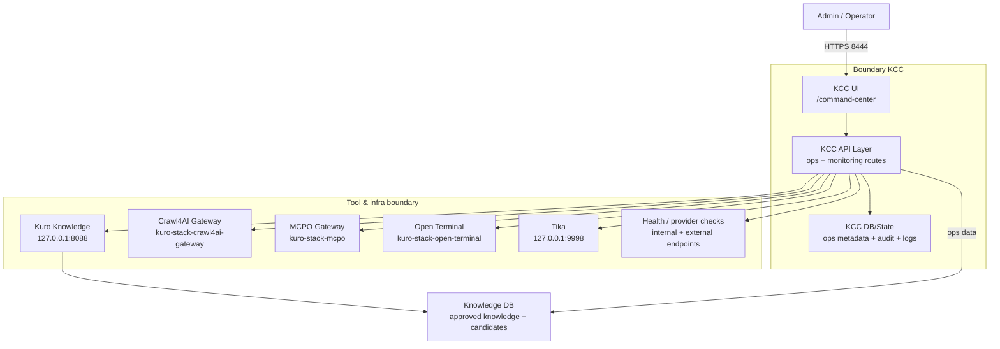

# Kuro Command Center (KCC) Manual Guide

## 1) Profil

KCC adalah panel operasional. Semua activity pengawasan, health, tools ops,
telemetry, dan kontrol konfigurasi dikelola di sini.

- Path: `/home/kuro/projects/kuro-command-center`
- Service: `kuro-command-center.service`
- Port: `8444` (TLS)
- Base path UI: `/command-center`
- Mode aktif: `KURO_APP_ROLE=kcc`

## 2) Cara mengakses

- Browser: `https://127.0.0.1:8444/command-center`
- Dashboard internal mengelola status service, operasi market/telegram, dan pengawasan
  ingest/ops.

## 3) Fungsi utama

- Command Center untuk admin/ops:
  - Health check provider/runtime
  - Storage / memory / sentry status
  - Backup dan observability view
  - OpenClaw / tool approvals
  - Ingestion operation controls
- Tidak menjadi source utama pengetahuan publik; fungsinya bukan chat cockpit
  untuk research daily, itu KRC.

## 4) Jalur utama yang perlu diingat

- UI:
  - `/command-center`
- API/ops:
  - `/api/admin/app-role`
  - ops/market/telemetry routes in KCC context
- Integrasi knowledge:
  - KCC berinteraksi dengan `kuro-knowledge` untuk ingestion dan audit

## 5) Konfigurasi kunci

- `/home/kuro/projects/kuro-command-center/.env.kcc.example`
- `/home/kuro/projects/kuro-command-center/deploy/systemd/kuro-command-center.service.example`

Flag penting yang biasanya aktif:
- `KURO_APP_ROLE=kcc`
- `KURO_KCC_MARKET_ENABLED=true`
- `KURO_KCC_TELEGRAM_ENABLED=true`
- `KURO_KCC_INGESTION_ADMIN_ENABLED=true`
- `KURO_KCC_PROVIDER_HEALTH_ENABLED=true`
- `KURO_KCC_BACKUP_ENABLED=true`
- `KURO_KCC_OBSERVABILITY_ENABLED=true`

## 6) Operasi & troubleshooting

### Restart dan status

```bash
sudo systemctl restart kuro-command-center.service
systemctl status kuro-command-center.service --no-pager -l
journalctl -u kuro-command-center.service -f
```

### Health

```bash
curl -k -I https://127.0.0.1:8444/api/health
```

### Validasi isolasi

- Pastikan user bukan admin tidak bisa akses shell KCC.
- Pastikan `KURO_APP_ROLE` benar, karena route set berbeda antara role.

## 7) Integrasi antar sistem

- KCC memanggil Kuro Knowledge untuk operasi ingest/monitoring.
- Untuk daily chat pengguna gunakan Kuro Stack; untuk approved knowledge tool
  gunakan KKG/KS configuration yang sudah terset di `.env` stack.

## 8) Arsitektur high level



### Penjelasan arsitektur KCC

- **Admin surface**: hanya kanal operasi, bukan daily chat workspace.
- **Core responsibility**: health/provisioning/telemetry, ingestions and guard operations.
- **Knowledge ops**: semua aliran ingest/audit diarahkan ke knowledge boundary (`8088`) agar data tidak melekat ke KCC.
- **Tool boundary**: Crawl4AI/MCPO/Terminal dipakai sebagai alat operasional, dipisah dari data model core.
- **Tika & extraction**: menjadi kanal untuk ekstraksi dokumen internal ketika dibutuhkan dalam ops/debug workflow.
