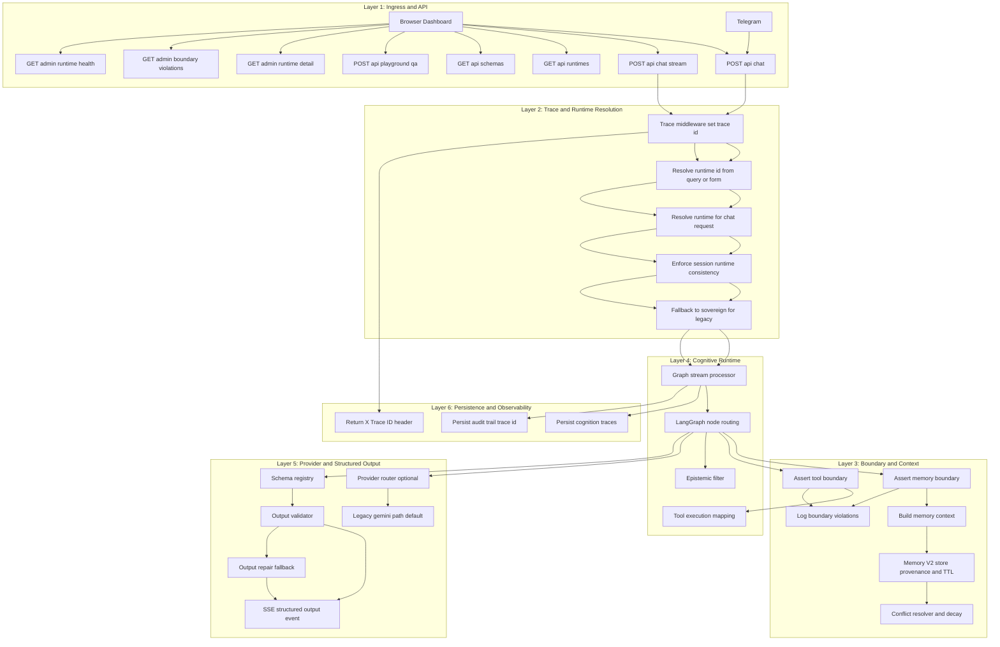
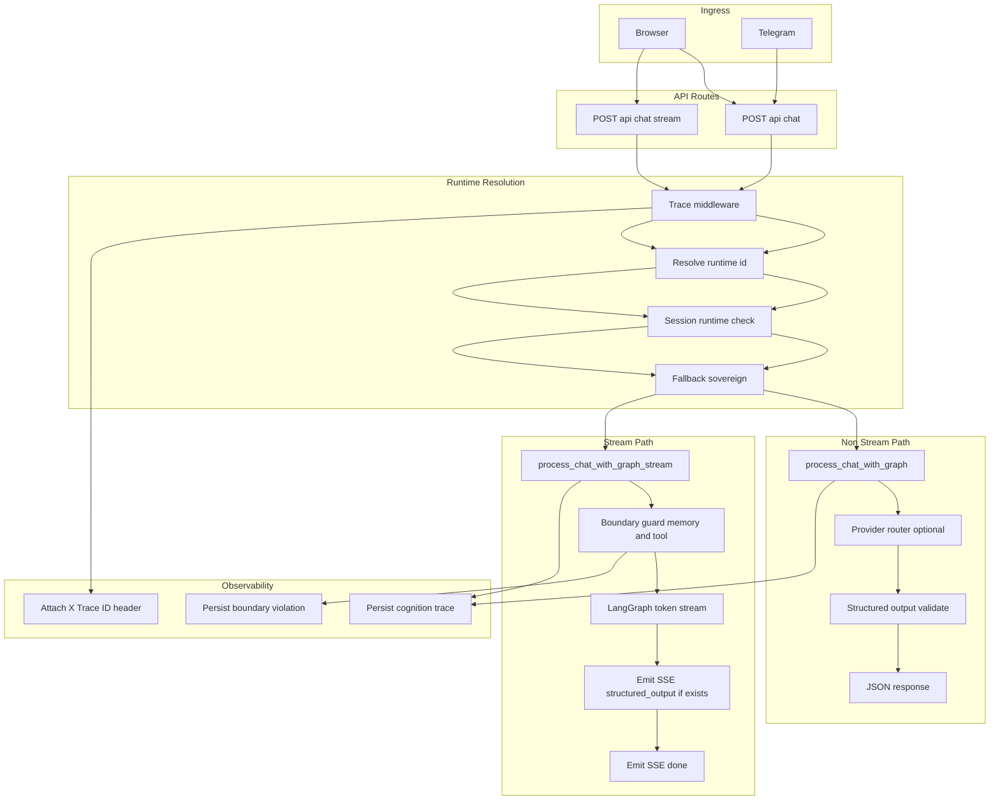

# Kuro AI V.2.1.0 Beta 1 "Runtime Sovereign" — SYSTEM_MAP

> Authoritative navigation map for the repository. Traced function-by-function
> from the true entrypoint (`main.py`) outward. Only source code under version
> control is listed; runtime caches, logs, SQLite files, virtualenvs, and build
> artefacts are intentionally excluded.

> **V2 COMPLETE TAG (2026-05-15):** Batch V2 HARDENED sudah dieksekusi sampai
> Prompt `7` (Prompt `-1..7` complete), tanpa menambahkan goal/decision engine
> baru di batch ini.

> **KRC REFOCUS TAG (2026-05-27):** Kuro Research Center profile mode is
> additive and playground-first. `KURO_APP_PROFILE=legacy` preserves legacy
> behavior; `KURO_APP_PROFILE=krc` refocuses UI V1, schedulers, and knowledge
> sharing around Kuro Playground, approved knowledge, ingestion, and research
> export/report support.

## Executive Summary (User-Friendly Overview)

**Note on Telegram**: Kuro AI uses Telegram for both *outbound* proactive notifications (e.g. Sentinel alerts, Dreaming cycle updates) and *inbound* two-way chat commands. Messages are processed via the same LangGraph reasoning core as the Web Dashboard.


Kuro AI is your **Intelligent Personal Sovereign**—a sophisticated digital companion designed to orchestrate your dissertation research, system security, and daily workflows into one seamless experience.

**What Kuro Does for You:**
1. **Perpetual Memory**: Kuro never forgets. Every critical discussion, dissertation commitment, and research insight is preserved and indexed for instant retrieval.
2. **Proactive Dissertation Partner**: Beyond a simple chatbot, Kuro acts as a "Natural Agent." It understands your long-term goals and will proactively challenge ideas or realign efforts if they stray from your dissertation's novelty gap.
3. **Security & Quality Gatekeeper**: With its specialized "Auditor" persona, Kuro strictly enforces high standards, ensuring your technical implementations are robust, compliant, and well-documented.
4. **Autonomous Sentinels**: Kuro works for you even when you aren't chatting. Background processes monitor system health, track global security threats (CVEs), and manage your fitness commitments.

**In essence**: Kuro is your "Second Brain," ensuring you stay focused on the "Big Picture" (your PhD) while it handles the complex technical and organizational heavy lifting.

**How It Works (Simplified Flow):**
- **Input**: You send a message, file, or instruction via the Dashboard or Telegram.
- **Process**: Kuro's "Brain" (Reasoning Core) orchestrates a multi-layered agency model:
    - **Memory Retrieval & Auto-RAG**: Searches your long-term memory and automatically refines the search query if the first attempt is insufficient.
    - **Executive Control (T1 — Intentional Agent)**: Filters out impulsive or irrelevant requests ("bloatware") and performs "imaginative simulations" to choose the best response strategy.
    - **Metacognitive Review (T2 — Rational Agent)**: Evaluates whether the plan aligns with your dissertation goals and checks the strength of retrieved evidence.
    - **Shared Agency (T3 — Social Agent)**: References our mutually agreed-upon commitments to act as your proactive research partner, not just a passive tool.
- **Output**: Kuro provides a verified, context-aware response and automatically saves important new facts to its long-term memory to keep your project evolving.

## Project Summary

- **Purpose**: Kuro is Master Pantronux's personal AI Sovereign — a unified
  FastAPI application that fuses a LangGraph reasoning loop, a 3-layer memory
  system (recent chat → short-term summary → long-term semantic + SSoT),
  and proactive sentinels (CVE, fitness) into one cohesive assistant accessible
  from a web dashboard and Telegram.
- **V1.2.0 Beta 1 Focus**: End-to-end hardening release covering memory consistency, DB resiliency/retry+migration baseline, chat/SSE reliability, Market Sentinel safeguards, Telegram retry+DLQ, UI/RBAC hardening, observability expansion, and topology/contract test coverage.
- **Enterprise Major Refactor status**: Prompts `-2..14` have been executed as
  an additive, feature-flagged enterprise refactor. The legacy runtime remains
  the default path; Memory V3, Chat V2, provider registry, governed tools,
  Market Sentinel V2, Telegram V2, API V2, and enterprise observability are
  present behind explicit flags. The separate Frontend V2 shell has been
  retired; `index.html` is the single dashboard shell.
- **Kuro Research Center Refocus status**: Phases `0..10` have been executed
  as an additive profile-mode refocus. Kuro Stack (KS) owns daily chat
  separately; KRC owns canonical research knowledge and exposes only the
  approved Knowledge API to KS/KKG callers. No KS database or daily history is
  shared with KRC.
- **Tech stack**:
  - Backend: FastAPI, LangGraph, `google-genai` (Gemini),
    APScheduler, SQLite, ChromaDB, Mem0 (via `perpetual_memory.py`),
    Arize Phoenix + OpenTelemetry.
  - Frontend: Vanilla JS on Jinja2 templates.
  - External: Telegram Bot API, Serper.dev, Proxmox VE API, NVD CVE feed,
    OpenClaw skill bridge.
- **Architecture pattern**: Monolithic FastAPI process (`main.py`) owning
  auth, routing, schedulers and WebSocket fan-out. Reasoning is delegated to
  a LangGraph state machine (`kuro_backend/langgraph_core.py`) with 
  **thread-based persistence** for multi-user isolation. Nodes call into a 
  layered memory stack (`memory_coordinator` → `memory_manager`
  + `perpetual_memory`) and feature services. Background sentinels
  (CVE dreaming, fitness, proactive events) run on APScheduler
  alongside the request loop. A separate `OpenClaw` process is reached via
  HTTP bridge for privileged skill execution.

## Evolution & Core Milestones

### V2.1.0 Beta 1 Runtime Sovereign (Prompt -1..7 Complete)

- **Execution status**: Complete for V2 HARDENED scope (`-1..7`).
- **Completed phases**:
  - Prompt `-1`: safety prep, backup, pre-migration inventory, baseline tests.
  - Prompt `0`: architecture snapshot docs + V2 scaffolding + runtime YAML configs.
  - Prompt `1`: runtime registry/context + runtime-aware chat/session path + runtime routes.
  - Prompt `2`: cognitive boundary guard + boundary violation persistence + admin audit route.
  - Prompt `3`: memory stratification/provenance store + conflict resolver + decay engine scheduler.
  - Prompt `4`: structured output registry/validator/repair + schema routes + SSE structured event.
  - Prompt `5`: provider abstraction adapter mode + router flag (`KURO_PROVIDER_ROUTER_ENABLED=false` default).
  - Prompt `6`: QA playground runtime vertical (`/api/playground/qa/*`) + kill-switch flag.
  - Prompt `7`: trace middleware + cognition traces + runtime health endpoint + vocabulary sanitization + evaluation artifacts.
- **Important constraints preserved**:
  - Legacy `/api/chat/stream` flow without `runtime_id` remains backward-compatible.
  - Legacy streaming path remains active when provider router flag is disabled (default).

### Enterprise Major Refactor (Prompts -2..14 Complete)

- **Execution status**: Complete for the Codex enterprise prompt pack through
  Phase 14 documentation and acceptance.
- **Safety model**: all enterprise replacements are additive and guarded by
  explicit `KURO_*_V2_ENABLED` or enterprise flags. Defaults stay off unless
  deployment profiles or `.env` opt in.
- **Core packages added**:
  - `kuro_backend/storage/` for SQLite connection policy, idempotency,
    migration history, retention helpers, health, and data catalog views.
  - `kuro_backend/memory_v3/` for evented memory writes, canonical items,
    assertions, links, provenance, access logging, privacy, retention, and
    retrieval grounding.
  - `kuro_backend/chat_v2/` for additive chat/session routes, SSE streaming,
    attachment contracts, session settings, and telemetry.
  - `kuro_backend/providers/` for provider adapters, model alias registry,
    fallback routing, usage metadata, streaming normalization, and the optional
    local Ollama adapter (`ollama_local`, default off).
  - `kuro_backend/tools_v2/` for governed tools, approvals, audit log,
    Deep Research V2 jobs, durable tasks, reminders, agent mode, and web search.
  - `kuro_backend/market_v2/` for source registry, collection, freshness,
    triangulation, cache, alerts, and admin health.
  - `kuro_backend/telegram_v2/` for webhook handling, sender mappings,
    outbound queue, DLQ, command parsing, and retry controls.
  - `kuro_backend/api_v2/` for normalized responses, pagination, authz,
    rate limiting, API V2 middleware, and public OpenAPI filtering.
  - `kuro_backend/enterprise_observability/` for audit/security events,
    metrics, traces, eval summaries, and admin dashboards.
  - `kuro_backend/enterprise_ops/` for deployment profiles, startup validation,
    and public-safe liveness/readiness/health metadata.
- **Acceptance status**: suitable for a small enterprise pilot when flags are
  enabled gradually with rollback plans. Large enterprise production still
  needs tenant isolation, SSO/OIDC, stronger RBAC, PostgreSQL/pgvector option,
  external telemetry collector, and formal secrets management.

### Kuro Research Center Refocus (Phases 0..10 Complete)

- **Execution status**: Complete for the playground-first KRC refocus plan.
- **Profile control**: `KURO_APP_PROFILE=legacy` remains the default.
  `KURO_APP_PROFILE=krc` enables Kuro Research Center presentation and
  scheduler narrowing. `KURO_APP_PROFILE=dev` exposes KRC features for local
  debugging.
- **Product split**: Kuro Stack (KS) is the daily chat surface. KRC is the
  Kuro Playground research, ingestion, export/report, and canonical knowledge
  authority. KS/KKG integration reads through approved-only Knowledge API
  routes; KS chat history and databases are not shared with KRC.
- **UI contract**: UI V1 (`web_interface/templates/index.html` +
  `web_interface/static/js/app.js`) remains the production shell. Frontend V2
  is not reintroduced. KRC mode adds the Kuro Playground landing surface as the
  primary research action.
- **Research Console persona contract**: `KURO_APP_PROFILE=krc` locks the
  Research Console to the `advisor` persona. Persona switching remains
  available in legacy/dev profiles, but KRC defaults every chat/session request
  to Advisor without migrating old non-Advisor history.
- **Knowledge contract**: `kuro_backend/knowledge_center/` owns approved
  knowledge search/context, candidate review, redaction, policy, audit, and
  its KRC-owned SQLite store. Candidate writes default off.
- **Bloatware control**: daily chat affordances, market/ticker flows, agent
  tools, tasks/reminders, proactive jobs, fitness, and daily briefings are
  hidden or disabled by KRC flags instead of deleting working modules.
  Telegram remains available as an ops command center for server status,
  backup, queue/DLQ, and controlled actions.
- **Legacy QA deactivation**: `/api/playground/qa/*` remains in the codebase
  for compatibility, but KRC hides and disables it by default through
  `KURO_KRC_QA_PLAYGROUND_ENABLED=false` and
  `KURO_KRC_QA_PRODUCTIZATION_ENABLED=false`.
- **Compatibility preserved**: legacy mode, `/api/chat/stream`, admin auth,
  port 8443 deployment assumptions, and existing modules remain intact.

### V7.0 Reset Notes ("Lean Leviathan")

- **The "Lean" Philosophy Purge:** NeMo Guardrails, Compliance Scorers, the `voice_service` (TTS), and redundant legacy modules were fully excised from the repository to achieve maximum efficiency and limit bloatware.
- **QA Architect Persona Integration:** Strict adherence to Business Requirements Documents (BRD) is enforced by the QA Architect, integrated directly into the `memory_manager` and frontend.
- **Core DAG simplified:** `kuro_backend/langgraph_core.py` now follows
  `Input -> Memory Retrieval -> Tool/Action -> Response -> Memory Extraction`.
  Compliance and habit/reminder nodes are removed from runtime graph routing.
- **Long-term semantic memory:** `kuro_backend/memory_coordinator.py` +
  `kuro_backend/perpetual_memory.py` use Mem0 as the only long-term semantic
  source for chat context.
- **Short-term context policy:** prompt injection now prioritizes a raw
  10-15 turn episodic buffer (no summary compression in hot path) to prevent hallucinations.
- **Attachment continuity:** `main.py` persists `current_session_state`
  runtime context (attachments + extracted snippets) and
  `memory_coordinator.build_referent_grounding_block` prioritizes this state
  for deictic follow-ups like "edit previous result" / "add to that".
- **Legacy modules:** Legacy compliance, habits, and reminder endpoints return `410 Gone` to enforce the Lean architecture.

### V7.1.0 Reset Notes ("Sovereign Unbound")

- **The Final Purge:** The legacy Habits and Reminders system, the Live2D "Hijiki" mascot, and all voice (TTS) infrastructure were completely purged from the codebase.
- **Sovereign Rebranding:** The "Butler" persona has been evolved into the "Sovereign" persona, reflecting a more autonomous and sophisticated architecture.
- **Frontend Simplification:** Removed L2D canvas, tips/trivia bubble, and voice artifacts from the dashboard. `app.js` and `index.html` were sanitized for maximum performance.
- **Asset Removal:** Deleted redundant `.db` files, Live2D models, and legacy JS libraries.

### V7.2.0 Architecture Notes ("Natural Agency")

- **Three-Tier Control System:** Kuro transitions from a stimulus-driven processor to a Natural Agency model based on Tomasello (2025).
- **Auto-RAG (V7.2.1):** Implements a self-correction loop in the retrieval layer. `retrieval_grader_node` evaluates context relevance (relevant/ambiguous/irrelevant); `query_transform_node` rewrites queries or triggers Serper web-search failover at max retries (bounded loop).
- **Multi-User Memory Isolation (V7.2.1 Hardening):** Strict isolation of memory tiers (Short-term, Long-term, and Structured Context) across different users.
    - `memory_coordinator.py`: Grounding blocks and session state retrieval now require a strict `username` parameter to prevent "context bleeding" between sessions.
    - `personas.py`: Replaced hardcoded "Pantronux" references with dynamic `{master_name}` placeholders, allowing Kuro to maintain a unique self-identity for each user (e.g., as Master Faikhira's Senior Auditor).
    - `proactive_greeting.py`: Dashboard greetings are now personalized using the `master_name` from the user registry.
- **T1 Executive / Intentional Agent:** `attention_filter_node` classifies input intent; `executive_monitor_node` applies inhibitory filter (blocks bloatware/off-track inputs) and runs dual-draft imaginative simulation (advisor/consultant: Conservative vs Novel; auditor: Pass vs Adversarial-Fail).
- **T2 Metacognitive / Rational Agent:** `metacognitive_review_node` performs belief revision via `memory_coordinator.evaluate_alignment()`, comparing current input against BRD-backed `research_ledger` commitments. Incorporates `retrieval_grade` as an evidence-quality signal for realignment call-outs.
- **T3 Shared Agency / Social Agent:** `joint_goal_store` (SQLite-backed, survives restarts) stores joint dissertation commitments. Active commitments are injected as `[JOINT_COMMITMENTS]` block into every agency-persona response. Advisor/consultant/auditor personas updated with Coordination Partner framing and proactive call-out authority.
- **Cognitive Effort Allocator:** `agency/cognitive_effort.py` maps intent category to `low/medium/high` effort level, injecting scaled CoT depth into the system prompt.
- **Gating:** All agency nodes self-bypass in O(1) for non-agency personas (chill, tactical, chancellor).
- **New env vars:** `KURO_ALIGNMENT_THRESHOLD` (float, default `0.35`) — alignment conflict floor.

### V1.0.0 Beta 1 Architecture Notes ("Sovereign Cat")

- **Major Version Transition**: Promoted from Alpha/Legacy (V7.x) to V1.0.0 Beta 1, establishing a stable baseline for the "Magic/Sovereign Cat" era.
- **Hybrid Market Sentinel (Triangulation Engine)**:
    - `price_ticker_worker.py`: Dedicated quantitative anchor using `yfinance` for IDX tickers (.JK).
    - `market_sentinel.py`: Qualitative engine using Google Grounding + OpenClaw to triangulate news with price action.
- **Role-Based Access Control (RBAC)**:
    - Implemented a strict enforcement gate for the "System Status" menu. Non-Administrator users (e.g., `Faikhira`) are 100% blocked via both UI modal and backend checks.
- **Per-User File Isolation**:
    - **Physical Partitioning**: Uploaded files are now stored in `uploaded_files/{username}/{category}/` subfolders to prevent cross-user file collisions.
    - **Isolation Logic**: `main.py` and `app.js` now strictly filter file lists based on the authenticated `username`.
- **180-Day Automated Retention Pipeline**:
    - `file_retention_worker.py`: Autonomous worker running daily at 02:00 WIB.
    - **Archival Flow**: Files exceeding 180 days are analyzed by LLM (summarization + entity extraction) before physical deletion.
    - **Memory Persistence**: Intisari file disimpan ke Mem0 dan `research_ledger` (`archived_file_memory` kind), allowing Kuro to "remember" the contents of deleted files.
    - **Archive Metadata**: Sidecar JSON files are persisted in `.archive/{username}/` as permanent records.

### V1.0.0 Beta 3 Architecture Notes ("Chat Isolation & Anti-Halusinasi")

- **Epistemic Accountability Layer**: 3-tier verification injected into all agency persona system prompts.
    - **Tier-1 Source Audit**: Classifies every factual claim by source (Mem0/ChromaDB, Serper, inference, parametric).
    - **Tier-2 Claim Density Control**: Max 3 specific factual claims per paragraph without labeled source.
    - **Tier-3 Disclaimer Injection**: Auto-appends `⚠️ Epistemic Notice` block for [SPECULATIVE]/[INFERRED] claims.
- **Mandatory Claim Labeling Grammar**: `[VERIFIED: memory]` `[VERIFIED: search]` `[INFERRED]` `[SPECULATIVE]` `[UNKNOWN]`.
- **Hard Anti-Fabrication Rules**: Specific numbers, filenames, function names MUST carry source labels. No fabrication of file existence or code modules not in SYSTEM_MAP.
- **AutoRAG Integration**: When `retrieval_grade = 'irrelevant'` or `'ambiguous'`, Kuro must explicitly notify user before responding from parametric knowledge.
- **Post-Generation Enforcement**: `epistemic_filter.py` validates LLM output after generation — complements existing pre-generation prompt directives.
- **Epistemic Audit Trail**: `epistemic_log` table in `kuro_intelligence.db` records all labeled claims per session.
- **Domain-Aware Relaxation**: General technical/compliance knowledge (ISO, NIST, legal) is allowed from model as `[INFERRED]` — avoids over-restricting Kuro's existing broad knowledge authority.

### V1.0.0 Beta 3 Patch Run ("Observability & Semantic Cache Fix")

- **Phoenix Persistence (Item 1)**: Configures `PHOENIX_WORKING_DIR` and `PHOENIX_SQL_DATABASE_URL` in `config.py` to ensure OTLP traces survive process restarts.
- **Named Project Tracing (Item 2)**: Standardized `kuro-ai` project identity for all OpenTelemetry spans, moving away from default project clutter.
- **Robust Span Management (Item 3)**:
    - `trace_node` context manager updated with mandatory `record_exception` and `StatusCode.ERROR` for failed reasoning nodes.
    - `KURO_TRACE_SPAN_TIMEOUT_S` (default: 120s) enforces hard closure of spans to prevent pathologically high latency metrics.
- **Autonomous Evaluator (Item 5)**: 
    - `kuro_backend/evaluation/`: Automated reasoning quality scoring (groundedness, alignment).
    - `/api/evaluation/summary`: Administrator-only summary endpoint providing aggregated performance metrics.
- **Semantic Cache Invalidation (Item 6)**: Mandatory `invalidate_tag(username)` trigger added to `memory_coordinator.py` successful write paths to prevent stale data retrieval after memory updates.

### V1.0.0 Beta 4 Architecture Notes ("Sovereign Intelligence")

- **Cognitive Agent Model**: Transitions personas from shallow declarations to deep cognitive agents with reasoning protocols.
- **Autonomous Dissertation Research**:
    - `advisor_research_node`: Implements proactive research grounding for the `advisor` persona.
    - Automatically fires `serper_scholar` and `serper_news` based on extracted research claims without user instruction.
    - Controlled by `KURO_ADVISOR_AUTO_SEARCH` and `KURO_ADVISOR_MAX_SERPER_CALLS`.
- **Source Provenance Tracking**:
    - `research_sources` table in `kuro_intelligence.db`: Tracks title, link, snippet, and academic metadata (year, citations) for all auto-retrieved materials.
    - Evidence trail persisted in `research_ledger.source_provenance` as JSON metadata.
- **Enhanced Serper Integration**: `serper_scholar` and `serper_news` registered as Gemini-callable tools with normalized academic metadata.
- **Cognitive Effort "Research" Tier**: New effort level that triggers extended CoT reasoning and autonomous retrieval for dissertation-grade queries.

### V1.0.0 Beta 5 Architecture Notes ("Sovereign Chat")

- **Sovereign Control Toolbar**: Injected dynamic toolbars into chat bubbles for message-level interaction (Copy, Edit, Regenerate, Bookmark).
- **Persistent Message Versioning**: `message_edits` table tracks the lineage of edits and regenerations, ensuring no data loss when branching history.
- **Session Pinning & Protection**: Added `is_pinned` status to `chat_sessions`. Pinned sessions are prioritized in the UI and protected from accidental deletion (`403 Forbidden`).
- **Background Auto-Titling**: Integrated asynchronous task generation in `langgraph_core.py` using a classifier model to generate concise session titles upon the first message.
- **In-Session Keyword Search**: Client-side search modal with backend keyword filtering (`search_messages_in_session`).
- **Markdown/Text Export**: Clean history formatting for archival purposes via `/api/chats/{chat_id}/export`.
- **Draft Preservation**: Persistent `sessionDrafts` object in `app.js` ensures unsent messages survive session switching.

### V1.0.0 Beta 5 Hotfix Architecture Notes ("Sovereign Shield")

- **Pre-migration snapshot**: `chat_history.py`, `auth_db.py`, `finance_db.py`,
  `intelligence_db.py`, and `memory_manager.py` now request a compressed
  pre-migration snapshot via `backup_manager.snapshot_pre_migration()` before
  live schema bootstrap touches an existing SQLite file.
- **Nightly automated backup (01:00 WIB)**: `kuro_backend/backup_manager.py`
  creates WAL-safe SQLite backups via `VACUUM INTO`, gzips runtime JSON state,
  writes `backup_manifest.json`, and prunes daily / weekly / pre-migration
  retention windows under `backups/`.
- **Backup audit trail**: `kuro_backend/intelligence_db.py` now owns the
  `backup_log` table plus `log_backup_start`, `log_backup_complete`,
  `get_backup_history`, and `get_last_backup_status`.
- **Admin backup routes**: `main.py` adds `/api/backup/status`,
  `/api/backup/run`, and `/api/backup/history`, all guarded by JWT cookie auth
  plus the `ADMIN_USERNAME` check.
- **Global test DB isolation**: `conftest.py` now autoredirects all active DB
  paths and runtime JSON state into `tmp_path`, preventing the test suite from
  mutating production `*.db` files.

### V1.0.0 Beta 6 Architecture Notes ("Sovereign Chat")

- **Universal Export Engine**:
    - `kuro_backend/export_engine/` introduces a renderer-first export subsystem for `chat_session`, `selected_messages`, `intelligence_report`, `compliance_report`, and `market_snapshot`.
    - Sync export formats: `md`, `txt`, `json`, `csv`, `xlsx`, `docx`.
    - Async export format: `pdf` with job tracking + download lifecycle.
- **Export Persistence & Auditability**:
    - `kuro_backend/intelligence_db.py` now owns `export_jobs` and `export_audit_log`.
    - Export jobs persist `briefing_date` and `standard` to support Phase 4 targets cleanly.
- **Persona-Aware Smart Export Suggestions**:
    - `main.py` now derives export suggestions from persona + output shape and injects them into sync responses and SSE completion metadata.
    - `chat_history.py` persists per-message `export_suggestions_json`, allowing suggestion buttons to survive page reload and history fetches.
    - Persona defaults:
        - `auditor` → `xlsx`
        - `advisor` → `pdf`, `docx`, `xlsx`
        - `chancellor` → `xlsx`, `csv`
- **Message-Scoped QA Export**:
    - When available, the assistant message ID is captured after persistence and routed into `selected_messages` export so auditor quick actions produce narrow spreadsheet output instead of exporting the whole chat.
- **Frontend Export UX**:
    - `web_interface/static/js/app.js` now renders persistent, inline quick-export buttons from export suggestion metadata.
    - `web_interface/templates/index.html` export modal now exposes all supported chat export formats through the dashboard.
- **Universal export subsystem**:
    - `kuro_backend/export_engine/export_manager.py`: Orchestrates sync export (`md`, `txt`, `json`, `csv`, `xlsx`, `docx`) and async PDF job processing.
    - `kuro_backend/export_engine/export_registry.py`: Registry-based exporter lookup.
    - `kuro_backend/export_engine/export_security.py`: Ownership validation + payload sanitization before rendering.
    - `kuro_backend/export_engine/renderers/chat_renderer.py`: Renderer layer for `chat_session` and `selected_messages`.
    - `kuro_backend/export_engine/renderers/intelligence_renderer.py`: Renderer layer for `intelligence_report`.
    - `kuro_backend/export_engine/renderers/compliance_renderer.py`: Renderer layer for `compliance_report` (admin-only because DB is global).
    - `kuro_backend/export_engine/renderers/finance_renderer.py`: Renderer layer for `market_snapshot`.
    - `kuro_backend/export_engine/exporters/*`: Format writers for Markdown, TXT, JSON, CSV, XLSX, DOCX, and PDF.
- **Export persistence**:
    - `kuro_backend/intelligence_db.py` now owns `export_jobs` and `export_audit_log`.
- **New routes**:
    - `POST /api/export`
    - `GET /api/export/history`
    - `GET /api/export/{job_id}`
    - `GET /api/export/{job_id}/download`
- **Backward compatibility**:
    - `GET /api/chats/{chat_id}/export` remains active for `md` and `txt`, but now delegates into the export engine.

### V1.0.0 Beta 6 Hotfix 1 Extension Notes ("Admin Ingestion Control Center")

- **Admin-only ingestion subsystem**:
    - `kuro_backend/ingestion_center/`: new package for dataset registry, ingestion orchestration, audit lineage, lifecycle control, and analytics.
    - Dedicated SQLite store `kuro_ingestion.db` isolates ingestion metadata from chat, intelligence, and short-term memory databases.
- **Registry-first ingestion flow**:
    - Uploads are stored under `uploaded_files/{username}/ingestion_center/`.
    - Pipeline shape: `parse_file() -> clean_text() -> semantic_chunk() -> embed_chunks() -> register_chunks() -> finalize`.
    - Vector failures degrade to `partially_indexed` without losing dataset, job, or chunk records.
- **Chroma-owned ingestion vectors**:
    - Ingestion vectors are written to a dedicated Chroma root under `kuro_chromadb/ingestion_center`.
    - Chat runtime now bridges ingestion retrieval as an additional owner-scoped context layer (always-on) with silent fallback.
    - Only `completed` and `partially_indexed` datasets are eligible for chat grounding; `archived` / `deleted` remain excluded.
    - User-facing provenance language is natural sentence style with document + **bagian** references (no raw technical markers).
- **Lifecycle and observability**:
    - New admin routes: `/ingestion`, `/ingestion/analytics`, `/api/ingestion/*`.
    - Supports upload, reindex, archive, delete, search, chunk explorer, lineage viewer, vector health, orphan inspection, retrieval analytics, and dataset-scoped semantic graph payloads.
- **Admin navigation gate**:
    - Sidebar renders ingestion menu entries only for the administrator.
    - Non-admin users are blocked both at menu visibility and direct route access (`403 Forbidden`).

### V1.1.0 Beta 1 Architecture Notes ("Sovereign Chat")

- **Canvas 3 Operational Maturity layer** introduced with default-safe feature flags (`OFF`) for zero-regression baseline.
- **Tool Governance Runtime**:
  - New `kuro_backend/tools/tool_*` governance modules for permission routing, risk scoring, budget checks, and audit trace logging.
  - New graph node `tool_governance_node` gates tool execution before `tool_node` when enabled.
- **Runtime Modes + Cognitive Budget**:
  - `runtime_mode_node` resolves mode profiles (`STRICT`, `BALANCED`, `CREATIVE`, `RESEARCH`, `ENTERPRISE`, `SAFE`).
  - Cognitive budget telemetry and enforcement trace are recorded for operational predictability.
- **Memory Canonicalization Pipeline**:
  - Memory write path now supports canonicalization metadata flow (`validation -> canonical_summary -> conflict handling -> temporal_score -> promotion`).
  - Canonicalization telemetry persisted to short-term operational logs when enabled.
- **Identity / Constitution / Boundaries**:
  - Response-time internal checks for identity drift, constitutional principles, and autonomy boundary violations.
  - Violations trigger safe degraded messaging while preserving SSE/API contract.
- **Source Reliability + Evaluation Runtime**:
  - Advisor research sources can be scored for reliability/trustworthiness before internal audit persistence.
  - New evaluation runtime snapshot computes hallucination, grounding, persona consistency, memory integrity, multi-model alignment, and governance compliance metrics.

### V1.2.0 Beta 1 Architecture Notes ("Sovereign Chat")

- **Memory/Storage hardening**:
  - Per-user Mem0 write serialization + dedup queue protection to reduce duplicate writes under concurrent load.
  - Atomic cache store+invalidate flow and hardened `kuro_memory.json` recovery path with backup fallback.
  - Shared SQLite utility layer (`db_utils.py`) with busy-timeout, retry/backoff, and migration baseline ledger (`migration_history`).
- **Chat/streaming hardening**:
  - Per-node timeout guard in LangGraph runtime with explicit SSE error path and deterministic stream termination.
  - Cursor pagination for chat history (`before_id`) and resumable SSE delivery via `Last-Event-ID` buffer replay.
- **Sentinel/Telegram hardening**:
  - Market HUD freshness checks + atomic snapshot current-version writes + deduplicated alert fingerprinting.
  - Telegram send retry pipeline with dead-letter queue (`failed_telegram_notifications`) and scheduled retry sweeper.
- **UI/RBAC + misc hardening**:
  - Frontend reconnect backoff, robust `authFetch`, draft persistence, export progress polling, and admin nav guarding.
  - Added topology/export diagnostics (`export_graph_topology`, `/api/openclaw/skills`, `/api/me`) and legacy 410 purge route coverage.

## Core Logic Flow (Function-Level Flowchart)

Layering tetap **monolith FastAPI + LangGraph core**, dan pada V2.1.0 Beta 1
jalur produksi sudah mencakup Prompt `-1..7`:
- **Ingress + tracing**: semua request masuk via route layer dan diberi `trace_id` (`X-Trace-ID`).
- **Runtime layer**: runtime request di-resolve (query/form), diselaraskan dengan `chat_sessions.runtime_id`, lalu fallback legacy ke `sovereign`.
- **Guard layer**: boundary guard memory/tool/prompt berjalan di mode `audit` atau `strict` (`KURO_V2_STRICT_MODE`).
- **Cognitive layer**: graph reasoning + memory retrieval + tool path + epistemic post-filter.
- **Output layer**: structured output (jika ada contract), SSE event `structured_output`, lalu completion event legacy.
- **Observability layer**: cognition trace disimpan ke DB, admin bisa audit violation dan runtime health.




### Core Logic Flow (Detailed Path Split)


Side-branches not drawn on trunk:
- **Admin ingestion center**: `/api/ingestion/*` and `/ingestion*` route ke `ingestion_manager -> ingestion_pipeline -> ingestion_registry`.
- **Scheduler jobs**: daily intelligence briefing, dreaming cycle, memory decay
  job, backup routines. KRC profile gates daily/market/Telegram/proactive
  jobs through `KURO_KRC_SCHEDULER_*` flags.
- **Legacy QA playground**: `interpret`, `generate-testcases`, `generate-gherkin`
  remain behind `KURO_QA_PLAYGROUND_ENABLED`; KRC additionally disables QA by
  default with `KURO_KRC_QA_PLAYGROUND_ENABLED=false` so Kuro Playground stays a
  single research surface.
- **Approved Knowledge API**: `/api/knowledge/health`,
  `/api/knowledge/search-approved`, `/api/knowledge/context-approved`,
  `/api/knowledge/sources/{source_id}`, and admin candidate review routes
  use KRC-owned storage and never expose chat history.

### Enterprise V2 Additive Data Flows

- **Capability discovery**: `/api/capabilities` reads
  `enterprise_flags.get_enterprise_flag_snapshot()` and returns a public-safe
  feature map without secrets, DB paths, prompts, or internal topology.
- **Admin control plane**: `/api/admin/enterprise-flags`,
  `/api/admin/storage/*`, `/api/admin/memory-v3/*`,
  `/api/admin/providers*`, `/api/admin/tools/*`,
  `/api/admin/market-v2/health`, `/api/admin/telegram-v2/*`,
  `/api/admin/observability/*`, `/api/ready`, and `/api/health` expose
  operator status while preserving existing admin authentication.
- **Memory V3**: legacy chat/memory writes can mirror into
  `memory_v3.store`, then `memory_v3.reader` retrieves scoped, provenance-aware
  context only when `KURO_MEMORY_V3_ENABLED=true`; legacy Mem0/Chroma context
  remains the fallback.
- **Chat V2**: `/api/chat/v2/stream` accepts the new chat contract, resolves
  session settings, streams normalized SSE events, optionally routes through
  `providers.registry`, and falls back to the legacy graph stream on provider
  failure.
- **Governed tools and research**: `/api/tools`,
  `/api/tools/{tool_id}/execute`, `/api/deep-research/jobs`, `/api/tasks`,
  and `/api/reminders` flow through `tools_v2.policy`, approvals, audit log,
  and durable SQLite stores.
- **Market Sentinel V2**: watchlist and analysis routes collect normalized
  market inputs, enforce freshness, triangulate evidence, cache reports, and
  deduplicate alerts before exposing user/admin views.
- **Telegram V2**: `/api/telegram/webhook` validates inbound payloads,
  records mappings and queued outbound messages, and lets admin retry DLQ
  items without changing the legacy notifier path.
- **API V2 middleware**: `/api/v2/*` routes normalize errors/responses, apply
  rate limits by path bucket, filter public OpenAPI output, and keep legacy
  `/api/*` behavior intact.
- **Dashboard UI**: the dashboard serves `index.html` only. The former
  feature-flagged Frontend V2 shell was removed so V1 can carry the dark-gray
  agent UX while preserving existing backend/playground behavior.

## Clean Tree

Source-only view. Everything listed below is either code, a template, a
declarative config, or a static asset shipped with the repo. Runtime
artefacts are excluded — see **Exclusions** at the bottom of this section.

```
.
├── main.py                      # FastAPI entrypoint, routes, schedulers
├── requirements.txt
├── CHANGELOG.md
├── INTEGRATION_HARDENING_DETAILS.md
├── SYSTEM_MAP.md                # this file
├── kuro_backend/
│   ├── version.py               # V.2.1.0 Beta 1 "Runtime Sovereign" single source of truth
│   ├── config.py                # env keys -> typed Settings
│   ├── db_utils.py              # shared SQLite connection/retry/migration helpers
│   ├── enterprise_flags.py      # enterprise refactor feature flag snapshot
│   ├── krc_profile.py           # KRC/legacy/dev profile flags and scheduler gates
│   ├── storage/                 # Storage V2 connections, migrations, catalog, idempotency
│   ├── api_v2/                  # response/error/rate-limit/OpenAPI V2 controls
│   ├── personas.py              # persona prompts + Anti-Halusinasi epistemic layer
│   ├── core.py                  # non-graph Gemini fallback
│   ├── langgraph_core.py        # graph nodes, streaming, tool dispatch
│   ├── runtime/                 # runtime registry/context/boundary loader
│   ├── output/                  # structured output schema/validation/normalization
│   ├── chat_v2/                 # additive Chat V2 contracts, settings, stream service
│   ├── providers/               # provider adapters, alias registry, fallback router
│   ├── memory_coordinator.py    # orchestrates 3-layer memory + evaluate_alignment
│   ├── memory_manager.py        # SQLite short-term + research ledger
│   ├── memory_v3/               # evented memory, provenance, conflicts, retention
│   ├── perpetual_memory.py      # Mem0 + Chroma wrapper
│   ├── ssot_shortcuts.py        # deterministic SSoT answers
│   ├── semantic_cache.py        # embedding-keyed response cache
│   ├── embedding_cache.py
│   ├── token_budget.py          # per-persona context sizing
│   ├── observability.py         # Phoenix + OTel bootstrap
│   ├── ui_mode_router.py        # English mode commands
│   ├── dashboard_broadcast.py   # /ws/dashboard fan-out
│   ├── telegram_notifier.py
│   ├── telegram_center/         # interactive Telegram cockpit: commands, callbacks, actions
│   ├── telegram_v2/             # webhook, outbound queue, mappings, DLQ, commands
│   ├── proactive_events.py
│   ├── proactive_greeting.py
│   ├── file_retention_worker.py  # 180-day retention & AI archival (V1.0)
│   ├── price_ticker_worker.py   # Quantitative market anchor (V1.0)
│   ├── market_v2/               # source registry, collectors, triangulator, alerts
│   ├── tools_v2/                # governed tools, approvals, tasks, reminders, research
│   ├── knowledge_center/        # approved knowledge API, candidates, policy, audit
│   ├── playground/qa/           # Optional legacy QA runtime helpers
│   ├── enterprise_observability/ # audit, security events, metrics, traces, evals
│   ├── enterprise_ops/          # deployment profiles, startup validation, health
│   ├── epistemic_filter.py      # Anti-Halusinasi claim labeling & hard-rule enforcement (V1.0)
│   ├── fitness_service.py
│   ├── intelligence_engine.py
│   ├── persona_history_admin.py
│   ├── dreaming_worker.py       # CVE + fiscal sentinels, reflection + CLI
│   ├── finance_db.py            # budgets, api_usage_daily, watched_symbols, prediction_watch
│   ├── pricing.py               # static Gemini USD/token estimates
│   ├── serper_tool.py
│   ├── auth_db.py               # schema only; *.db files excluded
│   ├── chat_history.py          # schema: uploaded_file_integrity + retention
│   ├── compliance_db.py
│   ├── intelligence_db.py
│   ├── ingestion_center/        # admin ingestion registry + lifecycle subsystem
│   │   ├── __init__.py
│   │   ├── ingestion_manager.py
│   │   ├── ingestion_pipeline.py
│   │   ├── ingestion_registry.py
│   │   ├── ingestion_audit.py
│   │   ├── ingestion_security.py
│   │   ├── ingestion_scheduler.py
│   │   ├── chunking_engine.py
│   │   ├── embedding_manager.py
│   │   ├── semantic_registry.py
│   │   ├── retrieval_analytics.py
│   │   ├── chroma_inspector.py
│   │   ├── renderers/
│   │   └── schemas/
│   ├── agency/                  # V7.2 Natural Agency sub-package
│   │   ├── __init__.py
│   │   ├── joint_goal_store.py  # SQLite joint commitments (T3 Shared Agency)
│   │   └── cognitive_effort.py  # effort allocator low/medium/high (T2)
│   ├── services/
│   │   ├── __init__.py
│   │   ├── core_service.py      # sync revision management (purged logic)
│   │   ├── schemas.py           # Pydantic contracts
│   │   └── async_adapter.py
│   ├── tools/
│   │   ├── __init__.py
│   │   ├── base_tools.py        # Gemini tool surface
│   │   └── system_tools.py
│   ├── execution/
│   │   ├── openclaw_bridge.py   # HTTP + circuit breaker
│   │   └── service.py           # sync wrapper
├── web_interface/
│   ├── templates/
│   │   ├── index.html           # single dashboard shell
│   │   ├── login.html
│   │   ├── intelligence.html
│   │   ├── ingestion_center.html
│   │   ├── ingestion_analytics.html
│   │   └── compliance.html
│   └── static/
│       ├── js/
│       │   ├── app.js           # chat UI, WS client, UI modes
│       │   ├── ingestion_center.js
│       │   └── semantic_graph.js
│       ├── css/                 # dashboard styles
│       └── vendor/
├── openclaw_skills/
│   ├── harvest_gemini_share/
│   │   ├── harvest_gemini_share.py
│   │   └── README.md
│   └── vulnerability_scan/
│       ├── vulnerability_scan.py
│       └── README.md
│   ├── market_analysis/
│   │   ├── market_analysis.py
│   │   └── README.md
│   └── prediction_market_scan/
│       ├── prediction_market_scan.py
│       └── README.md
├── maintenance/
│   ├── clean_duplicate_chat_history.py
│   ├── cleanup_orphan_chunks.py
│   ├── ingest_dataset.py
│   ├── rebuild_embeddings.py
│   ├── reindex_dataset.py
│   └── rebuild_compliance_base.py
├── scripts/
│   ├── migrate_persona_consultant_advisor.py
│   ├── purge_mem0_junk.py
│   ├── smoke_mem0_store.py
│   └── smoke_test_openclaw.py
├── tests/
│   ├── test_api_sse_contract.py
│   ├── test_approval_integrity.py
│   ├── test_branding.py
│   ├── test_cve_sentinel.py
│   ├── test_dreaming_worker.py
│   ├── test_finance_db.py
│   ├── test_finance_db_schema_guard.py   # V7.0 Leviathan schema guard + index presence
│   ├── test_fiscal_sentinel.py
│   ├── test_gemini_share_routing.py
│   ├── test_market_openclaw_tools.py
│   ├── test_market_sentinel.py
│   ├── test_memory_coordinator_contract.py
│   ├── test_memory_hardening.py
│   ├── test_db_hardening.py
│   ├── test_chat_hardening.py
│   ├── test_market_hardening.py
│   ├── test_telegram_hardening.py
│   ├── test_enterprise_refactor_baseline.py
│   ├── test_enterprise_feature_flags.py
│   ├── test_storage_v2.py
│   ├── test_memory_v3_core.py
│   ├── test_memory_v3_retrieval.py
│   ├── test_chat_v2.py
│   ├── test_provider_registry_v2.py
│   ├── test_provider_ollama.py
│   ├── test_provider_ollama_smoke_contract.py
│   ├── test_tools_v2.py
│   ├── test_market_v2.py
│   ├── test_telegram_v2.py
│   ├── test_api_v2.py
│   ├── test_frontend_v1_redesign.py
│   ├── test_enterprise_observability.py
│   ├── test_enterprise_ops.py
│   ├── test_performance_bugfix_sweep.py
│   ├── test_rbac_routes.py
│   ├── test_langgraph_topology.py
│   ├── test_ingestion_api.py
│   ├── test_ingestion_chroma_health.py
│   ├── test_ingestion_db_schema.py
│   ├── test_ingestion_graph.py
│   ├── test_ingestion_lifecycle.py
│   ├── test_ingestion_search.py
│   ├── test_persona_context_budget.py
│   ├── test_personas_english.py
│   ├── test_proactive_events.py
│   ├── test_proactive_greeting.py
│   ├── test_referent_grounding.py
│   ├── test_shortcuts_finance.py
│   ├── test_smart_read_flow.py
│   ├── test_sync_revision_contract.py
│   ├── test_ui_mode_router.py
│   ├── test_upload_filename_generation.py
│   └── test_version.py
├── profile/
│   ├── kuro_avatar.png
│   ├── favicon.ico
│   └── live2d/hijiki/           # Cubism source + runtime model3.json
├── certs/                       # cert.pem / key.pem for HTTPS
└── db/                          # reserved directory for future migrations
```

**Exclusions honoured** (not listed above, never committed as code):
`__pycache__/`, `venv/`, `.venv/`, `node_modules/`, `.git/`, `kuro_chromadb/`,
`phoenix_data/`, `uploaded_files/`,
`logs/`, all `*.db` files (`kuro_auth.db`,
`kuro_chat_history.db`, `kuro_compliance.db`, `kuro_habits.db`,
`kuro_intelligence.db`, `kuro_reminders.db`, `kuro_short_term.db`, plus
backups like `kuro_chat_history.db.backup_*`), all `*.log` /
`*.log.YYYY-MM-DD`, and the standalone `kuro_memory.json` +
`master_profile.json` runtime state (covered under **Data & Config**).

## Module Map (The Chapters)

### Entrypoint
- [`main.py`](main.py) — *public*: `app` (FastAPI), `verify_password`,
  `create_access_token`, `validate_token`, `save_upload_file`,
  `api_success`, `api_error`, and the FastAPI route handlers spanning
  `/api/login`, `/api/chat`, `/api/chat/stream`,
  `/ws/dashboard`, `/api/compliance*`,
  `/api/intelligence*`, `/api/finances/*`, `/api/persona*`, `/api/observability/*`,
  `/ingestion`, `/ingestion/analytics`, `/api/ingestion/*`,
  `/api/capabilities`, `/api/admin/enterprise-flags`,
  `/api/admin/krc/profile`, `/api/knowledge/*`, `/api/admin/knowledge/*`,
  optional legacy `/api/playground/qa/*`,
  `/api/admin/storage/*`, `/api/admin/memory-v3/*`,
  `/api/chat/v2/stream`, `/api/models`, `/api/admin/providers*`,
  `/api/admin/providers/ollama/*`,
  `/api/tools`, `/api/deep-research/jobs`, `/api/tasks`,
  `/api/market-v2/*`, `/api/telegram/webhook`, `/api/admin/telegram-v2/*`,
  `/api/v2/*`, `/api/admin/observability/*`,
  `/api/evaluation/summary` (**Beta 3** — Admin-only aggregated quality metrics),
  `/api/backup/status`, `/api/backup/run`, `/api/backup/history`,
  `/api/system-status`, `/api/live`, `/api/ready`, `/api/health`. Also wires three APScheduler
  `BackgroundScheduler` instances (`_hardware_sentinel_scheduler`) and the Uvicorn boot thread.

### KRC Refocus Packages
- [`kuro_backend/krc_profile.py`](kuro_backend/krc_profile.py) — *public*:
  `get_app_profile`, `is_krc_feature_enabled`, `is_krc_scheduler_enabled`,
  and `get_krc_profile_snapshot`. This is the profile-mode control plane for
  legacy/KRC/dev behavior.
- [`kuro_backend/knowledge_center/`](kuro_backend/knowledge_center/) —
  *public*: approved-only search/context routes, source metadata routes,
  candidate submission/review, policy/auth helpers, redaction, audit logging,
  and the KRC-owned knowledge SQLite store. Candidate writes default off.
- [`kuro_backend/playground/qa/`](kuro_backend/playground/qa/) — *public*:
  optional legacy requirement parsing, testcase generation, Gherkin generation,
  ambiguity analysis, coverage matrix, export-bundle preparation, and
  `QARuntime`. KRC mode disables this by default.

### Enterprise V2 Packages
- [`kuro_backend/enterprise_flags.py`](kuro_backend/enterprise_flags.py) —
  *public*: `ENTERPRISE_FLAG_NAMES`, `is_enabled`,
  `require_feature_enabled`, `get_enterprise_flag_snapshot`.
- [`kuro_backend/storage/`](kuro_backend/storage/) — *public*:
  `get_connection`, `run_migration`, `get_migration_history`,
  `get_storage_health`, `get_data_catalog`, `record_idempotency_result`.
- [`kuro_backend/api_v2/`](kuro_backend/api_v2/) — *public*:
  `create_api_v2_router`, `install_api_v2_middleware`, normalized response
  models, error payloads, pagination helpers, authz helpers, and rate limit
  buckets.
- [`kuro_backend/chat_v2/`](kuro_backend/chat_v2/) — *public*:
  `create_chat_v2_router`, session settings helpers, attachment contracts,
  streaming event helpers, and Chat V2 telemetry.
- [`kuro_backend/providers/`](kuro_backend/providers/) — *public*:
  provider adapters for Gemini/OpenAI/Anthropic/DeepSeek/Ollama, model alias
  registry, fallback router, streaming adapter, local routing guard, and usage
  summaries. `ollama_provider.py` uses direct HTTP to native Ollama
  `/api/chat` and optional OpenAI-compatible `/v1/chat/completions`.
- [`kuro_backend/memory_v3/`](kuro_backend/memory_v3/) — *public*:
  `write_memory_event`, retrieval reader helpers, provenance builders,
  conflict detection, privacy redaction, retention, and health snapshots.
- [`kuro_backend/tools_v2/`](kuro_backend/tools_v2/) — *public*:
  tool registry, policy checks, executor router, approval queue, audit log,
  Deep Research V2 jobs, task/reminder stores, agent mode, and web search.
- [`kuro_backend/market_v2/`](kuro_backend/market_v2/) — *public*:
  source registry, collectors, normalizer, freshness checks, triangulator,
  report cache, alert deduplication, telemetry, and route factory.
- [`kuro_backend/telegram_v2/`](kuro_backend/telegram_v2/) — *public*:
  Telegram webhook security, inbound command parser, sender mappings, bounded
  outbound queue, DLQ retry helpers, notifier, and route factory.
- [`kuro_backend/enterprise_observability/`](kuro_backend/enterprise_observability/) —
  *public*: audit writer, security event recorder, metric recorder, trace
  exporter, eval recorder, and admin dashboard router.
- [`kuro_backend/enterprise_ops/`](kuro_backend/enterprise_ops/) —
  *public*: deployment profiles, startup validation, liveness/readiness/health
  snapshot helpers.

### Reasoning Core
- [`kuro_backend/langgraph_core.py`](kuro_backend/langgraph_core.py) —
  *public*: `KuroState` (now includes `chat_id: Optional[str]`), `build_kuro_graph`,
  `process_chat_with_graph_stream` (now accepts `chat_id`),
  `process_chat_with_graph` (now accepts `chat_id`),
  `supervisor_node`, `memory_retrieval_node`, `retrieval_grader_node` (Auto-RAG),
  `query_transform_node` (Auto-RAG), `attention_filter_node` (T1),
  `advisor_research_node` (Beta 4 — Autonomous Grounding),
  `executive_monitor_node` (T1), `metacognitive_review_node` (T2),
  `response_node` (now passes `chat_id` to `build_context_for_llm`),
  `tool_node`, `memory_extraction_node`.
  **Beta 2**: `_persist_short_term_and_enqueue_writes()` now passes `chat_id`.
  `chat_context` auto-trigger via `maybe_trigger_chat_context()` in post-response tasks.
  Orchestrates the Tomasello-inspired 3-tier control system and self-correcting retrieval loop.
- [`kuro_backend/personas.py`](kuro_backend/personas.py) — *public*:
  `build_system_instruction`, `get_persona_instruction`. English prompts
  for consultant / advisor / chill / tactical / chancellor.
  Updated with Shared Agency (T3) coordination partner protocols.

### Agency (T1-T3)
- [`kuro_backend/agency/joint_goal_store.py`](kuro_backend/agency/joint_goal_store.py) —
  *public*: `add_commitment`, `get_active_commitments`, `format_for_prompt`.
  SQLite-backed persistent store for T3 Shared Agency dissertation goals.
- [`kuro_backend/agency/cognitive_effort.py`](kuro_backend/agency/cognitive_effort.py) —
  *public*: `get_effort_level`, `get_cot_injection`.
  T2 allocator that scales Chain-of-Thought reasoning depth (low/medium/high) based on input intent.

### Memory & SSoT
- [`kuro_backend/memory_coordinator.py`](kuro_backend/memory_coordinator.py)
  — *public*: `build_context_for_llm` (adds `finance_block` for
  `chancellor`; now filters by `chat_id`), `build_context_for_llm_async`,
  `build_gemini_contents_parts`, `build_referent_grounding_block` (now filters
  by `chat_id`), `apply_path_tokens_to_runtime`, `render_summary_for_prompt`,
  `build_compressed_short_term_text` (now filters by `chat_id`),
  `prefetch_mem0`, `take_prefetched_mem0`,
  `safe_mem0_retrieve`, `execute_memory_write_task`,
  `execute_mem0_extract_task`,
  `record_mutation`, `apply_openclaw_execution_result`.
  **Beta 2 additions**: `generate_chat_context(chat_id, persona_scope, username)`
  — generates compressed context summary using Gemini 3 Flash;
  `maybe_trigger_chat_context()` — checks threshold and triggers regeneration.
  Constants: `CHAT_CONTEXT_REFRESH_THRESHOLD`, `CHAT_CONTEXT_MODEL`.
- [`kuro_backend/memory_manager.py`](kuro_backend/memory_manager.py) —
  *public*: `load_master_profile`, `save_master_profile`,
  `get_master_profile_formatted`, `update_master_profile`,
  `get_active_persona`, `set_active_persona`, `normalize_persona`,
  `get_runtime_context_value`, `set_runtime_context_value`,
  `init_short_term_db`, `get_short_term_with_ids` (now filters by `chat_id`),
  `get_short_term` (now filters by `chat_id`),
  `get_short_term_summary` (+ `_json`, `upsert_*`),
  `append_research_ledger` (+ `_batch`), `query_research_ledger` (+
  `_since`), `query_short_term_summaries_recent`,
  `query_short_term_latest_timestamp`, `acquire_dreaming_lease`,
  `release_dreaming_lease`, `insert_dreaming_cycle`,
  `update_dreaming_cycle`, `dream_notification_seen`,
  `mark_dream_notification`.
  **Beta 2**: `short_term` table now has `chat_id` column + index.
  `add_short_term()`, `get_short_term()`, `get_short_term_with_ids()` now
  accept and filter by `chat_id`.
- [`kuro_backend/llm_utils.py`](kuro_backend/llm_utils.py) —
  *public*: `generate_chat_title`, `generate_chat_context_summary`.
  **Beta 2**: `generate_chat_context_summary()` — generates compact chat context
  summary using Gemini (model from `KURO_CHAT_CONTEXT_MODEL` env, default
  `gemini-3-flash-preview`). Returns JSON with topic, decisions, entities,
  open_questions, technical_specs.
- [`kuro_backend/perpetual_memory.py`](kuro_backend/perpetual_memory.py) —
  *public*: `PerpetualMemory`, `get_memory_client`,
  `coerce_mem0_search_results`, `extract_json_from_text`. Wraps Mem0 +
  ChromaDB for long-term semantic recall.
- [`kuro_backend/ssot_shortcuts.py`](kuro_backend/ssot_shortcuts.py) —
  *public*: `ShortcutResult`, `try_shortcut`. Deterministic "today's
  habits / upcoming reminders / budget / recurring expenses / API spend"
  short-circuit before LLM.
- [`kuro_backend/semantic_cache.py`](kuro_backend/semantic_cache.py) —
  *public*: `lookup`, `store`, `invalidate_tag`, `clear`, `classify_tags`.
- [`kuro_backend/embedding_cache.py`](kuro_backend/embedding_cache.py) —
  *public*: `embed_query`, `clear_cache`.
- [`kuro_backend/token_budget.py`](kuro_backend/token_budget.py) —
  *public*: `approx_tokens`, `trim_section`, `apply_section_budget`,
  `build_persona_section_quotas`, `apply_persona_budget`,
  `enforce_global_ceiling`, `collapse_duplicate_blocks`.

### Feature Services
- [`kuro_backend/services/core_service.py`](kuro_backend/services/core_service.py)
  — *public*: `init_all_databases`, `register_main_event_loop`,
  `bump_data_revision`, `get_data_revision`. Owns cross-worker sync revision
  state in `app_sync_metadata`.
- [`kuro_backend/services/schemas.py`](kuro_backend/services/schemas.py) —
  *public*: `ReminderRecord`, `ReminderStats`, `HabitRecord`,
  `HabitCompletionStats`, `HabitGridRow`, `MonthlyHabitPayload`,
  `WeeklyHabitPayload`, `AiEvaluationRecord`, `MonthlyBudgetRecord`,
  `RecurringExpenseRecord`, `ApiUsageDailyRecord`.
- [`kuro_backend/services/async_adapter.py`](kuro_backend/services/async_adapter.py)
  — *public*: `run_db`, `as_awaitable`.
- [`kuro_backend/fitness_service.py`](kuro_backend/fitness_service.py) —
  *public*: `check_fitness_anomalies`, `run_fitness_sentinel`.
- [`kuro_backend/intelligence_engine.py`](kuro_backend/intelligence_engine.py)
  — *public*: `generate_daily_queries`, `execute_research`,
  `synthesize_intelligence`, `format_telegram_message`,
  `run_daily_research`.
- [`kuro_backend/backup_manager.py`](kuro_backend/backup_manager.py) —
  *public*: `get_backup_dir`, `snapshot_pre_migration`,
  `run_nightly_backup`, `run_nightly_backup_sync`, `run_manual_backup`,
  `get_backup_status`, `prune_old_backups`.
  Nightly/manual backup engine for Tier 1 runtime DB/JSON assets plus weekly
  directory snapshots (`kuro_chromadb/`, `uploaded_files/`).
- [`kuro_backend/evaluation/`](kuro_backend/evaluation/) — *module*:
  Reasoning quality monitoring.
  - [`autonomous_evaluator.py`](kuro_backend/evaluation/autonomous_evaluator.py):
    `run_evaluation_batch`, `get_evaluation_summary`.
  - [`dataset_builder.py`](kuro_backend/evaluation/dataset_builder.py):
    `build_dataset`, `EvalRecord`.
  - [`evaluation_scheduler.py`](kuro_backend/evaluation/evaluation_scheduler.py):
    Automated background evaluator loop.

- [`kuro_backend/persona_history_admin.py`](kuro_backend/persona_history_admin.py)
  — *public*: `get_persona_counts`, `list_backups`, `preview_reclassify`,
  `run_reclassify`, `override_persona`, `restore_persona_from_backup`.
- [`kuro_backend/proactive_events.py`](kuro_backend/proactive_events.py) —
  *public*: `ProactiveEvent`, `publish`, `publish_async`, `make_event`.
- [`kuro_backend/proactive_greeting.py`](kuro_backend/proactive_greeting.py)
  — *public*: `maybe_send`.
- [`kuro_backend/dreaming_worker.py`](kuro_backend/dreaming_worker.py) —
  *public*: `Finding`, `run_dreaming_cycle`, `collect_last_24h`, `main`
  (CLI entry; `--run-fiscal`). CVE scan, `_run_fiscal_sentinel`, reflection,
  Proxmox discovery helpers.

### Execution & Tools
- [`kuro_backend/tools/base_tools.py`](kuro_backend/tools/base_tools.py) —
  *public* (Gemini-registered callables): `list_my_files`,
  `list_project_files`, `read_pdf_content`, `universal_read`, `smart_read`,
  `parse_log_content`, `index_system_path`, `analyze_system_health`,
  `get_system_status`, `check_proxmox_infrastructure`, `process_video`,
  `parse_datetime`,
  `lookup_chroma_context`,
  `set_monthly_budget_tool`, `get_budget_tool`, `add_recurring_expense_tool`,
  `list_recurring_expenses_tool`, `get_daily_api_cost_tool`,
  `summarize_pdf`, `read_docx_content`, `read_xlsx_content`,
  `read_pptx_content`, `summarize_document`, `extract_gemini_share_url`,
  `task_suggests_gemini_harvest`, `resolve_harvest_gemini_routing`,
  `advanced_execution_tool`.
- [`kuro_backend/tools/system_tools.py`](kuro_backend/tools/system_tools.py)
  — *public*: `generate_excel_report`, `manage_files`,
  `generate_report_template`.
- [`kuro_backend/execution/openclaw_bridge.py`](kuro_backend/execution/openclaw_bridge.py)
  — *public*: `OpenClawBridgeClient`, `is_command_safe`,
  `execute_openclaw_skill`, `execute_openclaw_skill_blocking`. Includes a
  failure-counted circuit breaker around the local OpenClaw HTTP endpoint.
- [`kuro_backend/execution/service.py`](kuro_backend/execution/service.py)
  — *public*: `execute_openclaw_skill_sync`.
- [`kuro_backend/serper_tool.py`](kuro_backend/serper_tool.py) — *public*:
  `serper_search`, `serper_news`, `serper_scholar`.
  **Beta 4**: Normalized academic metadata support (year, citations).

### Real-time & UI
- [`kuro_backend/dashboard_broadcast.py`](kuro_backend/dashboard_broadcast.py)
  — *public*: `connect`, `disconnect`, `broadcast_refresh`,
  `broadcast_ui_command`, `send_ui_command_to`, `schedule_ui_command`.
- [`kuro_backend/ui_mode_router.py`](kuro_backend/ui_mode_router.py) —
  *public*: `detect_mode_command`, `acknowledgement`. English verbs:
  "activate research mode", "switch to HUD", "system status", "stand
  down".
- [`kuro_backend/telegram_notifier.py`](kuro_backend/telegram_notifier.py)
  — *public*: `send_message`, `send_dream_inconsistency`.
- [`kuro_backend/telegram_center/`](kuro_backend/telegram_center/)
  — *public*: `service.run_bot_with_recovery`; owns the Telegram command
  registry, inline callback panels, confirmation-gated actions, inbound queue
  worker, and digest job.
- [`kuro_backend/observability.py`](kuro_backend/observability.py) —
  *public*: `start_phoenix_server`, `stop_phoenix_server`,
  `setup_opentelemetry`, `get_tracer`, `create_session_context`,
  `trace_node`, `track_token_usage` (also rolls up `finance_db.add_api_usage`
  when `KURO_FINANCE_TRACKING_ENABLED`), `get_session_token_usage`,
  `cleanup_old_sessions`, `record_latency_metric`,
  `get_latency_metrics_snapshot`, `is_client_query`, `add_client_label`,
  `initialize_observability`, `shutdown_observability`.

### DB Layer (schema declarations only — `*.db` files excluded)
- [`kuro_backend/auth_db.py`](kuro_backend/auth_db.py) — *public*:
  `init_auth_db`, `record_failed_attempt`, `clear_failed_attempts`,
  `is_account_locked`, `lock_account`, `record_successful_login`,
  `greeting_sent_within`, `record_greeting_sent`, `get_login_stats`.
  **Tables**: `failed_attempts`, `login_sessions`, `account_lockouts`,
  `proactive_greetings` (→ `kuro_auth.db`).
- [`kuro_backend/chat_history.py`](kuro_backend/chat_history.py) —
  *public*: `init_db`, `add_message`, `get_history`, `get_total_count`,
  `clear_history`, `record_uploaded_file_integrity`,
  `get_uploaded_file_integrity`, `update_session_context`,
  `get_session_context`, `get_session_message_count`,
  `update_session_message_count`, `get_default_chat_id`,
  `create_session`, `get_sessions`, `update_session_title`,
  `delete_session`, `pin_session`, `unpin_session`, `toggle_bookmark`,
  `delete_messages_after`, `update_message_content`, `save_message_edit`,
  `search_messages_in_session`. **Tables**: `chat_history`, `uploaded_file_integrity`,
  `chat_sessions`, `message_edits` (→ `kuro_chat_history.db`).
  **New columns (Beta 5)**: `chat_sessions.is_pinned`, `chat_sessions.pinned_at`,
  `chat_history.is_edited`, `chat_history.is_bookmarked`, `chat_history.is_regenerated`,
  `chat_history.edit_group_id`.
- [`kuro_backend/compliance_db.py`](kuro_backend/compliance_db.py) —
  *public*: `init_db`, `add_evidence`, `update_evidence_status`,
  `get_evidence_matrix`, `add_audit_trail`, `get_audit_trail`,
  `add_gap_analysis`, `get_compliance_progress`. **Tables**:
  `evidence_matrix`, `audit_trail`, `standards_kb`, `gap_analysis`
  (→ `kuro_compliance.db`).
- [`kuro_backend/intelligence_db.py`](kuro_backend/intelligence_db.py) —
  *public*: `init_db`, `save_briefing`, `get_briefings`,
  `get_briefing_by_date`, `search_briefings`, `get_total_count`,
  `save_research_sources`, `get_research_sources`, `log_backup_start`,
  `log_backup_complete`, `get_backup_history`, `get_last_backup_status`.
  **Tables**: `intelligence_briefings`, `research_sources`, `backup_log`,
  `audit_trail`, `failed_telegram_notifications`, `sentinel_health`
  (→ `kuro_intelligence.db`).
- [`kuro_backend/ingestion_center/ingestion_registry.py`](kuro_backend/ingestion_center/ingestion_registry.py) —
  *public*: `init_db`, `create_dataset`, `update_dataset`, `list_datasets`,
  `list_active_datasets`, `replace_chunks`, `get_chunk_by_dataset_and_index`,
  `create_job`, `update_job`, `create_lineage`,
  `create_retrieval_event`, `search_datasets`, `get_totals`.
  **Tables**: `ingested_datasets`, `dataset_chunks`, `ingestion_jobs`,
  `retrieval_analytics`, `dataset_lineage` (→ `kuro_ingestion.db`).
- [`kuro_backend/finance_db.py`](kuro_backend/finance_db.py) — *public*:
  `init_db`, `add_budget`, `get_budget`, `list_budgets`,
  `upsert_recurring_expense`, `delete_recurring_expense`,
  `list_recurring_expenses`, `add_api_usage`, `get_daily_api_cost_usd`,
  `get_last_n_days_spend`, `format_ledger_snapshot`. **Tables**:
  `monthly_budget`, `recurring_expenses`, `api_usage_daily`,
  `watched_symbols`, `prediction_watch`, `market_hud_snapshot`
  (→ `kuro_finances.db`, path from `KURO_FINANCE_DB_PATH`).
- [`kuro_backend/memory_v3/store.py`](kuro_backend/memory_v3/store.py) —
  *public*: `init_memory_v3_db`, event/item/assertion/link/conflict/access
  helpers. **Tables**: `memory_events`, `memory_items`,
  `memory_assertions`, `memory_links`, `memory_conflicts`,
  `memory_access_log`, `memory_retention_policies`, `memory_redaction_log`,
  `memory_embedding_refs`, `memory_source_refs`
  (→ `kuro_memory_v3.db` or `KURO_MEMORY_V3_DB_PATH`).
- [`kuro_backend/tools_v2/`](kuro_backend/tools_v2/) stores governed action
  state in `tool_audit_log_v2`, `tool_approval_requests_v2`,
  `deep_research_jobs_v2`, `tasks_v2`, and `reminders_v2`
  (→ `kuro_tools_v2.db` or `KURO_TOOLS_V2_DB_PATH`).
- [`kuro_backend/market_v2/`](kuro_backend/market_v2/) stores
  `market_v2_reports` and `market_v2_alerts`
  (→ `kuro_market_v2.db` or `KURO_MARKET_V2_DB_PATH`).
- [`kuro_backend/telegram_v2/`](kuro_backend/telegram_v2/) stores
  `telegram_v2_outbound_queue` and `telegram_v2_sender_mappings`
  (→ `kuro_telegram_v2.db` or `KURO_TELEGRAM_V2_DB_PATH`).
- [`kuro_backend/enterprise_observability/audit.py`](kuro_backend/enterprise_observability/audit.py)
  stores `enterprise_audit_events`, `enterprise_security_events`,
  `enterprise_metrics`, `enterprise_traces`, and `enterprise_evals`
  (→ `kuro_enterprise_observability.db` or
  `KURO_ENTERPRISE_OBSERVABILITY_DB_PATH`).
- [`kuro_backend/storage/`](kuro_backend/storage/) standardizes
  `migration_history` and `idempotency_results` across managed SQLite stores.
- `memory_manager.py` additionally declares `short_term`,
  `short_term_summaries`, `research_ledger`, `dreaming_locks`,
  `dreaming_cycles`, `dream_notifications` in `kuro_short_term.db`.
- `db_utils.py` additionally declares `migration_history` in every SQLite
  module that calls `ensure_migration_history(...)`.

### Frontend
- [`web_interface/templates/index.html`](web_interface/templates/index.html)
  — single dashboard shell: dark-gray agent UI, session-first sidebar,
  profile-menu tools/admin navigation, flat Kuro monogram, WebSocket status
  ticker, chat pane, favicon links, persona options, existing Playground
  Runtime panel, market chips, and admin-only controls.
- [`web_interface/templates/intelligence.html`](web_interface/templates/intelligence.html),
  [`ingestion_center.html`](web_interface/templates/ingestion_center.html),
  [`ingestion_analytics.html`](web_interface/templates/ingestion_analytics.html),
  [`market.html`](web_interface/templates/market.html),
  [`compliance.html`](web_interface/templates/compliance.html),
  [`login.html`](web_interface/templates/login.html) — secondary pages,
  each with favicon.
- [`web_interface/static/js/app.js`](web_interface/static/js/app.js) —
  key symbols: `authFetch`, `setupEventListeners`, `kuroApplyUIMode`,
  `kuroEnsureTicker`, `kuroRenderStatusTicker`, `kuroRenderSentinelTicker`,
  `kuroSetAvatarSpeaking`, `kuroConnectDashboardWS`, `kuroStartMarketHudPoll`, `kuroMarketHudChipLine`,
  `kuroHandleGreeting`, `kuroRestoreUIMode`, `sendMessage`, `handleFiles`.
- [`web_interface/static/css/style.css`](web_interface/static/css/style.css)
  — shared dashboard styling plus the scoped `kuro-redesign-v1` dark-gray
  redesign tokens and component overrides.
- [`web_interface/static/js/ingestion_center.js`](web_interface/static/js/ingestion_center.js) —
  dataset registry UI, upload form, polling for jobs, detail drawer, and lifecycle actions.
- [`web_interface/static/js/semantic_graph.js`](web_interface/static/js/semantic_graph.js) —
  analytics page loader for retrieval health, orphan view, and dataset-scoped SVG semantic graph.
- [`web_interface/static/js/live2d_manager.js`](web_interface/static/js/live2d_manager.js) — [PURGED].

### Ops / CLI / Tests
- [`openclaw_skills/`](openclaw_skills/) — out-of-process skills consumed
  by `execution/openclaw_bridge.py`: `harvest_gemini_share` and
  `vulnerability_scan` (each ships its own `README.md`).
- [`maintenance/`](maintenance/) — ad-hoc data repair:
  `clean_duplicate_chat_history.py`, `rebuild_compliance_base.py`,
  `ingest_dataset.py`, `rebuild_embeddings.py`, `cleanup_orphan_chunks.py`,
  `reindex_dataset.py`.
- [`scripts/`](scripts/) — one-shot migrations & smokes:
  `migrate_persona_consultant_advisor.py`, `purge_mem0_junk.py`,
  `smoke_mem0_store.py`, `smoke_test_openclaw.py`,
  `migrate_chat_id.py` (**Beta 2** — migrates legacy `chat_id` rows to
  Default Chat per `(username, persona)`; supports `--dry-run`).
- [`tests/`](tests/) — pytest suite covering contracts (SSE, referent
  grounding, sync revisions), branding/HTML, English personas, UI router,
  dreaming worker, CVE sentinel, fiscal shortcuts, finance_db,
  proactive events/greeting, upload hashing, version,
  persona budget, **chat isolation (Beta 2)**, and the admin ingestion
  center (`test_ingestion_*`). Enterprise refactor coverage includes
  `test_enterprise_refactor_baseline.py`, `test_enterprise_feature_flags.py`,
  `test_storage_v2.py`, `test_memory_v3_core.py`,
  `test_memory_v3_retrieval.py`, `test_chat_v2.py`,
  `test_provider_registry_v2.py`, `test_provider_ollama.py`,
  `test_provider_ollama_smoke_contract.py`, `test_tools_v2.py`,
  `test_market_v2.py`, `test_telegram_v2.py`, `test_api_v2.py`,
  `test_frontend_v1_redesign.py`, `test_enterprise_observability.py`,
  `test_enterprise_ops.py`, and `test_performance_bugfix_sweep.py`.
  KRC refocus coverage includes `test_krc_profile_flags.py`,
  `test_krc_navigation_profile.py`, `test_krc_knowledge_api.py`,
  `test_krc_scheduler_flags.py`, and `test_krc_qa_productization.py`.

## Data & Config

- **Env loader**: [`kuro_backend/config.py`](kuro_backend/config.py) exposes
  a `Settings` class driven by `python-dotenv`; `.env` is read at startup
  but never committed. Public env keys (values redacted):
  - Gemini / runtime: `GEMINI_API_KEY`, `MODEL_NAME`, `TIMEZONE`,
    `WORKING_DIR`, `GEMINI_CACHED_CONTENT`.
  - Provider registry: `OPENAI_API_KEY`, `ANTHROPIC_API_KEY`,
    `DEEPSEEK_API_KEY`, `KURO_DEFAULT_PROVIDER`,
    `KURO_DEFAULT_MODEL_ALIAS`, `KURO_PROVIDER_FALLBACK_ALIASES`,
    `KURO_MODEL_GEMINI_FAST`, `KURO_MODEL_OPENAI_NANO`,
    `KURO_MODEL_CLAUDE_FAST`, `KURO_MODEL_DEEPSEEK_FAST`,
    `KURO_MODEL_OLLAMA_LOCAL`.
  - Ollama local provider: `KURO_OLLAMA_ENABLED`,
    `KURO_OLLAMA_BASE_URL`, `KURO_OLLAMA_OPENAI_BASE_URL`,
    `KURO_OLLAMA_TIMEOUT_S`, `KURO_OLLAMA_STREAM_TIMEOUT_S`,
    `KURO_OLLAMA_DEFAULT_MODEL`, `KURO_OLLAMA_USE_OPENAI_COMPAT`,
    `KURO_OLLAMA_ALLOW_PUBLIC_MODEL_LIST`,
    `KURO_LOCAL_MODEL_ROUTING_ENABLED`.
  - Enterprise feature flags: `KURO_ENTERPRISE_REFACTOR_ENABLED`,
    `KURO_MEMORY_V3_ENABLED`, `KURO_STORAGE_V2_ENABLED`,
    `KURO_CHAT_V2_ENABLED`, `KURO_MARKET_SENTINEL_V2_ENABLED`,
    `KURO_TELEGRAM_V2_ENABLED`, `KURO_PROVIDER_REGISTRY_V2_ENABLED`,
    `KURO_AGENT_TOOLS_V2_ENABLED`, `KURO_TASKS_V2_ENABLED`,
    `KURO_DEEP_RESEARCH_V2_ENABLED`, `KURO_WEB_SEARCH_V2_ENABLED`,
    `KURO_ADMIN_SETTINGS_V2_ENABLED`,
    `KURO_ENTERPRISE_OBSERVABILITY_ENABLED`, `KURO_API_V2_ENABLED`.
  - KRC profile and knowledge flags: `KURO_APP_PROFILE`,
    `KURO_KRC_RESEARCH_CONSOLE_ENABLED`, `KURO_KRC_PLAYGROUND_ENABLED`,
    `KURO_KRC_QA_PLAYGROUND_ENABLED`,
    `KURO_KRC_QA_PRODUCTIZATION_ENABLED`,
    `KURO_KRC_KNOWLEDGE_PUBLISH_ENABLED`, `KURO_KRC_INGESTION_ENABLED`,
    `KURO_KRC_EVALUATION_ENABLED`, `KURO_KRC_EXPORT_ENABLED`,
    `KURO_KRC_DAILY_CHAT_PROMINENT`,
    `KURO_KRC_TELEGRAM_CENTER_ENABLED`, `KURO_KRC_MARKET_ENABLED`,
    `KURO_KRC_AGENT_TOOLS_ENABLED`, `KURO_KRC_DAILY_TASKS_ENABLED`,
    `KURO_KRC_PROACTIVE_EVENTS_ENABLED`,
    `KURO_KRC_KNOWLEDGE_CANDIDATES_ENABLED`, `KURO_KNOWLEDGE_DB_PATH`,
    `KURO_KNOWLEDGE_API_KEY`.
  - KRC scheduler flags: `KURO_KRC_SCHEDULER_BACKUP_ENABLED`,
    `KURO_KRC_SCHEDULER_MEMORY_DECAY_ENABLED`,
    `KURO_KRC_SCHEDULER_EVALUATION_ENABLED`,
    `KURO_KRC_SCHEDULER_MARKET_ENABLED`,
    `KURO_KRC_SCHEDULER_TELEGRAM_ENABLED`,
    `KURO_KRC_SCHEDULER_PROACTIVE_ENABLED`,
    `KURO_KRC_SCHEDULER_FITNESS_ENABLED`,
    `KURO_KRC_SCHEDULER_DAILY_BRIEFING_ENABLED`,
    `KURO_KRC_SCHEDULER_FILE_RETENTION_ENABLED`.
  - Chat / memory / DB hardening: `KURO_CHAT_CONTEXT_REFRESH_THRESHOLD`,
    `KURO_CHAT_CONTEXT_MODEL`, `KURO_NODE_TIMEOUT_S`,
    `KURO_ADVISOR_NODE_TIMEOUT_S`, `KURO_DB_BUSY_TIMEOUT_MS`.
  - Enterprise data paths: `KURO_MEMORY_V3_DB_PATH`,
    `KURO_TOOLS_V2_DB_PATH`, `KURO_MARKET_V2_DB_PATH`,
    `KURO_TELEGRAM_V2_DB_PATH`, `KURO_ENTERPRISE_OBSERVABILITY_DB_PATH`,
    `KURO_PLAYGROUND_DB_PATH`, `KURO_MEM0_STORAGE_DIR`.
  - Phoenix: `PHOENIX_WORKING_DIR` (default `./phoenix_data`),
    `PHOENIX_SQL_DATABASE_URL` (optional; auto-derived from PHOENIX_WORKING_DIR if unset),
    `KURO_TRACE_SPAN_TIMEOUT_S` (default `120`),
    `KURO_OBSERVABILITY_LOG_PROMPTS_ENABLED`, `KURO_EVAL_BATCH_RPM`,
    `KURO_EVAL_ALERT_THRESHOLD`.
  - Proxmox: `PVE_HOST`, `PVE_PORT`, `PVE_TOKEN_ID`, `PVE_TOKEN_SECRET`.
  - Telegram: `TELEGRAM_TOKEN`, `TELEGRAM_CHAT_ID`,
    `TELEGRAM_WEBHOOK_SECRET`, `KURO_TELEGRAM_RATE_LIMIT_PER_MIN`,
    `KURO_TELEGRAM_QUEUE_MAXSIZE`, `KURO_TELEGRAM_RESPONSE_TIMEOUT_S`,
    `KURO_TELEGRAM_DROP_PENDING_UPDATES`, `KURO_TELEGRAM_COCKPIT_ENABLED`,
    `KURO_TELEGRAM_CONFIRM_TTL_S`, `KURO_TELEGRAM_DIGEST_ENABLED`,
    `KURO_TELEGRAM_DIGEST_HOUR`, `KURO_TELEGRAM_CRITICAL_INSTANT`.
  - CVE sentinel: `KURO_CVE_SENTINEL_ENABLED`, `KURO_CVE_MIN_CVSS`,
    `KURO_CVE_MAX_ALERTS_PER_CYCLE`, `KURO_VULN_NMAP_ENABLED`.
  - Proactive: `KURO_PROACTIVE_ENABLED`,
    `KURO_PROACTIVE_TELEGRAM_ENABLED`, `KURO_PROACTIVE_SEVERITY_FLOOR`.
  - Fitness: `KURO_FITNESS_ENABLED`, `KURO_FITNESS_DATA_PATH`,
    `KURO_FITNESS_INTERVAL_MIN`.
  - Finances / Chancellor: `KURO_FINANCE_TRACKING_ENABLED`,
    `KURO_FINANCE_DB_PATH`, `KURO_FISCAL_DAILY_USD_THRESHOLD`,
    `KURO_FISCAL_SENTINEL_ENABLED`.
  - Market Sentinel hardening: `KURO_SENTINEL_STALE_THRESHOLD_MIN`,
    `KURO_SENTINEL_DEDUP_WINDOW_MIN`, `KURO_PRICE_TICKER_TIMEOUT_S`.
  - Greeting / UI: `KURO_PROACTIVE_GREETING_ENABLED`,
    `KURO_PROACTIVE_GREETING_COOLDOWN_DAYS`,
    `KURO_PROACTIVE_GREETING_LANG`, `KURO_UI_MODE_DEFAULT`.
  - Backup & safety: `KURO_BACKUP_ENABLED`, `KURO_BACKUP_DIR`,
    `KURO_BACKUP_RETAIN_DAYS`, `KURO_BACKUP_WEEKLY_RETAIN_WEEKS`,
    `KURO_BACKUP_PRE_MIGRATION_RETAIN_DAYS`,
    `KURO_BACKUP_COMPRESS_LEVEL`, `KURO_BACKUP_ALERT_ON_FAILURE`.
  - Deployment ops: `KURO_DEPLOYMENT_PROFILE`, `JWT_SECRET_KEY`,
    `ADMIN_USERNAME`, `ADMIN_PASSWORD_HASH`.
  - Additional runtime keys read inline across modules (e.g. Mem0, OpenAI
    embedding, OpenClaw bridge URL/token, Serper) are documented in the
    respective files' docstrings.
- **Runtime JSON state (excluded from VCS but read at runtime)**:
  - `master_profile.json` — read/written by
    `memory_manager.load_master_profile` / `save_master_profile`; holds
    Master Pantronux's canonical profile facts.
  - `kuro_memory.json` — legacy/auxiliary memory blob referenced by
    `perpetual_memory.PerpetualMemory`.
- **SQLite files** (all sit at repo root, excluded from the tree, schemas
  cited above): `kuro_auth.db`, `kuro_chat_history.db`,
  `kuro_compliance.db`, `kuro_habits.db`, `kuro_intelligence.db`,
  `kuro_reminders.db`, `kuro_short_term.db`, `kuro_finances.db`,
  `kuro_memory_v3.db`, `kuro_tools_v2.db`, `kuro_market_v2.db`,
  `kuro_telegram_v2.db`, `kuro_enterprise_observability.db`. The empty
  [`db/`](db/) directory is reserved for future versioned migrations.
- **Vector stores**: `kuro_chromadb/` (general semantic memory). It is a
  Chroma on-disk persistent and is excluded from the tree.
- **Primary table one-liners** (summaries — see each `*_db.py` /
  `services/core_service.py` for full DDL):
  - `failed_attempts(id, username, ip, user_agent, timestamp, …)`
  - `login_sessions(id, username, session_token, login_time, …)`
  - `account_lockouts(id, username, locked_until, reason, …)`
  - `proactive_greetings(id, username, sent_at, …)`
  - `chat_history(id, role, content, timestamp, platform, persona, …)`
  - `uploaded_file_integrity(id, stored_filename, sha256, request_id, …)`
  - `reminders(id, event_name, event_time, description, status, …)`
  - `daily_habits(id, title, scheduled_time, category, …)`,
    `habit_logs(id, habit_id, log_date, status)`,
    `completion_history(id, habit_id, completed_at)`,
    `ai_evaluations(id, habit_id, period_type, year, period, payload)`,
    `app_sync_metadata(key, value)`
  - `short_term(id, persona_scope, role, content, ts)`,
    `short_term_summaries(persona_scope, last_entry_id, summary, …)`,
    `research_ledger(id, persona, kind, payload, ts)`,
    `dreaming_locks(name, leased_by, expires_at)`,
    `dreaming_cycles(id, status, …)`,
    `dream_notifications(fingerprint, ts)`
  - `evidence_matrix(id, file_name, standard, clause_id, status, …)`,
    `audit_trail(id, action, details, ts)`,
    `standards_kb(id, standard, clause, …)`,
    `gap_analysis(id, document_name, standard, results, …)`
  - `intelligence_briefings(id, date, summary_text, raw_json, signals)`
  - `failed_telegram_notifications(id, payload_json, error_message, attempt_count, status, …)`
  - `sentinel_health(id, service, status, details, created_at)`
  - `backup_log(id, backup_type, status, backup_path, files_backed_up, total_size_bytes, started_at, completed_at, …)`
  - `monthly_budget(id, month, amount_usd, notes, …)`,
    `recurring_expenses(id, label, amount_usd, cadence, next_due, …)`,
    `api_usage_daily(date, model_name, prompt_tokens, completion_tokens, cost_usd, …)`
  - `memory_events(event_id, username, workspace_id, chat_id, event_type, …)`,
    `memory_items(item_id, username, workspace_id, canonical_text, …)`,
    `memory_assertions(assertion_id, item_id, assertion_text, confidence, …)`,
    `memory_links(link_id, source_item_id, target_item_id, relation, …)`,
    `memory_conflicts(conflict_id, status, resolution_note, …)`,
    `memory_access_log(id, username, purpose, created_at, …)`
  - `tool_audit_log_v2(id, trace_id, username, tool_id, action, status, …)`,
    `tool_approval_requests_v2(approval_id, username, tool_id, status, …)`,
    `deep_research_jobs_v2(job_id, username, status, query, result_json, …)`,
    `tasks_v2(task_id, username, status, title, …)`,
    `reminders_v2(reminder_id, username, status, due_at, …)`
  - `market_v2_reports(report_id, username, symbol, payload_json, generated_at, …)`,
    `market_v2_alerts(alert_id, username, fingerprint, severity, expires_at, …)`
  - `telegram_v2_outbound_queue(message_id, chat_id, payload_json, status, …)`,
    `telegram_v2_sender_mappings(mapping_id, username, telegram_chat_id, active, …)`
  - `enterprise_audit_events(id, trace_id, actor, action, target, created_at, …)`,
    `enterprise_security_events(id, event_type, severity, details_json, …)`,
    `enterprise_metrics(id, metric_name, value, labels_json, created_at, …)`,
    `enterprise_traces(id, trace_id, span_name, status, created_at, …)`,
    `enterprise_evals(id, eval_name, score, payload_json, created_at, …)`
  - `idempotency_results(key, scope, response_json, created_at, expires_at, …)`
  - `migration_history(version, applied_at, description)` (baseline migration ledger across SQLite modules)
- **Migrations / seeds**: [`maintenance/`](maintenance/) +
  [`scripts/`](scripts/).
- **Runtime output directories (excluded)**: `uploaded_files/` (user uploads),
  `logs/` (structured: `logs/system/` for active `kuro_butler.log` + `kuro_sovereign.log`, 
  `logs/archive/` for rotated history, `logs/briefings/` for research reports),
  `phoenix_data/` (OpenTelemetry traces).
- **TLS**: [`certs/cert.pem`](certs/cert.pem) +
  [`certs/key.pem`](certs/key.pem) used by Uvicorn's HTTPS bind in
  `main.py`.

## External Integrations

| Integration | Call sites | Notes |
| --- | --- | --- |
| Google Gemini (`google-genai`) | `langgraph_core.py`, `core.py`, `memory_coordinator.py` (summariser), `dreaming_worker.py` | Primary LLM; persona-specific configs in `personas.py`. |
| Provider Registry V2 | `providers/registry.py`, `providers/router.py`, `chat_v2/service.py` | Alias-based routing across Gemini/OpenAI/Anthropic/DeepSeek/Ollama; cloud providers require keys, while Ollama requires explicit local enablement. |
| Ollama local provider (optional) | `providers/ollama_provider.py`, `/api/admin/providers/ollama/*` | Direct HTTP to local Ollama. Disabled by default, no startup contact, public routes do not expose base URL or raw local model inventory. |
| Static Gemini list pricing (USD) | `pricing.py` (→ `observability.track_token_usage` → `finance_db.add_api_usage`) | Approximate per-1K token map for ledgered `api_usage_daily`; unknown models log + record `0.0` cost. |
| Mem0 | `perpetual_memory.py` (via `memory_coordinator.safe_mem0_retrieve` + `execute_mem0_extract_task`) | Long-term semantic memory store. |
| ChromaDB | `perpetual_memory.py`, `tools/base_tools.lookup_chroma_context`, maintenance scripts | On-disk collections `kuro_chromadb/`. |
| Telegram Bot API | `telegram_notifier.py` (→ `proactive_events.publish`, intelligence_engine.format_telegram_message pipeline) | Uses `TELEGRAM_TOKEN` / `TELEGRAM_CHAT_ID`. |
| Serper.dev | `serper_tool.py` (→ `tool_node` in `langgraph_core.py`, `intelligence_engine.execute_research`, `dreaming_worker._google_via_serper`) | Requires `SERPER_API_KEY` env. |
| Proxmox VE API | `tools/base_tools._get_proxmox_headers`, `check_proxmox_infrastructure`, `dreaming_worker._discover_proxmox_targets_locally`, `/api/proxmox-status` route | Uses `PVE_*` env keys. |
| NVD (CVE feed) | `dreaming_worker._cve_scan_via_nvd_direct` | Direct HTTPS; no auth required but API key supported. |
| OpenClaw skill bridge | `execution/openclaw_bridge.py` + `execution/service.py` | HTTP + circuit breaker to local OpenClaw process; skills enumerated in `openclaw_skills/`. |
| NewsAPI (optional) | `openclaw_skills/market_analysis/market_analysis.py` (`get_market_news`) | Requires `NEWSAPI_API_KEY`; when unset the skill returns `articles: []` gracefully. |
| Metaculus (prediction markets) | `openclaw_skills/prediction_market_scan/prediction_market_scan.py` (→ Chancellor tool + nightly `_run_prediction_scan_nightly`) | Requires `METACULUS_API_TOKEN` or the `KURO_PREDICTION_MARKET_DEMO=1` seeded path. |
| Stooq (ticker price CSV) | `openclaw_skills/market_analysis/market_analysis.py` (`get_ticker_price`) | No auth; public CSV endpoint at `https://stooq.com/q/d/l/`. |
| yfinance (optional) | `price_ticker_worker.py` | Optional quantitative ticker anchor; missing dependency now returns a controlled error and `KURO_PRICE_TICKER_TIMEOUT_S` bounds upstream waits. |

| Arize Phoenix + OpenTelemetry | `observability.py` | Phoenix UI served from `phoenix_data/`; OTel exports traces for every LangGraph node via `trace_node`. |

## Documentation discipline (V7.2.2)

The V7.0 pass landed a repo-wide documentation standard so every file can
answer the same five questions at a glance. Keep it intact when adding new
modules.

### Header Doc contract

Every Python, HTML, JS, and CSS source file under version control MUST
carry a `--- Header Doc ---` block inside its top-of-file docstring /
comment, with these fields:

- **Purpose** — one-line purpose.
- **Caller** — modules or routes that import / invoke it.
- **Dependencies** — key libraries, SSoT DBs, or external APIs.
- **Main Functions** — public symbols / sections worth knowing about.
- **Side Effects** — DB writes, HTTP calls, file I/O, threads.

Existing docstrings are preserved verbatim; the Header Doc block is
appended to the end of whatever prose already lives there. Tests use a
shorter three-line form (`Purpose` / `Covers` / `Fixtures`).

### DB hygiene justification (finance_db)

[`finance_db.py`](kuro_backend/finance_db.py) is the single hottest SSoT on
the Chancellor path. The V7.0 audit captured the following decisions
inline in the module docstring; summarised here so the map stays
self-contained:

- **Schema bootstrap is once-per-process-per-path**: `init_db()` is gated
  by `_SCHEMA_READY_FOR` + `_SCHEMA_LOCK`. Hot-path helpers (e.g.
  `add_api_usage`, `apply_watched_price`) still call `init_db()`
  defensively, but after the first successful call the guard short-circuits
  so we skip six `CREATE TABLE IF NOT EXISTS` + one `INSERT OR IGNORE` per
  CRUD. Tests that rotate `KURO_FINANCE_DB_PATH` in `tmp_path` re-bootstrap
  automatically.
- **Indexes for the hot list paths**:
  - `idx_recurring_active(active, label)` — powers
    `list_recurring_expenses(active_only=True)` from the Chancellor
    context and `/api/finances/recurring` list route.
  - `idx_watched_active(active, symbol)` — powers
    `list_watched_symbols(active_only=True)` used by the nightly
    `_run_market_sentinel` and `market_hud` polling.
  - `api_usage_daily` keeps its implicit PK index on `date` (no extra
    index needed; PK already covers the descending-date scan).
- **Connection reuse**: short-lived `_conn()` + WAL is retained. Finance
  cardinality is bounded (budgets ≤ 24 rows, recurring ≤ ~50,
  api_usage_daily ≤ 365, watched_symbols ≤ ~30) so connection churn is
  not a bottleneck and avoids cross-thread locking.
- **`apply_watched_price`**: stays as `SELECT last_price` → compute
  pct-change → `UPDATE`. A single-statement `UPDATE ... RETURNING` would
  work on recent SQLite but is not reliable across the bundled versions
  we target; the two-statement pattern inside one connection is well
  within the rounding error at this cardinality.
- **`format_market_snapshot_for_prompt`**: two list queries + one brief
  read per Chancellor turn is acceptable and documented. Revisit if we
  ever scale watched_symbols above ~200.

Tests: [`tests/test_finance_db_schema_guard.py`](tests/test_finance_db_schema_guard.py)
asserts the idempotency of `init_db()`, the rebootstrap-on-path-change
semantics, and the presence of both indexes via `PRAGMA index_list`.

## Risks / Blind Spots

- **Enterprise V2 rollout is opt-in**: Memory V3, Chat V2, Provider
  Registry V2, Tools V2, Market Sentinel V2, Telegram V2, API V2, Frontend
  V2, and Enterprise Observability default off. Production behavior remains
  legacy until flags are intentionally enabled and observed.
- **Large-enterprise blockers**: current storage remains SQLite-first,
  tenancy is workspace/user-scoped but not full tenant isolation, RBAC is
  still mostly admin-username based, SSO/OIDC is absent, and telemetry is
  local/Phoenix-first rather than an external OpenTelemetry collector.
- **Provider registry readiness**: Gemini remains the known primary provider.
  OpenAI/Anthropic/DeepSeek adapters are governed by key presence and tests,
  but need live production validation before being used as critical fallbacks.
- **Ollama local model limits**: `ollama_local` is useful for local/private
  drafts and cost-saving tasks, but it is disabled by default, must not be
  treated as current knowledge without RAG/web grounding, and cannot execute
  tool-like output outside governed Tool Runtime V2.
- **Dashboard UI scope**: Frontend V2 was retired; browser smoke testing is
  still recommended for the V1 dark-gray redesign before daily use.
- **Operational docs are pilot-grade**: `docker-compose.yml` and
  `docs/deployment/*` are enough for a single-VM/small pilot, not a complete
  HA/Kubernetes/regulated-enterprise runbook.
- **Dynamic OpenClaw skill loading**: skills under
  [`openclaw_skills/`](openclaw_skills/) are discovered at runtime by the
  external OpenClaw process; this map only lists the two shipped with the
  repo (`harvest_gemini_share`, `vulnerability_scan`). New skills dropped
  on disk will not appear until this document is regenerated.
- **`.env` values**: only key names are catalogued above — actual secrets
  (`GEMINI_API_KEY`, `TELEGRAM_TOKEN`, `PVE_TOKEN_SECRET`, Mem0, OpenClaw,
  Serper, NVD…) are never read into this map.
- **Runtime state files** (`kuro_memory.json`, `master_profile.json`, all
  `*.db` files, `kuro_chromadb/`, `phoenix_data/`) are deliberately excluded; they mutate constantly and
  are never part of the source tree.
- **Backup storage growth**: `backups/` is runtime-only and intentionally
  excluded from VCS; daily compressed DB snapshots plus weekly directory copies
  can grow quickly and should be monitored with the configured retention window.
- **Telegram, Proxmox, and OpenClaw** calls assume the matching sidecar
  services are reachable; failure is absorbed by circuit-breakers but
  downgraded reasoning quality will not be visible in this map.
- **Any `sys.path` or import-time monkey-patch** is flagged
  here rather than traced — assume hidden side-effects at import.
