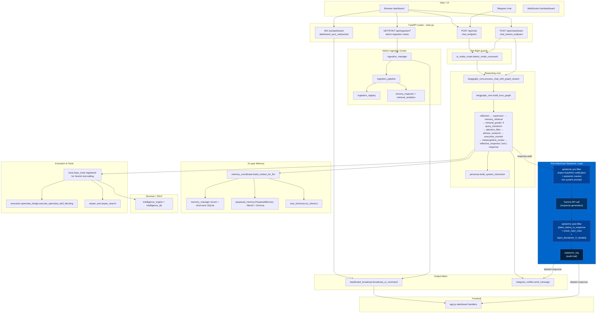

# Kuro AI V1.1.0 Beta 1 "Sovereign Chat" — SYSTEM_MAP

> Authoritative navigation map for the repository. Traced function-by-function
> from the true entrypoint (`main.py`) outward. Only source code under version
> control is listed; runtime caches, logs, SQLite files, virtualenvs, and build
> artefacts are intentionally excluded.

## Executive Summary (User-Friendly Overview)

**Note on Telegram**: Kuro AI uses Telegram for both *outbound* proactive notifications (e.g. Sentinel alerts, Dreaming cycle updates) and *inbound* two-way chat commands. Messages are processed via the same LangGraph reasoning core as the Web Dashboard.


Kuro AI is your **Intelligent Personal Sovereign**—a sophisticated digital companion designed to orchestrate your dissertation research, system security, and daily workflows into one seamless experience.

**What Kuro Does for You:**
1. **Perpetual Memory**: Kuro never forgets. Every critical discussion, dissertation commitment, and research insight is preserved and indexed for instant retrieval.
2. **Proactive Dissertation Partner**: Beyond a simple chatbot, Kuro acts as a "Natural Agent." It understands your long-term goals and will proactively challenge ideas or realign efforts if they stray from your dissertation's novelty gap.
3. **Security & Quality Gatekeeper**: With its specialized "Auditor" persona, Kuro strictly enforces high standards, ensuring your technical implementations are robust, compliant, and well-documented.
4. **Autonomous Sentinels**: Kuro works for you even when you aren't chatting. Background processes monitor system health, track global security threats (CVEs), and manage your fitness commitments.

**In essence**: Kuro is your "Second Brain," ensuring you stay focused on the "Big Picture" (your PhD) while it handles the complex technical and organizational heavy lifting.

**How It Works (Simplified Flow):**
- **Input**: You send a message, file, or instruction via the Dashboard or Telegram.
- **Process**: Kuro's "Brain" (Reasoning Core) orchestrates a multi-layered agency model:
    - **Memory Retrieval & Auto-RAG**: Searches your long-term memory and automatically refines the search query if the first attempt is insufficient.
    - **Executive Control (T1 — Intentional Agent)**: Filters out impulsive or irrelevant requests ("bloatware") and performs "imaginative simulations" to choose the best response strategy.
    - **Metacognitive Review (T2 — Rational Agent)**: Evaluates whether the plan aligns with your dissertation goals and checks the strength of retrieved evidence.
    - **Shared Agency (T3 — Social Agent)**: References our mutually agreed-upon commitments to act as your proactive research partner, not just a passive tool.
- **Output**: Kuro provides a verified, context-aware response and automatically saves important new facts to its long-term memory to keep your project evolving.

## Project Summary

- **Purpose**: Kuro is Master Pantronux's personal AI Sovereign — a unified
  FastAPI application that fuses a LangGraph reasoning loop, a 3-layer memory
  system (recent chat → short-term summary → long-term semantic + SSoT),
  and proactive sentinels (CVE, fitness) into one cohesive assistant accessible
  from a web dashboard and Telegram.
- **V1.1.0 Beta 1 Focus**: Canvas 3 operational maturity layer with tool governance runtime, cognitive budget controls, runtime modes, memory canonicalization flow, identity/constitution safeguards, autonomy boundaries, source reliability scoring, and evaluation runtime telemetry (all feature-flagged safe-by-default).
- **Tech stack**:
  - Backend: FastAPI, LangGraph, `google-genai` (Gemini),
    APScheduler, SQLite, ChromaDB, Mem0 (via `perpetual_memory.py`),
    Arize Phoenix + OpenTelemetry.
  - Frontend: Vanilla JS on Jinja2 templates.
  - External: Telegram Bot API, Serper.dev, Proxmox VE API, NVD CVE feed,
    OpenClaw skill bridge.
- **Architecture pattern**: Monolithic FastAPI process (`main.py`) owning
  auth, routing, schedulers and WebSocket fan-out. Reasoning is delegated to
  a LangGraph state machine (`kuro_backend/langgraph_core.py`) with 
  **thread-based persistence** for multi-user isolation. Nodes call into a 
  layered memory stack (`memory_coordinator` → `memory_manager`
  + `perpetual_memory`) and feature services. Background sentinels
  (CVE dreaming, fitness, proactive events) run on APScheduler
  alongside the request loop. A separate `OpenClaw` process is reached via
  HTTP bridge for privileged skill execution.

## Evolution & Core Milestones

### V7.0 Reset Notes ("Lean Leviathan")

- **The "Lean" Philosophy Purge:** NeMo Guardrails, Compliance Scorers, the `voice_service` (TTS), and redundant legacy modules were fully excised from the repository to achieve maximum efficiency and limit bloatware.
- **QA Architect Persona Integration:** Strict adherence to Business Requirements Documents (BRD) is enforced by the QA Architect, integrated directly into the `memory_manager` and frontend.
- **Core DAG simplified:** `kuro_backend/langgraph_core.py` now follows
  `Input -> Memory Retrieval -> Tool/Action -> Response -> Memory Extraction`.
  Compliance and habit/reminder nodes are removed from runtime graph routing.
- **Long-term semantic memory:** `kuro_backend/memory_coordinator.py` +
  `kuro_backend/perpetual_memory.py` use Mem0 as the only long-term semantic
  source for chat context.
- **Short-term context policy:** prompt injection now prioritizes a raw
  10-15 turn episodic buffer (no summary compression in hot path) to prevent hallucinations.
- **Attachment continuity:** `main.py` persists `current_session_state`
  runtime context (attachments + extracted snippets) and
  `memory_coordinator.build_referent_grounding_block` prioritizes this state
  for deictic follow-ups like "edit previous result" / "add to that".
- **Legacy modules:** Legacy compliance, habits, and reminder endpoints return `410 Gone` to enforce the Lean architecture.

### V7.1.0 Reset Notes ("Sovereign Unbound")

- **The Final Purge:** The legacy Habits and Reminders system, the Live2D "Hijiki" mascot, and all voice (TTS) infrastructure were completely purged from the codebase.
- **Sovereign Rebranding:** The "Butler" persona has been evolved into the "Sovereign" persona, reflecting a more autonomous and sophisticated architecture.
- **Frontend Simplification:** Removed L2D canvas, tips/trivia bubble, and voice artifacts from the dashboard. `app.js` and `index.html` were sanitized for maximum performance.
- **Asset Removal:** Deleted redundant `.db` files, Live2D models, and legacy JS libraries.

### V7.2.0 Architecture Notes ("Natural Agency")

- **Three-Tier Control System:** Kuro transitions from a stimulus-driven processor to a Natural Agency model based on Tomasello (2025).
- **Auto-RAG (V7.2.1):** Implements a self-correction loop in the retrieval layer. `retrieval_grader_node` evaluates context relevance (relevant/ambiguous/irrelevant); `query_transform_node` rewrites queries or triggers Serper web-search failover at max retries (bounded loop).
- **Multi-User Memory Isolation (V7.2.1 Hardening):** Strict isolation of memory tiers (Short-term, Long-term, and Structured Context) across different users.
    - `memory_coordinator.py`: Grounding blocks and session state retrieval now require a strict `username` parameter to prevent "context bleeding" between sessions.
    - `personas.py`: Replaced hardcoded "Pantronux" references with dynamic `{master_name}` placeholders, allowing Kuro to maintain a unique self-identity for each user (e.g., as Master Faikhira's Senior Auditor).
    - `proactive_greeting.py`: Dashboard greetings are now personalized using the `master_name` from the user registry.
- **T1 Executive / Intentional Agent:** `attention_filter_node` classifies input intent; `executive_monitor_node` applies inhibitory filter (blocks bloatware/off-track inputs) and runs dual-draft imaginative simulation (advisor/consultant: Conservative vs Novel; auditor: Pass vs Adversarial-Fail).
- **T2 Metacognitive / Rational Agent:** `metacognitive_review_node` performs belief revision via `memory_coordinator.evaluate_alignment()`, comparing current input against BRD-backed `research_ledger` commitments. Incorporates `retrieval_grade` as an evidence-quality signal for realignment call-outs.
- **T3 Shared Agency / Social Agent:** `joint_goal_store` (SQLite-backed, survives restarts) stores joint dissertation commitments. Active commitments are injected as `[JOINT_COMMITMENTS]` block into every agency-persona response. Advisor/consultant/auditor personas updated with Coordination Partner framing and proactive call-out authority.
- **Cognitive Effort Allocator:** `agency/cognitive_effort.py` maps intent category to `low/medium/high` effort level, injecting scaled CoT depth into the system prompt.
- **Gating:** All agency nodes self-bypass in O(1) for non-agency personas (chill, tactical, chancellor).
- **New env vars:** `KURO_ALIGNMENT_THRESHOLD` (float, default `0.35`) — alignment conflict floor.

### V1.0.0 Beta 1 Architecture Notes ("Sovereign Cat")

- **Major Version Transition**: Promoted from Alpha/Legacy (V7.x) to V1.0.0 Beta 1, establishing a stable baseline for the "Magic/Sovereign Cat" era.
- **Hybrid Market Sentinel (Triangulation Engine)**:
    - `price_ticker_worker.py`: Dedicated quantitative anchor using `yfinance` for IDX tickers (.JK).
    - `market_sentinel.py`: Qualitative engine using Google Grounding + OpenClaw to triangulate news with price action.
- **Role-Based Access Control (RBAC)**:
    - Implemented a strict enforcement gate for the "System Status" menu. Non-Administrator users (e.g., `Faikhira`) are 100% blocked via both UI modal and backend checks.
- **Per-User File Isolation**:
    - **Physical Partitioning**: Uploaded files are now stored in `uploaded_files/{username}/{category}/` subfolders to prevent cross-user file collisions.
    - **Isolation Logic**: `main.py` and `app.js` now strictly filter file lists based on the authenticated `username`.
- **180-Day Automated Retention Pipeline**:
    - `file_retention_worker.py`: Autonomous worker running daily at 02:00 WIB.
    - **Archival Flow**: Files exceeding 180 days are analyzed by LLM (summarization + entity extraction) before physical deletion.
    - **Memory Persistence**: Intisari file disimpan ke Mem0 dan `research_ledger` (`archived_file_memory` kind), allowing Kuro to "remember" the contents of deleted files.
    - **Archive Metadata**: Sidecar JSON files are persisted in `.archive/{username}/` as permanent records.

### V1.0.0 Beta 3 Architecture Notes ("Chat Isolation & Anti-Halusinasi")

- **Epistemic Accountability Layer**: 3-tier verification injected into all agency persona system prompts.
    - **Tier-1 Source Audit**: Classifies every factual claim by source (Mem0/ChromaDB, Serper, inference, parametric).
    - **Tier-2 Claim Density Control**: Max 3 specific factual claims per paragraph without labeled source.
    - **Tier-3 Disclaimer Injection**: Auto-appends `⚠️ Epistemic Notice` block for [SPECULATIVE]/[INFERRED] claims.
- **Mandatory Claim Labeling Grammar**: `[VERIFIED: memory]` `[VERIFIED: search]` `[INFERRED]` `[SPECULATIVE]` `[UNKNOWN]`.
- **Hard Anti-Fabrication Rules**: Specific numbers, filenames, function names MUST carry source labels. No fabrication of file existence or code modules not in SYSTEM_MAP.
- **AutoRAG Integration**: When `retrieval_grade = 'irrelevant'` or `'ambiguous'`, Kuro must explicitly notify user before responding from parametric knowledge.
- **Post-Generation Enforcement**: `epistemic_filter.py` validates LLM output after generation — complements existing pre-generation prompt directives.
- **Epistemic Audit Trail**: `epistemic_log` table in `kuro_intelligence.db` records all labeled claims per session.
- **Domain-Aware Relaxation**: General technical/compliance knowledge (ISO, NIST, legal) is allowed from model as `[INFERRED]` — avoids over-restricting Kuro's existing broad knowledge authority.

### V1.0.0 Beta 3 Patch Run ("Observability & Semantic Cache Fix")

- **Phoenix Persistence (Item 1)**: Configures `PHOENIX_WORKING_DIR` and `PHOENIX_SQL_DATABASE_URL` in `config.py` to ensure OTLP traces survive process restarts.
- **Named Project Tracing (Item 2)**: Standardized `kuro-ai` project identity for all OpenTelemetry spans, moving away from default project clutter.
- **Robust Span Management (Item 3)**:
    - `trace_node` context manager updated with mandatory `record_exception` and `StatusCode.ERROR` for failed reasoning nodes.
    - `KURO_TRACE_SPAN_TIMEOUT_S` (default: 120s) enforces hard closure of spans to prevent pathologically high latency metrics.
- **Autonomous Evaluator (Item 5)**: 
    - `kuro_backend/evaluation/`: Automated reasoning quality scoring (groundedness, alignment).
    - `/api/evaluation/summary`: Administrator-only summary endpoint providing aggregated performance metrics.
- **Semantic Cache Invalidation (Item 6)**: Mandatory `invalidate_tag(username)` trigger added to `memory_coordinator.py` successful write paths to prevent stale data retrieval after memory updates.

### V1.0.0 Beta 4 Architecture Notes ("Sovereign Intelligence")

- **Cognitive Agent Model**: Transitions personas from shallow declarations to deep cognitive agents with reasoning protocols.
- **Autonomous Dissertation Research**:
    - `advisor_research_node`: Implements proactive research grounding for the `advisor` persona.
    - Automatically fires `serper_scholar` and `serper_news` based on extracted research claims without user instruction.
    - Controlled by `KURO_ADVISOR_AUTO_SEARCH` and `KURO_ADVISOR_MAX_SERPER_CALLS`.
- **Source Provenance Tracking**:
    - `research_sources` table in `kuro_intelligence.db`: Tracks title, link, snippet, and academic metadata (year, citations) for all auto-retrieved materials.
    - Evidence trail persisted in `research_ledger.source_provenance` as JSON metadata.
- **Enhanced Serper Integration**: `serper_scholar` and `serper_news` registered as Gemini-callable tools with normalized academic metadata.
- **Cognitive Effort "Research" Tier**: New effort level that triggers extended CoT reasoning and autonomous retrieval for dissertation-grade queries.

### V1.0.0 Beta 5 Architecture Notes ("Sovereign Chat")

- **Sovereign Control Toolbar**: Injected dynamic toolbars into chat bubbles for message-level interaction (Copy, Edit, Regenerate, Bookmark).
- **Persistent Message Versioning**: `message_edits` table tracks the lineage of edits and regenerations, ensuring no data loss when branching history.
- **Session Pinning & Protection**: Added `is_pinned` status to `chat_sessions`. Pinned sessions are prioritized in the UI and protected from accidental deletion (`403 Forbidden`).
- **Background Auto-Titling**: Integrated asynchronous task generation in `langgraph_core.py` using a classifier model to generate concise session titles upon the first message.
- **In-Session Keyword Search**: Client-side search modal with backend keyword filtering (`search_messages_in_session`).
- **Markdown/Text Export**: Clean history formatting for archival purposes via `/api/chats/{chat_id}/export`.
- **Draft Preservation**: Persistent `sessionDrafts` object in `app.js` ensures unsent messages survive session switching.

### V1.0.0 Beta 5 Hotfix Architecture Notes ("Sovereign Shield")

- **Pre-migration snapshot**: `chat_history.py`, `auth_db.py`, `finance_db.py`,
  `intelligence_db.py`, and `memory_manager.py` now request a compressed
  pre-migration snapshot via `backup_manager.snapshot_pre_migration()` before
  live schema bootstrap touches an existing SQLite file.
- **Nightly automated backup (01:00 WIB)**: `kuro_backend/backup_manager.py`
  creates WAL-safe SQLite backups via `VACUUM INTO`, gzips runtime JSON state,
  writes `backup_manifest.json`, and prunes daily / weekly / pre-migration
  retention windows under `backups/`.
- **Backup audit trail**: `kuro_backend/intelligence_db.py` now owns the
  `backup_log` table plus `log_backup_start`, `log_backup_complete`,
  `get_backup_history`, and `get_last_backup_status`.
- **Admin backup routes**: `main.py` adds `/api/backup/status`,
  `/api/backup/run`, and `/api/backup/history`, all guarded by JWT cookie auth
  plus the `ADMIN_USERNAME` check.
- **Global test DB isolation**: `conftest.py` now autoredirects all active DB
  paths and runtime JSON state into `tmp_path`, preventing the test suite from
  mutating production `*.db` files.

### V1.0.0 Beta 6 Architecture Notes ("Sovereign Chat")

- **Universal Export Engine**:
    - `kuro_backend/export_engine/` introduces a renderer-first export subsystem for `chat_session`, `selected_messages`, `intelligence_report`, `compliance_report`, and `market_snapshot`.
    - Sync export formats: `md`, `txt`, `json`, `csv`, `xlsx`, `docx`.
    - Async export format: `pdf` with job tracking + download lifecycle.
- **Export Persistence & Auditability**:
    - `kuro_backend/intelligence_db.py` now owns `export_jobs` and `export_audit_log`.
    - Export jobs persist `briefing_date` and `standard` to support Phase 4 targets cleanly.
- **Persona-Aware Smart Export Suggestions**:
    - `main.py` now derives export suggestions from persona + output shape and injects them into sync responses and SSE completion metadata.
    - `chat_history.py` persists per-message `export_suggestions_json`, allowing suggestion buttons to survive page reload and history fetches.
    - Persona defaults:
        - `auditor` → `xlsx`
        - `advisor` → `pdf`, `docx`, `xlsx`
        - `chancellor` → `xlsx`, `csv`
- **Message-Scoped QA Export**:
    - When available, the assistant message ID is captured after persistence and routed into `selected_messages` export so auditor quick actions produce narrow spreadsheet output instead of exporting the whole chat.
- **Frontend Export UX**:
    - `web_interface/static/js/app.js` now renders persistent, inline quick-export buttons from export suggestion metadata.
    - `web_interface/templates/index.html` export modal now exposes all supported chat export formats through the dashboard.
- **Universal export subsystem**:
    - `kuro_backend/export_engine/export_manager.py`: Orchestrates sync export (`md`, `txt`, `json`, `csv`, `xlsx`, `docx`) and async PDF job processing.
    - `kuro_backend/export_engine/export_registry.py`: Registry-based exporter lookup.
    - `kuro_backend/export_engine/export_security.py`: Ownership validation + payload sanitization before rendering.
    - `kuro_backend/export_engine/renderers/chat_renderer.py`: Renderer layer for `chat_session` and `selected_messages`.
    - `kuro_backend/export_engine/renderers/intelligence_renderer.py`: Renderer layer for `intelligence_report`.
    - `kuro_backend/export_engine/renderers/compliance_renderer.py`: Renderer layer for `compliance_report` (admin-only because DB is global).
    - `kuro_backend/export_engine/renderers/finance_renderer.py`: Renderer layer for `market_snapshot`.
    - `kuro_backend/export_engine/exporters/*`: Format writers for Markdown, TXT, JSON, CSV, XLSX, DOCX, and PDF.
- **Export persistence**:
    - `kuro_backend/intelligence_db.py` now owns `export_jobs` and `export_audit_log`.
- **New routes**:
    - `POST /api/export`
    - `GET /api/export/history`
    - `GET /api/export/{job_id}`
    - `GET /api/export/{job_id}/download`
- **Backward compatibility**:
    - `GET /api/chats/{chat_id}/export` remains active for `md` and `txt`, but now delegates into the export engine.

### V1.0.0 Beta 6 Hotfix 1 Extension Notes ("Admin Ingestion Control Center")

- **Admin-only ingestion subsystem**:
    - `kuro_backend/ingestion_center/`: new package for dataset registry, ingestion orchestration, audit lineage, lifecycle control, and analytics.
    - Dedicated SQLite store `kuro_ingestion.db` isolates ingestion metadata from chat, intelligence, and short-term memory databases.
- **Registry-first ingestion flow**:
    - Uploads are stored under `uploaded_files/{username}/ingestion_center/`.
    - Pipeline shape: `parse_file() -> clean_text() -> semantic_chunk() -> embed_chunks() -> register_chunks() -> finalize`.
    - Vector failures degrade to `partially_indexed` without losing dataset, job, or chunk records.
- **Chroma-owned ingestion vectors**:
    - Ingestion vectors are written to a dedicated Chroma root under `kuro_chromadb/ingestion_center`.
    - Chat runtime now bridges ingestion retrieval as an additional owner-scoped context layer (always-on) with silent fallback.
    - Only `completed` and `partially_indexed` datasets are eligible for chat grounding; `archived` / `deleted` remain excluded.
    - User-facing provenance language is natural sentence style with document + **bagian** references (no raw technical markers).
- **Lifecycle and observability**:
    - New admin routes: `/ingestion`, `/ingestion/analytics`, `/api/ingestion/*`.
    - Supports upload, reindex, archive, delete, search, chunk explorer, lineage viewer, vector health, orphan inspection, retrieval analytics, and dataset-scoped semantic graph payloads.
- **Admin navigation gate**:
    - Sidebar renders ingestion menu entries only for the administrator.
    - Non-admin users are blocked both at menu visibility and direct route access (`403 Forbidden`).

### V1.1.0 Beta 1 Architecture Notes ("Sovereign Chat")

- **Canvas 3 Operational Maturity layer** introduced with default-safe feature flags (`OFF`) for zero-regression baseline.
- **Tool Governance Runtime**:
  - New `kuro_backend/tools/tool_*` governance modules for permission routing, risk scoring, budget checks, and audit trace logging.
  - New graph node `tool_governance_node` gates tool execution before `tool_node` when enabled.
- **Runtime Modes + Cognitive Budget**:
  - `runtime_mode_node` resolves mode profiles (`STRICT`, `BALANCED`, `CREATIVE`, `RESEARCH`, `ENTERPRISE`, `SAFE`).
  - Cognitive budget telemetry and enforcement trace are recorded for operational predictability.
- **Memory Canonicalization Pipeline**:
  - Memory write path now supports canonicalization metadata flow (`validation -> canonical_summary -> conflict handling -> temporal_score -> promotion`).
  - Canonicalization telemetry persisted to short-term operational logs when enabled.
- **Identity / Constitution / Boundaries**:
  - Response-time internal checks for identity drift, constitutional principles, and autonomy boundary violations.
  - Violations trigger safe degraded messaging while preserving SSE/API contract.
- **Source Reliability + Evaluation Runtime**:
  - Advisor research sources can be scored for reliability/trustworthiness before internal audit persistence.
  - New evaluation runtime snapshot computes hallucination, grounding, persona consistency, memory integrity, multi-model alignment, and governance compliance metrics.

## Core Logic Flow (Function-Level Flowchart)



Side-branches not drawn on the trunk but reachable from the same
`tool_node` / scheduler layer:
- **Intelligence briefings** — `/api/intelligence/*` and the daily scheduler
  → `intelligence_engine` → `serper_tool` + `intelligence_db`.
- **Admin ingestion center** — `/api/ingestion/*` and `/ingestion*`
  → `ingestion_manager` → `ingestion_pipeline` → `ingestion_registry`
  + `chroma_inspector` / `retrieval_analytics`.
- **Chat ingestion bridge** — main chat flow
  → `langgraph_core.response_node` / `process_chat_with_graph_stream`
  → `memory_coordinator.build_context_for_llm*`
  → ingestion Chroma + `ingestion_registry` filtering (`completed`/`partially_indexed`, owner-scoped).
- **Dreaming / CVE + fiscal sentinels** — `dreaming_worker.run_dreaming_cycle`
  → `proactive_events.publish` → `telegram_notifier` (CVE + `fiscal_alert`).
- **Proactive greeting** — `proactive_greeting.maybe_send` on first
  `/ws/dashboard` connect.

## Clean Tree

Source-only view. Everything listed below is either code, a template, a
declarative config, or a static asset shipped with the repo. Runtime
artefacts are excluded — see **Exclusions** at the bottom of this section.

```
.
├── main.py                      # FastAPI entrypoint, routes, schedulers
├── requirements.txt
├── CHANGELOG.md
├── INTEGRATION_HARDENING_DETAILS.md
├── SYSTEM_MAP.md                # this file
├── kuro_backend/
│   ├── version.py               # V1.1.0 Beta 1 "Sovereign Chat" single source of truth
│   ├── config.py                # env keys -> typed Settings
│   ├── personas.py              # persona prompts + Anti-Halusinasi epistemic layer
│   ├── core.py                  # non-graph Gemini fallback
│   ├── langgraph_core.py        # graph nodes, streaming, tool dispatch
│   ├── memory_coordinator.py    # orchestrates 3-layer memory + evaluate_alignment
│   ├── memory_manager.py        # SQLite short-term + research ledger
│   ├── perpetual_memory.py      # Mem0 + Chroma wrapper
│   ├── ssot_shortcuts.py        # deterministic SSoT answers
│   ├── semantic_cache.py        # embedding-keyed response cache
│   ├── embedding_cache.py
│   ├── token_budget.py          # per-persona context sizing
│   ├── observability.py         # Phoenix + OTel bootstrap
│   ├── ui_mode_router.py        # English mode commands
│   ├── dashboard_broadcast.py   # /ws/dashboard fan-out
│   ├── telegram_notifier.py
│   ├── proactive_events.py
│   ├── proactive_greeting.py
│   ├── file_retention_worker.py  # 180-day retention & AI archival (V1.0)
│   ├── price_ticker_worker.py   # Quantitative market anchor (V1.0)
│   ├── epistemic_filter.py      # Anti-Halusinasi claim labeling & hard-rule enforcement (V1.0)
│   ├── reminder_service.py      # [PURGED in V7.1]
│   ├── habit_service.py         # [PURGED in V7.1]
│   ├── fitness_service.py
│   ├── intelligence_engine.py
│   ├── persona_history_admin.py
│   ├── dreaming_worker.py       # CVE + fiscal sentinels, reflection + CLI
│   ├── finance_db.py            # budgets, api_usage_daily, watched_symbols, prediction_watch
│   ├── pricing.py               # static Gemini USD/token estimates
│   ├── serper_tool.py
│   ├── auth_db.py               # schema only; *.db files excluded
│   ├── chat_history.py          # schema: uploaded_file_integrity + retention
│   ├── compliance_db.py
│   ├── daily_habits_db.py       # [PURGED in V7.1]
│   ├── intelligence_db.py
│   ├── ingestion_center/        # admin ingestion registry + lifecycle subsystem
│   │   ├── __init__.py
│   │   ├── ingestion_manager.py
│   │   ├── ingestion_pipeline.py
│   │   ├── ingestion_registry.py
│   │   ├── ingestion_audit.py
│   │   ├── ingestion_security.py
│   │   ├── ingestion_scheduler.py
│   │   ├── chunking_engine.py
│   │   ├── embedding_manager.py
│   │   ├── semantic_registry.py
│   │   ├── retrieval_analytics.py
│   │   ├── chroma_inspector.py
│   │   ├── renderers/
│   │   └── schemas/
│   ├── reminder_db.py           # [PURGED in V7.1]
│   ├── agency/                  # V7.2 Natural Agency sub-package
│   │   ├── __init__.py
│   │   ├── joint_goal_store.py  # SQLite joint commitments (T3 Shared Agency)
│   │   └── cognitive_effort.py  # effort allocator low/medium/high (T2)
│   ├── services/
│   │   ├── __init__.py
│   │   ├── core_service.py      # sync revision management (purged logic)
│   │   ├── schemas.py           # Pydantic contracts
│   │   └── async_adapter.py
│   ├── tools/
│   │   ├── __init__.py
│   │   ├── base_tools.py        # Gemini tool surface
│   │   └── system_tools.py
│   ├── execution/
│   │   ├── openclaw_bridge.py   # HTTP + circuit breaker
│   │   └── service.py           # sync wrapper
├── web_interface/
│   ├── templates/
│   │   ├── index.html           # dashboard + avatar
│   │   ├── login.html
│   │   ├── intelligence.html
│   │   ├── ingestion_center.html
│   │   ├── ingestion_analytics.html
│   │   └── compliance.html
│   └── static/
│       ├── js/
│       │   ├── app.js           # WS client, UI modes
│       │   ├── ingestion_center.js
│       │   └── semantic_graph.js
│       ├── css/                 # dashboard styles
│       └── vendor/
├── openclaw_skills/
│   ├── harvest_gemini_share/
│   │   ├── harvest_gemini_share.py
│   │   └── README.md
│   └── vulnerability_scan/
│       ├── vulnerability_scan.py
│       └── README.md
│   ├── market_analysis/
│   │   ├── market_analysis.py
│   │   └── README.md
│   └── prediction_market_scan/
│       ├── prediction_market_scan.py
│       └── README.md
├── maintenance/
│   ├── clean_duplicate_chat_history.py
│   ├── cleanup_orphan_chunks.py
│   ├── ingest_dataset.py
│   ├── rebuild_embeddings.py
│   ├── reindex_dataset.py
│   └── rebuild_compliance_base.py
├── scripts/
│   ├── migrate_persona_consultant_advisor.py
│   ├── purge_mem0_junk.py
│   ├── smoke_mem0_store.py
│   └── smoke_test_openclaw.py
├── tests/
│   ├── test_api_sse_contract.py
│   ├── test_approval_integrity.py
│   ├── test_branding.py
│   ├── test_cve_sentinel.py
│   ├── test_dreaming_worker.py
│   ├── test_finance_db.py
│   ├── test_finance_db_schema_guard.py   # V7.0 Leviathan schema guard + index presence
│   ├── test_fiscal_sentinel.py
│   ├── test_gemini_share_routing.py
│   ├── test_market_openclaw_tools.py
│   ├── test_market_sentinel.py
│   ├── test_memory_coordinator_contract.py
│   ├── test_ingestion_api.py
│   ├── test_ingestion_chroma_health.py
│   ├── test_ingestion_db_schema.py
│   ├── test_ingestion_graph.py
│   ├── test_ingestion_lifecycle.py
│   ├── test_ingestion_search.py
│   ├── test_persona_context_budget.py
│   ├── test_personas_english.py
│   ├── test_proactive_events.py
│   ├── test_proactive_greeting.py
│   ├── test_referent_grounding.py
│   ├── test_shortcuts_finance.py
│   ├── test_smart_read_flow.py
│   ├── test_sync_revision_contract.py
│   ├── test_ui_mode_router.py
│   ├── test_upload_filename_generation.py
│   └── test_version.py
├── profile/
│   ├── kuro_avatar.png
│   ├── favicon.ico
│   └── live2d/hijiki/           # Cubism source + runtime model3.json
├── certs/                       # cert.pem / key.pem for HTTPS
└── db/                          # reserved directory for future migrations
```

**Exclusions honoured** (not listed above, never committed as code):
`__pycache__/`, `venv/`, `.venv/`, `node_modules/`, `.git/`, `kuro_chromadb/`,
`phoenix_data/`, `uploaded_files/`,
`logs/`, all `*.db` files (`kuro_auth.db`,
`kuro_chat_history.db`, `kuro_compliance.db`, `kuro_habits.db`,
`kuro_intelligence.db`, `kuro_reminders.db`, `kuro_short_term.db`, plus
backups like `kuro_chat_history.db.backup_*`), all `*.log` /
`*.log.YYYY-MM-DD`, and the standalone `kuro_memory.json` +
`master_profile.json` runtime state (covered under **Data & Config**).

## Module Map (The Chapters)

### Entrypoint
- [`main.py`](main.py) — *public*: `app` (FastAPI), `verify_password`,
  `create_access_token`, `validate_token`, `save_upload_file`,
  `api_success`, `api_error`, and the FastAPI route handlers spanning
  `/api/login`, `/api/chat`, `/api/chat/stream`,
  `/ws/dashboard`, `/api/compliance*`,
  `/api/intelligence*`, `/api/finances/*`, `/api/persona*`, `/api/observability/*`,
  `/ingestion`, `/ingestion/analytics`, `/api/ingestion/*`,
  `/api/evaluation/summary` (**Beta 3** — Admin-only aggregated quality metrics),
  `/api/backup/status`, `/api/backup/run`, `/api/backup/history`,
  `/api/system-status`, `/api/health`. Also wires three APScheduler
  `BackgroundScheduler` instances (`_hardware_sentinel_scheduler`) and the Uvicorn boot thread.

### Reasoning Core
- [`kuro_backend/langgraph_core.py`](kuro_backend/langgraph_core.py) —
  *public*: `KuroState` (now includes `chat_id: Optional[str]`), `build_kuro_graph`,
  `process_chat_with_graph_stream` (now accepts `chat_id`),
  `process_chat_with_graph` (now accepts `chat_id`),
  `supervisor_node`, `memory_retrieval_node`, `retrieval_grader_node` (Auto-RAG),
  `query_transform_node` (Auto-RAG), `attention_filter_node` (T1),
  `advisor_research_node` (Beta 4 — Autonomous Grounding),
  `executive_monitor_node` (T1), `metacognitive_review_node` (T2),
  `response_node` (now passes `chat_id` to `build_context_for_llm`),
  `tool_node`, `memory_extraction_node`.
  **Beta 2**: `_persist_short_term_and_enqueue_writes()` now passes `chat_id`.
  `chat_context` auto-trigger via `maybe_trigger_chat_context()` in post-response tasks.
  Orchestrates the Tomasello-inspired 3-tier control system and self-correcting retrieval loop.
- [`kuro_backend/personas.py`](kuro_backend/personas.py) — *public*:
  `build_system_instruction`, `get_persona_instruction`. English prompts
  for consultant / advisor / chill / tactical / chancellor.
  Updated with Shared Agency (T3) coordination partner protocols.

### Agency (T1-T3)
- [`kuro_backend/agency/joint_goal_store.py`](kuro_backend/agency/joint_goal_store.py) —
  *public*: `add_commitment`, `get_active_commitments`, `format_for_prompt`.
  SQLite-backed persistent store for T3 Shared Agency dissertation goals.
- [`kuro_backend/agency/cognitive_effort.py`](kuro_backend/agency/cognitive_effort.py) —
  *public*: `get_effort_level`, `get_cot_injection`.
  T2 allocator that scales Chain-of-Thought reasoning depth (low/medium/high) based on input intent.

### Memory & SSoT
- [`kuro_backend/memory_coordinator.py`](kuro_backend/memory_coordinator.py)
  — *public*: `build_context_for_llm` (adds `finance_block` for
  `chancellor`; now filters by `chat_id`), `build_context_for_llm_async`,
  `build_gemini_contents_parts`, `build_referent_grounding_block` (now filters
  by `chat_id`), `apply_path_tokens_to_runtime`, `render_summary_for_prompt`,
  `build_compressed_short_term_text` (now filters by `chat_id`),
  `prefetch_mem0`, `take_prefetched_mem0`,
  `safe_mem0_retrieve`, `execute_memory_write_task`,
  `execute_mem0_extract_task`,
  `record_mutation`, `apply_openclaw_execution_result`.
  **Beta 2 additions**: `generate_chat_context(chat_id, persona_scope, username)`
  — generates compressed context summary using Gemini 3 Flash;
  `maybe_trigger_chat_context()` — checks threshold and triggers regeneration.
  Constants: `CHAT_CONTEXT_REFRESH_THRESHOLD`, `CHAT_CONTEXT_MODEL`.
- [`kuro_backend/memory_manager.py`](kuro_backend/memory_manager.py) —
  *public*: `load_master_profile`, `save_master_profile`,
  `get_master_profile_formatted`, `update_master_profile`,
  `get_active_persona`, `set_active_persona`, `normalize_persona`,
  `get_runtime_context_value`, `set_runtime_context_value`,
  `init_short_term_db`, `get_short_term_with_ids` (now filters by `chat_id`),
  `get_short_term` (now filters by `chat_id`),
  `get_short_term_summary` (+ `_json`, `upsert_*`),
  `append_research_ledger` (+ `_batch`), `query_research_ledger` (+
  `_since`), `query_short_term_summaries_recent`,
  `query_short_term_latest_timestamp`, `acquire_dreaming_lease`,
  `release_dreaming_lease`, `insert_dreaming_cycle`,
  `update_dreaming_cycle`, `dream_notification_seen`,
  `mark_dream_notification`.
  **Beta 2**: `short_term` table now has `chat_id` column + index.
  `add_short_term()`, `get_short_term()`, `get_short_term_with_ids()` now
  accept and filter by `chat_id`.
- [`kuro_backend/llm_utils.py`](kuro_backend/llm_utils.py) —
  *public*: `generate_chat_title`, `generate_chat_context_summary`.
  **Beta 2**: `generate_chat_context_summary()` — generates compact chat context
  summary using Gemini (model from `KURO_CHAT_CONTEXT_MODEL` env, default
  `gemini-3-flash-preview`). Returns JSON with topic, decisions, entities,
  open_questions, technical_specs.
- [`kuro_backend/perpetual_memory.py`](kuro_backend/perpetual_memory.py) —
  *public*: `PerpetualMemory`, `get_memory_client`,
  `coerce_mem0_search_results`, `extract_json_from_text`. Wraps Mem0 +
  ChromaDB for long-term semantic recall.
- [`kuro_backend/ssot_shortcuts.py`](kuro_backend/ssot_shortcuts.py) —
  *public*: `ShortcutResult`, `try_shortcut`. Deterministic "today's
  habits / upcoming reminders / budget / recurring expenses / API spend"
  short-circuit before LLM.
- [`kuro_backend/semantic_cache.py`](kuro_backend/semantic_cache.py) —
  *public*: `lookup`, `store`, `invalidate_tag`, `clear`, `classify_tags`.
- [`kuro_backend/embedding_cache.py`](kuro_backend/embedding_cache.py) —
  *public*: `embed_query`, `clear_cache`.
- [`kuro_backend/token_budget.py`](kuro_backend/token_budget.py) —
  *public*: `approx_tokens`, `trim_section`, `apply_section_budget`,
  `build_persona_section_quotas`, `apply_persona_budget`,
  `enforce_global_ceiling`, `collapse_duplicate_blocks`.

### Feature Services
- [`kuro_backend/services/core_service.py`](kuro_backend/services/core_service.py)
  — *public*: `init_all_databases`, `register_main_event_loop`,
  `bump_data_revision`, `get_data_revision`; reminder API (`add_reminder`,
  `get_pending_reminders`, `get_upcoming_reminders`,
  `get_reminder_history`, `update_reminder_status`, `mark_notified_10m`,
  `mark_notified_event`, `mark_completed`, `delete_reminder`,
  `get_reminders_needing_*_notification`, `get_reminder_stats`); habit API
  (`add_habit`, `update_habit`, `delete_habit`, `get_all_habits`,
  `get_todays_habits`, `mark_habit_done/undone`,
  `toggle_habit_log_for_date`, `reset_all_habits`, `get_completion_stats`,
  `get_end_of_day_report`, `get_weekly_stats`, `get_monthly_data`,
  `get_weekly_data`, `get_ai_evaluation`, `save_ai_evaluation`,
  `get_monthly_report_data`, `get_weekly_report_data`,
  `fetch_habit_activity_snapshot`); `*_validated` Pydantic-backed
  counterparts. Also hosts the reminders and habits SQLite schemas.
- [`kuro_backend/services/schemas.py`](kuro_backend/services/schemas.py) —
  *public*: `ReminderRecord`, `ReminderStats`, `HabitRecord`,
  `HabitCompletionStats`, `HabitGridRow`, `MonthlyHabitPayload`,
  `WeeklyHabitPayload`, `AiEvaluationRecord`, `MonthlyBudgetRecord`,
  `RecurringExpenseRecord`, `ApiUsageDailyRecord`.
- [`kuro_backend/services/async_adapter.py`](kuro_backend/services/async_adapter.py)
  — *public*: `run_db`, `as_awaitable`.
- [`kuro_backend/reminder_service.py`](kuro_backend/reminder_service.py) —
  *public*: facade re-exporting `add_reminder`, `delete_reminder`,
  `mark_notified_10m/event`, `mark_reminder_completed`, `add_habit`,
  `update_habit`, `delete_habit`, `mark_habit_done/undone`,
  `toggle_habit_log_for_date`, `reset_all_habits`, `save_ai_evaluation`,
  `get_upcoming_reminders`, `get_reminder_history`, `get_reminder_stats`,
  `get_reminders_needing_*_notification`, `get_pending_reminders`.
- [`kuro_backend/habit_service.py`](kuro_backend/habit_service.py) — [PURGED].
- [`kuro_backend/fitness_service.py`](kuro_backend/fitness_service.py) —
  *public*: `check_fitness_anomalies`, `run_fitness_sentinel`.
- [`kuro_backend/intelligence_engine.py`](kuro_backend/intelligence_engine.py)
  — *public*: `generate_daily_queries`, `execute_research`,
  `synthesize_intelligence`, `format_telegram_message`,
  `run_daily_research`.
- [`kuro_backend/backup_manager.py`](kuro_backend/backup_manager.py) —
  *public*: `get_backup_dir`, `snapshot_pre_migration`,
  `run_nightly_backup`, `run_nightly_backup_sync`, `run_manual_backup`,
  `get_backup_status`, `prune_old_backups`.
  Nightly/manual backup engine for Tier 1 runtime DB/JSON assets plus weekly
  directory snapshots (`kuro_chromadb/`, `uploaded_files/`).
- [`kuro_backend/evaluation/`](kuro_backend/evaluation/) — *module*:
  Reasoning quality monitoring.
  - [`autonomous_evaluator.py`](kuro_backend/evaluation/autonomous_evaluator.py):
    `run_evaluation_batch`, `get_evaluation_summary`.
  - [`dataset_builder.py`](kuro_backend/evaluation/dataset_builder.py):
    `build_dataset`, `EvalRecord`.
  - [`evaluation_scheduler.py`](kuro_backend/evaluation/evaluation_scheduler.py):
    Automated background evaluator loop.

- [`kuro_backend/persona_history_admin.py`](kuro_backend/persona_history_admin.py)
  — *public*: `get_persona_counts`, `list_backups`, `preview_reclassify`,
  `run_reclassify`, `override_persona`, `restore_persona_from_backup`.
- [`kuro_backend/proactive_events.py`](kuro_backend/proactive_events.py) —
  *public*: `ProactiveEvent`, `publish`, `publish_async`, `make_event`.
- [`kuro_backend/proactive_greeting.py`](kuro_backend/proactive_greeting.py)
  — *public*: `maybe_send`.
- [`kuro_backend/dreaming_worker.py`](kuro_backend/dreaming_worker.py) —
  *public*: `Finding`, `run_dreaming_cycle`, `collect_last_24h`, `main`
  (CLI entry; `--run-fiscal`). CVE scan, `_run_fiscal_sentinel`, reflection,
  Proxmox discovery helpers.

### Execution & Tools
- [`kuro_backend/tools/base_tools.py`](kuro_backend/tools/base_tools.py) —
  *public* (Gemini-registered callables): `list_my_files`,
  `list_project_files`, `read_pdf_content`, `universal_read`, `smart_read`,
  `parse_log_content`, `index_system_path`, `analyze_system_health`,
  `get_system_status`, `check_proxmox_infrastructure`, `process_video`,
  `parse_datetime`,
  `lookup_chroma_context`,
  `set_monthly_budget_tool`, `get_budget_tool`, `add_recurring_expense_tool`,
  `list_recurring_expenses_tool`, `get_daily_api_cost_tool`,
  `summarize_pdf`, `read_docx_content`, `read_xlsx_content`,
  `read_pptx_content`, `summarize_document`, `extract_gemini_share_url`,
  `task_suggests_gemini_harvest`, `resolve_harvest_gemini_routing`,
  `advanced_execution_tool`.
- [`kuro_backend/tools/system_tools.py`](kuro_backend/tools/system_tools.py)
  — *public*: `generate_excel_report`, `manage_files`,
  `generate_report_template`.
- [`kuro_backend/execution/openclaw_bridge.py`](kuro_backend/execution/openclaw_bridge.py)
  — *public*: `OpenClawBridgeClient`, `is_command_safe`,
  `execute_openclaw_skill`, `execute_openclaw_skill_blocking`. Includes a
  failure-counted circuit breaker around the local OpenClaw HTTP endpoint.
- [`kuro_backend/execution/service.py`](kuro_backend/execution/service.py)
  — *public*: `execute_openclaw_skill_sync`.
- [`kuro_backend/serper_tool.py`](kuro_backend/serper_tool.py) — *public*:
  `serper_search`, `serper_news`, `serper_scholar`.
  **Beta 4**: Normalized academic metadata support (year, citations).

### Real-time & UI
- [`kuro_backend/dashboard_broadcast.py`](kuro_backend/dashboard_broadcast.py)
  — *public*: `connect`, `disconnect`, `broadcast_refresh`,
  `broadcast_ui_command`, `send_ui_command_to`, `schedule_ui_command`.
- [`kuro_backend/ui_mode_router.py`](kuro_backend/ui_mode_router.py) —
  *public*: `detect_mode_command`, `acknowledgement`. English verbs:
  "activate research mode", "switch to HUD", "system status", "stand
  down".
- [`kuro_backend/telegram_notifier.py`](kuro_backend/telegram_notifier.py)
  — *public*: `send_message`, `send_dream_inconsistency`.
- [`kuro_backend/observability.py`](kuro_backend/observability.py) —
  *public*: `start_phoenix_server`, `stop_phoenix_server`,
  `setup_opentelemetry`, `get_tracer`, `create_session_context`,
  `trace_node`, `track_token_usage` (also rolls up `finance_db.add_api_usage`
  when `KURO_FINANCE_TRACKING_ENABLED`), `get_session_token_usage`,
  `cleanup_old_sessions`, `record_latency_metric`,
  `get_latency_metrics_snapshot`, `is_client_query`, `add_client_label`,
  `initialize_observability`, `shutdown_observability`.

### DB Layer (schema declarations only — `*.db` files excluded)
- [`kuro_backend/auth_db.py`](kuro_backend/auth_db.py) — *public*:
  `init_auth_db`, `record_failed_attempt`, `clear_failed_attempts`,
  `is_account_locked`, `lock_account`, `record_successful_login`,
  `greeting_sent_within`, `record_greeting_sent`, `get_login_stats`.
  **Tables**: `failed_attempts`, `login_sessions`, `account_lockouts`,
  `proactive_greetings` (→ `kuro_auth.db`).
- [`kuro_backend/chat_history.py`](kuro_backend/chat_history.py) —
  *public*: `init_db`, `add_message`, `get_history`, `get_total_count`,
  `clear_history`, `record_uploaded_file_integrity`,
  `get_uploaded_file_integrity`, `update_session_context`,
  `get_session_context`, `get_session_message_count`,
  `update_session_message_count`, `get_default_chat_id`,
  `create_session`, `get_sessions`, `update_session_title`,
  `delete_session`, `pin_session`, `unpin_session`, `toggle_bookmark`,
  `delete_messages_after`, `update_message_content`, `save_message_edit`,
  `search_messages_in_session`. **Tables**: `chat_history`, `uploaded_file_integrity`,
  `chat_sessions`, `message_edits` (→ `kuro_chat_history.db`).
  **New columns (Beta 5)**: `chat_sessions.is_pinned`, `chat_sessions.pinned_at`,
  `chat_history.is_edited`, `chat_history.is_bookmarked`, `chat_history.is_regenerated`,
  `chat_history.edit_group_id`.
- [`kuro_backend/compliance_db.py`](kuro_backend/compliance_db.py) —
  *public*: `init_db`, `add_evidence`, `update_evidence_status`,
  `get_evidence_matrix`, `add_audit_trail`, `get_audit_trail`,
  `add_gap_analysis`, `get_compliance_progress`. **Tables**:
  `evidence_matrix`, `audit_trail`, `standards_kb`, `gap_analysis`
  (→ `kuro_compliance.db`).
- [`kuro_backend/daily_habits_db.py`](kuro_backend/daily_habits_db.py) —
  *public*: `init_habits_db`. Schemas for `daily_habits`,
  `completion_history`, `habit_logs`, `ai_evaluations`,
  `app_sync_metadata` actually live in `services/core_service.py`
  (→ `kuro_habits.db`).
- [`kuro_backend/intelligence_db.py`](kuro_backend/intelligence_db.py) —
  *public*: `init_db`, `save_briefing`, `get_briefings`,
  `get_briefing_by_date`, `search_briefings`, `get_total_count`,
  `save_research_sources`, `get_research_sources`, `log_backup_start`,
  `log_backup_complete`, `get_backup_history`, `get_last_backup_status`.
  **Tables**: `intelligence_briefings`, `research_sources`, `backup_log`
  (→ `kuro_intelligence.db`).
- [`kuro_backend/ingestion_center/ingestion_registry.py`](kuro_backend/ingestion_center/ingestion_registry.py) —
  *public*: `init_db`, `create_dataset`, `update_dataset`, `list_datasets`,
  `list_active_datasets`, `replace_chunks`, `get_chunk_by_dataset_and_index`,
  `create_job`, `update_job`, `create_lineage`,
  `create_retrieval_event`, `search_datasets`, `get_totals`.
  **Tables**: `ingested_datasets`, `dataset_chunks`, `ingestion_jobs`,
  `retrieval_analytics`, `dataset_lineage` (→ `kuro_ingestion.db`).
- [`kuro_backend/reminder_db.py`](kuro_backend/reminder_db.py) —
  *public*: `init_reminder_db`. Schema for `reminders` lives in
  `services/core_service.py` (→ `kuro_reminders.db`).
- [`kuro_backend/finance_db.py`](kuro_backend/finance_db.py) — *public*:
  `init_db`, `add_budget`, `get_budget`, `list_budgets`,
  `upsert_recurring_expense`, `delete_recurring_expense`,
  `list_recurring_expenses`, `add_api_usage`, `get_daily_api_cost_usd`,
  `get_last_n_days_spend`, `format_ledger_snapshot`. **Tables**:
  `monthly_budget`, `recurring_expenses`, `api_usage_daily`,
  `watched_symbols`, `prediction_watch`, `market_hud_snapshot`
  (→ `kuro_finances.db`, path from `KURO_FINANCE_DB_PATH`).
- `memory_manager.py` additionally declares `short_term`,
  `short_term_summaries`, `research_ledger`, `dreaming_locks`,
  `dreaming_cycles`, `dream_notifications` in `kuro_short_term.db`.

### Frontend
- [`web_interface/templates/index.html`](web_interface/templates/index.html)
  — dashboard shell: avatar (`/profile/kuro_avatar.png`), WebSocket status ticker, chat pane,
  favicon links, `V1.1.0 Beta 1` sidebar badge, Chancellor persona option, market chips bar,
  and admin-only sidebar entries for `Ingestion Center` / `Ingestion Analytics`.
- [`web_interface/templates/intelligence.html`](web_interface/templates/intelligence.html),
  [`ingestion_center.html`](web_interface/templates/ingestion_center.html),
  [`ingestion_analytics.html`](web_interface/templates/ingestion_analytics.html),
  [`market.html`](web_interface/templates/market.html),
  [`compliance.html`](web_interface/templates/compliance.html),
  [`login.html`](web_interface/templates/login.html) — secondary pages,
  each with favicon.
- [`web_interface/static/js/app.js`](web_interface/static/js/app.js) —
  key symbols: `authFetch`, `setupEventListeners`, `kuroApplyUIMode`,
  `kuroEnsureTicker`, `kuroRenderStatusTicker`, `kuroRenderSentinelTicker`,
  `kuroSetAvatarSpeaking`, `kuroConnectDashboardWS`, `kuroStartMarketHudPoll`, `kuroMarketHudChipLine`,
  `kuroHandleGreeting`, `kuroRestoreUIMode`, `sendMessage`, `handleFiles`.
- [`web_interface/static/js/ingestion_center.js`](web_interface/static/js/ingestion_center.js) —
  dataset registry UI, upload form, polling for jobs, detail drawer, and lifecycle actions.
- [`web_interface/static/js/semantic_graph.js`](web_interface/static/js/semantic_graph.js) —
  analytics page loader for retrieval health, orphan view, and dataset-scoped SVG semantic graph.
- [`web_interface/static/js/live2d_manager.js`](web_interface/static/js/live2d_manager.js) — [PURGED].

### Ops / CLI / Tests
- [`openclaw_skills/`](openclaw_skills/) — out-of-process skills consumed
  by `execution/openclaw_bridge.py`: `harvest_gemini_share` and
  `vulnerability_scan` (each ships its own `README.md`).
- [`maintenance/`](maintenance/) — ad-hoc data repair:
  `clean_duplicate_chat_history.py`, `rebuild_compliance_base.py`,
  `ingest_dataset.py`, `rebuild_embeddings.py`, `cleanup_orphan_chunks.py`,
  `reindex_dataset.py`.
- [`scripts/`](scripts/) — one-shot migrations & smokes:
  `migrate_persona_consultant_advisor.py`, `purge_mem0_junk.py`,
  `smoke_mem0_store.py`, `smoke_test_openclaw.py`,
  `migrate_chat_id.py` (**Beta 2** — migrates legacy `chat_id` rows to
  Default Chat per `(username, persona)`; supports `--dry-run`).
- [`tests/`](tests/) — pytest suite covering contracts (SSE, referent
  grounding, sync revisions), branding/HTML, English personas, UI router,
  dreaming worker, CVE sentinel, fiscal shortcuts, finance_db,
  proactive events/greeting, upload hashing, version,
  persona budget, **chat isolation (Beta 2)**, and the admin ingestion
  center (`test_ingestion_*`).

## Data & Config

- **Env loader**: [`kuro_backend/config.py`](kuro_backend/config.py) exposes
  a `Settings` class driven by `python-dotenv`; `.env` is read at startup
  but never committed. Public env keys (values redacted):
  - Gemini / runtime: `GEMINI_API_KEY`, `MODEL_NAME`, `TIMEZONE`,
    `WORKING_DIR`, `GEMINI_CACHED_CONTENT`.
  - Phoenix: `PHOENIX_WORKING_DIR` (default `./phoenix_data`),
    `PHOENIX_SQL_DATABASE_URL` (optional; auto-derived from PHOENIX_WORKING_DIR if unset),
    `KURO_TRACE_SPAN_TIMEOUT_S` (default `120`).
  - Proxmox: `PVE_HOST`, `PVE_PORT`, `PVE_TOKEN_ID`, `PVE_TOKEN_SECRET`.
  - Telegram: `TELEGRAM_TOKEN`, `TELEGRAM_CHAT_ID`.
  - CVE sentinel: `KURO_CVE_SENTINEL_ENABLED`, `KURO_CVE_MIN_CVSS`,
    `KURO_CVE_MAX_ALERTS_PER_CYCLE`, `KURO_VULN_NMAP_ENABLED`.
  - Proactive: `KURO_PROACTIVE_ENABLED`,
    `KURO_PROACTIVE_TELEGRAM_ENABLED`, `KURO_PROACTIVE_SEVERITY_FLOOR`.
  - Fitness: `KURO_FITNESS_ENABLED`, `KURO_FITNESS_DATA_PATH`,
    `KURO_FITNESS_INTERVAL_MIN`.
  - Finances / Chancellor: `KURO_FINANCE_TRACKING_ENABLED`,
    `KURO_FINANCE_DB_PATH`, `KURO_FISCAL_DAILY_USD_THRESHOLD`,
    `KURO_FISCAL_SENTINEL_ENABLED`.
  - Greeting / UI: `KURO_PROACTIVE_GREETING_ENABLED`,
    `KURO_PROACTIVE_GREETING_COOLDOWN_DAYS`,
    `KURO_PROACTIVE_GREETING_LANG`, `KURO_UI_MODE_DEFAULT`.
  - Backup & safety: `KURO_BACKUP_ENABLED`, `KURO_BACKUP_DIR`,
    `KURO_BACKUP_RETAIN_DAYS`, `KURO_BACKUP_WEEKLY_RETAIN_WEEKS`,
    `KURO_BACKUP_PRE_MIGRATION_RETAIN_DAYS`,
    `KURO_BACKUP_COMPRESS_LEVEL`, `KURO_BACKUP_ALERT_ON_FAILURE`.
  - Additional runtime keys read inline across modules (e.g. Mem0, OpenAI
    embedding, OpenClaw bridge URL/token, Serper) are documented in the
    respective files' docstrings.
- **Runtime JSON state (excluded from VCS but read at runtime)**:
  - `master_profile.json` — read/written by
    `memory_manager.load_master_profile` / `save_master_profile`; holds
    Master Pantronux's canonical profile facts.
  - `kuro_memory.json` — legacy/auxiliary memory blob referenced by
    `perpetual_memory.PerpetualMemory`.
- **SQLite files** (all sit at repo root, excluded from the tree, schemas
  cited above): `kuro_auth.db`, `kuro_chat_history.db`,
  `kuro_compliance.db`, `kuro_habits.db`, `kuro_intelligence.db`,
  `kuro_reminders.db`, `kuro_short_term.db`, `kuro_finances.db`. The empty
  [`db/`](db/) directory is reserved for future versioned migrations.
- **Vector stores**: `kuro_chromadb/` (general semantic memory). It is a
  Chroma on-disk persistent and is excluded from the tree.
- **Primary table one-liners** (summaries — see each `*_db.py` /
  `services/core_service.py` for full DDL):
  - `failed_attempts(id, username, ip, user_agent, timestamp, …)`
  - `login_sessions(id, username, session_token, login_time, …)`
  - `account_lockouts(id, username, locked_until, reason, …)`
  - `proactive_greetings(id, username, sent_at, …)`
  - `chat_history(id, role, content, timestamp, platform, persona, …)`
  - `uploaded_file_integrity(id, stored_filename, sha256, request_id, …)`
  - `reminders(id, event_name, event_time, description, status, …)`
  - `daily_habits(id, title, scheduled_time, category, …)`,
    `habit_logs(id, habit_id, log_date, status)`,
    `completion_history(id, habit_id, completed_at)`,
    `ai_evaluations(id, habit_id, period_type, year, period, payload)`,
    `app_sync_metadata(key, value)`
  - `short_term(id, persona_scope, role, content, ts)`,
    `short_term_summaries(persona_scope, last_entry_id, summary, …)`,
    `research_ledger(id, persona, kind, payload, ts)`,
    `dreaming_locks(name, leased_by, expires_at)`,
    `dreaming_cycles(id, status, …)`,
    `dream_notifications(fingerprint, ts)`
  - `evidence_matrix(id, file_name, standard, clause_id, status, …)`,
    `audit_trail(id, action, details, ts)`,
    `standards_kb(id, standard, clause, …)`,
    `gap_analysis(id, document_name, standard, results, …)`
  - `intelligence_briefings(id, date, summary_text, raw_json, signals)`
  - `backup_log(id, backup_type, status, backup_path, files_backed_up, total_size_bytes, started_at, completed_at, …)`
  - `monthly_budget(id, month, amount_usd, notes, …)`,
    `recurring_expenses(id, label, amount_usd, cadence, next_due, …)`,
    `api_usage_daily(date, model_name, prompt_tokens, completion_tokens, cost_usd, …)`
- **Migrations / seeds**: [`maintenance/`](maintenance/) +
  [`scripts/`](scripts/).
- **Runtime output directories (excluded)**: `uploaded_files/` (user uploads),
  `logs/` (structured: `logs/system/` for active `kuro_butler.log` + `kuro_sovereign.log`, 
  `logs/archive/` for rotated history, `logs/briefings/` for research reports),
  `phoenix_data/` (OpenTelemetry traces).
- **TLS**: [`certs/cert.pem`](certs/cert.pem) +
  [`certs/key.pem`](certs/key.pem) used by Uvicorn's HTTPS bind in
  `main.py`.

## External Integrations

| Integration | Call sites | Notes |
| --- | --- | --- |
| Google Gemini (`google-genai`) | `langgraph_core.py`, `core.py`, `memory_coordinator.py` (summariser), `dreaming_worker.py` | Primary LLM; persona-specific configs in `personas.py`. |
| Static Gemini list pricing (USD) | `pricing.py` (→ `observability.track_token_usage` → `finance_db.add_api_usage`) | Approximate per-1K token map for ledgered `api_usage_daily`; unknown models log + record `0.0` cost. |
| Mem0 | `perpetual_memory.py` (via `memory_coordinator.safe_mem0_retrieve` + `execute_mem0_extract_task`) | Long-term semantic memory store. |
| ChromaDB | `perpetual_memory.py`, `tools/base_tools.lookup_chroma_context`, maintenance scripts | On-disk collections `kuro_chromadb/`. |
| Telegram Bot API | `telegram_notifier.py` (→ `proactive_events.publish`, intelligence_engine.format_telegram_message pipeline) | Uses `TELEGRAM_TOKEN` / `TELEGRAM_CHAT_ID`. |
| Serper.dev | `serper_tool.py` (→ `tool_node` in `langgraph_core.py`, `intelligence_engine.execute_research`, `dreaming_worker._google_via_serper`) | Requires `SERPER_API_KEY` env. |
| Proxmox VE API | `tools/base_tools._get_proxmox_headers`, `check_proxmox_infrastructure`, `dreaming_worker._discover_proxmox_targets_locally`, `/api/proxmox-status` route | Uses `PVE_*` env keys. |
| NVD (CVE feed) | `dreaming_worker._cve_scan_via_nvd_direct` | Direct HTTPS; no auth required but API key supported. |
| OpenClaw skill bridge | `execution/openclaw_bridge.py` + `execution/service.py` | HTTP + circuit breaker to local OpenClaw process; skills enumerated in `openclaw_skills/`. |
| NewsAPI (optional) | `openclaw_skills/market_analysis/market_analysis.py` (`get_market_news`) | Requires `NEWSAPI_API_KEY`; when unset the skill returns `articles: []` gracefully. |
| Metaculus (prediction markets) | `openclaw_skills/prediction_market_scan/prediction_market_scan.py` (→ Chancellor tool + nightly `_run_prediction_scan_nightly`) | Requires `METACULUS_API_TOKEN` or the `KURO_PREDICTION_MARKET_DEMO=1` seeded path. |
| Stooq (ticker price CSV) | `openclaw_skills/market_analysis/market_analysis.py` (`get_ticker_price`) | No auth; public CSV endpoint at `https://stooq.com/q/d/l/`. |

| Arize Phoenix + OpenTelemetry | `observability.py` | Phoenix UI served from `phoenix_data/`; OTel exports traces for every LangGraph node via `trace_node`. |

## Documentation discipline (V7.2.2)

The V7.0 pass landed a repo-wide documentation standard so every file can
answer the same five questions at a glance. Keep it intact when adding new
modules.

### Header Doc contract

Every Python, HTML, JS, and CSS source file under version control MUST
carry a `--- Header Doc ---` block inside its top-of-file docstring /
comment, with these fields:

- **Purpose** — one-line purpose.
- **Caller** — modules or routes that import / invoke it.
- **Dependencies** — key libraries, SSoT DBs, or external APIs.
- **Main Functions** — public symbols / sections worth knowing about.
- **Side Effects** — DB writes, HTTP calls, file I/O, threads.

Existing docstrings are preserved verbatim; the Header Doc block is
appended to the end of whatever prose already lives there. Tests use a
shorter three-line form (`Purpose` / `Covers` / `Fixtures`).

### DB hygiene justification (finance_db)

[`finance_db.py`](kuro_backend/finance_db.py) is the single hottest SSoT on
the Chancellor path. The V7.0 audit captured the following decisions
inline in the module docstring; summarised here so the map stays
self-contained:

- **Schema bootstrap is once-per-process-per-path**: `init_db()` is gated
  by `_SCHEMA_READY_FOR` + `_SCHEMA_LOCK`. Hot-path helpers (e.g.
  `add_api_usage`, `apply_watched_price`) still call `init_db()`
  defensively, but after the first successful call the guard short-circuits
  so we skip six `CREATE TABLE IF NOT EXISTS` + one `INSERT OR IGNORE` per
  CRUD. Tests that rotate `KURO_FINANCE_DB_PATH` in `tmp_path` re-bootstrap
  automatically.
- **Indexes for the hot list paths**:
  - `idx_recurring_active(active, label)` — powers
    `list_recurring_expenses(active_only=True)` from the Chancellor
    context and `/api/finances/recurring` list route.
  - `idx_watched_active(active, symbol)` — powers
    `list_watched_symbols(active_only=True)` used by the nightly
    `_run_market_sentinel` and `market_hud` polling.
  - `api_usage_daily` keeps its implicit PK index on `date` (no extra
    index needed; PK already covers the descending-date scan).
- **Connection reuse**: short-lived `_conn()` + WAL is retained. Finance
  cardinality is bounded (budgets ≤ 24 rows, recurring ≤ ~50,
  api_usage_daily ≤ 365, watched_symbols ≤ ~30) so connection churn is
  not a bottleneck and avoids cross-thread locking.
- **`apply_watched_price`**: stays as `SELECT last_price` → compute
  pct-change → `UPDATE`. A single-statement `UPDATE ... RETURNING` would
  work on recent SQLite but is not reliable across the bundled versions
  we target; the two-statement pattern inside one connection is well
  within the rounding error at this cardinality.
- **`format_market_snapshot_for_prompt`**: two list queries + one brief
  read per Chancellor turn is acceptable and documented. Revisit if we
  ever scale watched_symbols above ~200.

Tests: [`tests/test_finance_db_schema_guard.py`](tests/test_finance_db_schema_guard.py)
asserts the idempotency of `init_db()`, the rebootstrap-on-path-change
semantics, and the presence of both indexes via `PRAGMA index_list`.

## Risks / Blind Spots

- **Dynamic OpenClaw skill loading**: skills under
  [`openclaw_skills/`](openclaw_skills/) are discovered at runtime by the
  external OpenClaw process; this map only lists the two shipped with the
  repo (`harvest_gemini_share`, `vulnerability_scan`). New skills dropped
  on disk will not appear until this document is regenerated.
- **`.env` values**: only key names are catalogued above — actual secrets
  (`GEMINI_API_KEY`, `TELEGRAM_TOKEN`, `PVE_TOKEN_SECRET`, Mem0, OpenClaw,
  Serper, NVD…) are never read into this map.
- **LangGraph topology**: the node list for
  [`langgraph_core.py`](kuro_backend/langgraph_core.py) reflects its
  top-level Python symbols, not the compiled DAG (which is assembled
  lazily inside `build_kuro_graph`). Conditional edges (e.g. approval
  gating, tool-vs-response routing) only resolve at runtime.
- **Runtime state files** (`kuro_memory.json`, `master_profile.json`, all
  `*.db` files, `kuro_chromadb/`, `phoenix_data/`) are deliberately excluded; they mutate constantly and
  are never part of the source tree.
- **Backup storage growth**: `backups/` is runtime-only and intentionally
  excluded from VCS; daily compressed DB snapshots plus weekly directory copies
  can grow quickly and should be monitored with the configured retention window.
- **Telegram, Proxmox, and OpenClaw** calls assume the matching sidecar
  services are reachable; failure is absorbed by circuit-breakers but
  downgraded reasoning quality will not be visible in this map.
- **Any `sys.path` or import-time monkey-patch** is flagged
  here rather than traced — assume hidden side-effects at import.
