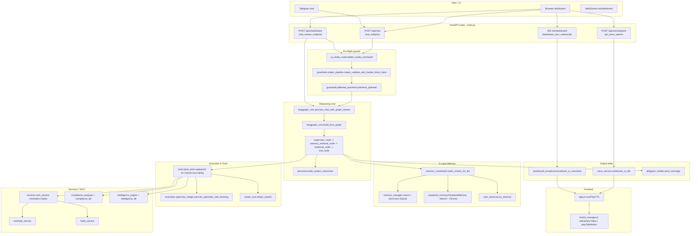

# Kuro AI V7.0 "Leviathan" — SYSTEM_MAP

> Authoritative navigation map for the repository. Traced function-by-function
> from the true entrypoint (`main.py`) outward. Only source code under version
> control is listed; runtime caches, logs, SQLite files, virtualenvs, and build
> artefacts are intentionally excluded.

## Project Summary

- **Purpose**: Kuro is Master Pantronux's personal AI Butler — a unified
  FastAPI application that fuses a LangGraph reasoning loop, a 3-layer memory
  system (recent chat → short-term summary → long-term semantic + SSoT),
  proactive sentinels (CVE, fitness, reminders), a compliance workbench, a
  habit tracker, a Piper-driven butler voice, and a Live2D (Hijiki) mascot
  into one cohesive assistant accessible from a web dashboard and Telegram.
- **Tech stack**:
  - Backend: FastAPI, LangGraph, `google-genai` (Gemini), NeMo Guardrails,
    APScheduler, SQLite, ChromaDB, Mem0 (via `perpetual_memory.py`),
    Arize Phoenix + OpenTelemetry.
  - Voice: Piper TTS (`en_GB-alan-medium`) + ffmpeg pitch-shift, gTTS
    fallback.
  - Frontend: Vanilla JS on Jinja2 templates, PIXI.js +
    `pixi-live2d-display` for Hijiki, Web Audio API for lip-sync RMS.
  - External: Telegram Bot API, Serper.dev, Proxmox VE API, NVD CVE feed,
    OpenClaw skill bridge.
- **Architecture pattern**: Monolithic FastAPI process (`main.py`) owning
  auth, routing, schedulers and WebSocket fan-out. Reasoning is delegated to
  a LangGraph state machine (`kuro_backend/langgraph_core.py`) whose nodes
  call into a layered memory stack (`memory_coordinator` → `memory_manager`
  + `perpetual_memory`) and feature services. Background sentinels
  (reminders, CVE dreaming, fitness, proactive events) run on APScheduler
  alongside the request loop. A separate `OpenClaw` process is reached via
  HTTP bridge for privileged skill execution.

## V7.0 Reset Notes

- **Core DAG simplified:** `kuro_backend/langgraph_core.py` now follows
  `Input -> Memory Retrieval -> Tool/Action -> Response -> Memory Extraction`.
  Compliance and habit/reminder nodes are removed from runtime graph routing.
- **Long-term semantic memory:** `kuro_backend/memory_coordinator.py` +
  `kuro_backend/perpetual_memory.py` use Mem0 as the only long-term semantic
  source for chat context.
- **Short-term context policy:** prompt injection now prioritizes raw
  last-15-turn context (no summary compression in hot path).
- **Attachment continuity:** `main.py` persists `current_session_state`
  runtime context (attachments + extracted snippets) and
  `memory_coordinator.build_referent_grounding_block` prioritizes this state
  for deictic follow-ups like "edit previous result" / "add to that".
- **Legacy modules:** compliance/habits/reminders product routes are retained
  as disabled endpoints (`410`) pending full module excision in a follow-up.

## Core Logic Flow (Function-Level Flowchart)



Side-branches not drawn on the trunk but reachable from the same
`tool_node` / scheduler layer:
- **Habits** — `/api/habits*` routes → `services/core_service` → `habit_service`.
- **Reminders** — APScheduler jobs in `main.py` → `reminder_service` →
  Telegram + dashboard WS.
- **Compliance** — `/api/compliance/*` → `compliance_analyzer` +
  `compliance_db` + Chroma `kuro_compliance_chroma`.
- **Intelligence briefings** — `/api/intelligence/*` and the daily scheduler
  → `intelligence_engine` → `serper_tool` + `intelligence_db`.
- **Dreaming / CVE + fiscal sentinels** — `dreaming_worker.run_dreaming_cycle`
  → `proactive_events.publish` → `telegram_notifier` (CVE + `fiscal_alert`).
- **Proactive greeting** — `proactive_greeting.maybe_send` on first
  `/ws/dashboard` connect.

## Clean Tree

Source-only view. Everything listed below is either code, a template, a
declarative config, or a static asset shipped with the repo. Runtime
artefacts are excluded — see **Exclusions** at the bottom of this section.

```
.
├── main.py                      # FastAPI entrypoint, routes, schedulers
├── requirements.txt
├── CHANGELOG.md
├── INTEGRATION_HARDENING_DETAILS.md
├── SYSTEM_MAP.md                # this file
├── kuro_backend/
│   ├── version.py               # V7.0.0 "Leviathan" single source of truth
│   ├── config.py                # env keys -> typed Settings
│   ├── personas.py              # butler/consultant/advisor/chill/tactical/chancellor
│   ├── core.py                  # non-graph Gemini fallback
│   ├── langgraph_core.py        # graph nodes, streaming, tool dispatch
│   ├── memory_coordinator.py    # orchestrates 3-layer memory
│   ├── memory_manager.py        # SQLite short-term + research ledger
│   ├── perpetual_memory.py      # Mem0 + Chroma wrapper
│   ├── ssot_shortcuts.py        # deterministic SSoT answers
│   ├── semantic_cache.py        # embedding-keyed response cache
│   ├── embedding_cache.py
│   ├── token_budget.py          # per-persona context sizing
│   ├── observability.py         # Phoenix + OTel bootstrap
│   ├── voice_service.py         # Piper + gTTS + pitch shift
│   ├── ui_mode_router.py        # English mode commands
│   ├── dashboard_broadcast.py   # /ws/dashboard fan-out
│   ├── telegram_notifier.py
│   ├── proactive_events.py
│   ├── proactive_greeting.py
│   ├── reminder_service.py
│   ├── habit_service.py
│   ├── fitness_service.py
│   ├── intelligence_engine.py
│   ├── compliance_analyzer.py
│   ├── persona_history_admin.py
│   ├── dreaming_worker.py       # CVE + fiscal sentinels, reflection + CLI
│   ├── finance_db.py            # budgets, api_usage_daily, watched_symbols, prediction_watch
│   ├── pricing.py               # static Gemini USD/token estimates
│   ├── voice_profiles.py        # per-persona Piper length/pitch overrides
│   ├── serper_tool.py
│   ├── auth_db.py               # schema only; *.db files excluded
│   ├── chat_history.py
│   ├── compliance_db.py
│   ├── daily_habits_db.py
│   ├── intelligence_db.py
│   ├── reminder_db.py
│   ├── services/
│   │   ├── __init__.py
│   │   ├── core_service.py      # reminders + habits canonical layer
│   │   ├── schemas.py           # Pydantic contracts
│   │   └── async_adapter.py
│   ├── tools/
│   │   ├── __init__.py
│   │   ├── base_tools.py        # Gemini tool surface
│   │   └── system_tools.py
│   ├── execution/
│   │   ├── openclaw_bridge.py   # HTTP + circuit breaker
│   │   └── service.py           # sync wrapper
│   └── guardrails/
│       ├── __init__.py
│       ├── sniper_pipeline.py
│       ├── sniper_context.py
│       ├── jailbreak_precheck.py
│       └── nemo_bootstrap.py
├── kuro_nemo_guardrails/
│   ├── config.yml
│   ├── actions.py
│   ├── main.co                  # NeMo Colang rails
│   ├── rails.co
│   ├── safety.co
│   ├── fact_check.co
│   └── jailbreak.co
├── web_interface/
│   ├── templates/
│   │   ├── index.html           # dashboard + Live2D dock + avatar
│   │   ├── login.html
│   │   ├── daily_habits.html
│   │   ├── reminder.html
│   │   ├── intelligence.html
│   │   └── compliance.html
│   └── static/
│       ├── js/
│       │   ├── app.js           # WS client, kuroPlayTTS, UI modes
│       │   └── live2d_manager.js # Hijiki loader + lip-sync
│       ├── css/                 # dashboard styles
│       └── vendor/
│           └── live2d/
│               └── README.md    # offline SDK drop-in instructions
├── openclaw_skills/
│   ├── harvest_gemini_share/
│   │   ├── harvest_gemini_share.py
│   │   └── README.md
│   └── vulnerability_scan/
│       ├── vulnerability_scan.py
│       └── README.md
│   ├── market_analysis/
│   │   ├── market_analysis.py
│   │   └── README.md
│   └── prediction_market_scan/
│       ├── prediction_market_scan.py
│       └── README.md
├── maintenance/
│   ├── clean_duplicate_chat_history.py
│   └── rebuild_compliance_base.py
├── scripts/
│   ├── migrate_persona_consultant_advisor.py
│   ├── purge_mem0_junk.py
│   ├── smoke_mem0_store.py
│   ├── smoke_sniper_guardrails.py
│   └── smoke_test_openclaw.py
├── tests/
│   ├── test_api_sse_contract.py
│   ├── test_approval_integrity.py
│   ├── test_branding.py
│   ├── test_cve_sentinel.py
│   ├── test_dreaming_worker.py
│   ├── test_finance_db.py
│   ├── test_finance_db_schema_guard.py   # V7.0 Leviathan schema guard + index presence
│   ├── test_fiscal_sentinel.py
│   ├── test_gemini_share_routing.py
│   ├── test_market_openclaw_tools.py
│   ├── test_market_sentinel.py
│   ├── test_memory_coordinator_contract.py
│   ├── test_persona_context_budget.py
│   ├── test_personas_english.py
│   ├── test_proactive_events.py
│   ├── test_proactive_greeting.py
│   ├── test_referent_grounding.py
│   ├── test_shortcuts_finance.py
│   ├── test_smart_read_flow.py
│   ├── test_ssot_guardrails.py
│   ├── test_sync_revision_contract.py
│   ├── test_ui_mode_router.py
│   ├── test_upload_filename_generation.py
│   ├── test_version.py
│   ├── test_voice_profiles.py
│   └── test_voice_service.py
├── profile/
│   ├── kuro_avatar.png
│   ├── favicon.ico
│   └── live2d/hijiki/           # Cubism source + runtime model3.json
├── certs/                       # cert.pem / key.pem for HTTPS
└── db/                          # reserved directory for future migrations
```

**Exclusions honoured** (not listed above, never committed as code):
`__pycache__/`, `venv/`, `.venv/`, `node_modules/`, `.git/`, `kuro_chromadb/`,
`kuro_compliance_chroma/`, `phoenix_data/`, `media/`, `uploaded_files/`,
`logs/`, `guardrails_test/`, all `*.db` files (`kuro_auth.db`,
`kuro_chat_history.db`, `kuro_compliance.db`, `kuro_habits.db`,
`kuro_intelligence.db`, `kuro_reminders.db`, `kuro_short_term.db`, plus
backups like `kuro_chat_history.db.backup_*`), all `*.log` /
`*.log.YYYY-MM-DD`, and the standalone `kuro_memory.json` +
`master_profile.json` runtime state (covered under **Data & Config**).

## Module Map (The Chapters)

### Entrypoint
- [`main.py`](main.py) — *public*: `app` (FastAPI), `verify_password`,
  `create_access_token`, `validate_token`, `save_upload_file`,
  `api_success`, `api_error`, and 65 `@app.*` route handlers spanning
  `/api/login`, `/api/chat`, `/api/chat/stream`, `/api/voice/speech`,
  `/ws/dashboard`, `/api/habits*`, `/api/reminders*`, `/api/compliance*`,
  `/api/intelligence*`, `/api/finances/*`, `/api/persona*`, `/api/observability/*`,
  `/api/system-status`, `/api/health`. Also wires two APScheduler
  `BackgroundScheduler` instances (`_hardware_sentinel_scheduler`,
  `_reminder_scheduler`) and the Uvicorn boot thread.

### Reasoning Core
- [`kuro_backend/langgraph_core.py`](kuro_backend/langgraph_core.py) —
  *public*: `KuroState`, `build_kuro_graph`, `process_chat_with_graph`,
  `process_chat_with_graph_stream`, `process_pdf_with_thinking`,
  `supervisor_node`, `memory_retrieval_node`, `memory_extraction_node`,
  `response_node`, `tool_node`, `compliance_node`, `habit_node`,
  `route_after_supervisor`, `get_system_instruction`,
  `get_post_response_queue_depth`, `save_graph_visualization`. Owns the
  Gemini tool-calling loop and destructive-action approval gate.
- [`kuro_backend/core.py`](kuro_backend/core.py) — *public*: `process_chat`,
  `get_last_topic`. Non-graph fallback path used when LangGraph is
  bypassed (e.g. some CLI/smoke tools).
- [`kuro_backend/personas.py`](kuro_backend/personas.py) — *public*:
  `SamplingProfile`, `LayerWeights`, `ContextBudget`, `get_sampling_profile`,
  `get_context_budget`, `build_factual_response_config`,
  `normalize_persona_key`, `build_system_instruction`. English "Elegant &
  Sophisticated" prompts for butler / consultant / advisor / chill /
  tactical / chancellor (Sovereign Accountant + financial SSoT addendum).

### Memory & SSoT
- [`kuro_backend/memory_coordinator.py`](kuro_backend/memory_coordinator.py)
  — *public*: `build_context_for_llm` (adds `finance_block` for
  `chancellor`), `build_context_for_llm_async`,
  `build_gemini_contents_parts`, `build_referent_grounding_block`,
  `apply_path_tokens_to_runtime`, `render_summary_for_prompt`,
  `build_compressed_short_term_text`, `prefetch_mem0`, `take_prefetched_mem0`,
  `safe_mem0_retrieve`, `execute_memory_write_task`,
  `execute_mem0_extract_task`, `habit_create/update/delete`,
  `record_mutation`, `apply_openclaw_execution_result`.
- [`kuro_backend/memory_manager.py`](kuro_backend/memory_manager.py) —
  *public*: `load_master_profile`, `save_master_profile`,
  `get_master_profile_formatted`, `update_master_profile`,
  `get_active_persona`, `set_active_persona`, `normalize_persona`,
  `get_runtime_context_value`, `set_runtime_context_value`,
  `init_short_term_db`, `get_short_term_with_ids`,
  `get_short_term_summary` (+ `_json`, `upsert_*`),
  `append_research_ledger` (+ `_batch`), `query_research_ledger` (+
  `_since`), `query_short_term_summaries_recent`,
  `query_short_term_latest_timestamp`, `acquire_dreaming_lease`,
  `release_dreaming_lease`, `insert_dreaming_cycle`,
  `update_dreaming_cycle`, `dream_notification_seen`,
  `mark_dream_notification`.
- [`kuro_backend/perpetual_memory.py`](kuro_backend/perpetual_memory.py) —
  *public*: `PerpetualMemory`, `get_memory_client`,
  `coerce_mem0_search_results`, `extract_json_from_text`. Wraps Mem0 +
  ChromaDB for long-term semantic recall.
- [`kuro_backend/ssot_shortcuts.py`](kuro_backend/ssot_shortcuts.py) —
  *public*: `ShortcutResult`, `try_shortcut`. Deterministic "today's
  habits / upcoming reminders / budget / recurring expenses / API spend"
  short-circuit before LLM.
- [`kuro_backend/semantic_cache.py`](kuro_backend/semantic_cache.py) —
  *public*: `lookup`, `store`, `invalidate_tag`, `clear`, `classify_tags`.
- [`kuro_backend/embedding_cache.py`](kuro_backend/embedding_cache.py) —
  *public*: `embed_query`, `clear_cache`.
- [`kuro_backend/token_budget.py`](kuro_backend/token_budget.py) —
  *public*: `approx_tokens`, `trim_section`, `apply_section_budget`,
  `build_persona_section_quotas`, `apply_persona_budget`,
  `enforce_global_ceiling`, `collapse_duplicate_blocks`.

### Feature Services
- [`kuro_backend/services/core_service.py`](kuro_backend/services/core_service.py)
  — *public*: `init_all_databases`, `register_main_event_loop`,
  `bump_data_revision`, `get_data_revision`; reminder API (`add_reminder`,
  `get_pending_reminders`, `get_upcoming_reminders`,
  `get_reminder_history`, `update_reminder_status`, `mark_notified_10m`,
  `mark_notified_event`, `mark_completed`, `delete_reminder`,
  `get_reminders_needing_*_notification`, `get_reminder_stats`); habit API
  (`add_habit`, `update_habit`, `delete_habit`, `get_all_habits`,
  `get_todays_habits`, `mark_habit_done/undone`,
  `toggle_habit_log_for_date`, `reset_all_habits`, `get_completion_stats`,
  `get_end_of_day_report`, `get_weekly_stats`, `get_monthly_data`,
  `get_weekly_data`, `get_ai_evaluation`, `save_ai_evaluation`,
  `get_monthly_report_data`, `get_weekly_report_data`,
  `fetch_habit_activity_snapshot`); `*_validated` Pydantic-backed
  counterparts. Also hosts the reminders and habits SQLite schemas.
- [`kuro_backend/services/schemas.py`](kuro_backend/services/schemas.py) —
  *public*: `ReminderRecord`, `ReminderStats`, `HabitRecord`,
  `HabitCompletionStats`, `HabitGridRow`, `MonthlyHabitPayload`,
  `WeeklyHabitPayload`, `AiEvaluationRecord`, `MonthlyBudgetRecord`,
  `RecurringExpenseRecord`, `ApiUsageDailyRecord`.
- [`kuro_backend/services/async_adapter.py`](kuro_backend/services/async_adapter.py)
  — *public*: `run_db`, `as_awaitable`.
- [`kuro_backend/reminder_service.py`](kuro_backend/reminder_service.py) —
  *public*: facade re-exporting `add_reminder`, `delete_reminder`,
  `mark_notified_10m/event`, `mark_reminder_completed`, `add_habit`,
  `update_habit`, `delete_habit`, `mark_habit_done/undone`,
  `toggle_habit_log_for_date`, `reset_all_habits`, `save_ai_evaluation`,
  `get_upcoming_reminders`, `get_reminder_history`, `get_reminder_stats`,
  `get_reminders_needing_*_notification`, `get_pending_reminders`.
- [`kuro_backend/habit_service.py`](kuro_backend/habit_service.py) —
  *public*: `fetch_sqlite_habit_snapshot`,
  `snapshot_has_no_positive_activity`, `log_snapshot_debug`,
  `format_habit_block_for_llm`, `build_monthly_eval_user_prompt`.
- [`kuro_backend/fitness_service.py`](kuro_backend/fitness_service.py) —
  *public*: `check_fitness_anomalies`, `run_fitness_sentinel`.
- [`kuro_backend/intelligence_engine.py`](kuro_backend/intelligence_engine.py)
  — *public*: `generate_daily_queries`, `execute_research`,
  `synthesize_intelligence`, `format_telegram_message`,
  `run_daily_research`.
- [`kuro_backend/compliance_analyzer.py`](kuro_backend/compliance_analyzer.py)
  — *public*: `analyze_document_compliance`.
- [`kuro_backend/persona_history_admin.py`](kuro_backend/persona_history_admin.py)
  — *public*: `get_persona_counts`, `list_backups`, `preview_reclassify`,
  `run_reclassify`, `override_persona`, `restore_persona_from_backup`.
- [`kuro_backend/proactive_events.py`](kuro_backend/proactive_events.py) —
  *public*: `ProactiveEvent`, `publish`, `publish_async`, `make_event`.
- [`kuro_backend/proactive_greeting.py`](kuro_backend/proactive_greeting.py)
  — *public*: `maybe_send`.
- [`kuro_backend/dreaming_worker.py`](kuro_backend/dreaming_worker.py) —
  *public*: `Finding`, `run_dreaming_cycle`, `collect_last_24h`, `main`
  (CLI entry; `--run-fiscal`). CVE scan, `_run_fiscal_sentinel`, reflection,
  Proxmox discovery helpers.

### Execution & Tools
- [`kuro_backend/tools/base_tools.py`](kuro_backend/tools/base_tools.py) —
  *public* (Gemini-registered callables): `list_my_files`,
  `list_project_files`, `read_pdf_content`, `universal_read`, `smart_read`,
  `parse_log_content`, `index_system_path`, `analyze_system_health`,
  `get_system_status`, `check_proxmox_infrastructure`, `process_video`,
  `analyze_compliance`, `search_compliance_clause`, `parse_datetime`,
  `lookup_chroma_context`, `add_reminder_tool`, `get_reminders_tool`,
  `set_monthly_budget_tool`, `get_budget_tool`, `add_recurring_expense_tool`,
  `list_recurring_expenses_tool`, `get_daily_api_cost_tool`,
  `mark_habit_done_tool`, `get_habits_status_tool`, `get_habit_history_tool`,
  `summarize_pdf`, `read_docx_content`, `read_xlsx_content`,
  `read_pptx_content`, `summarize_document`, `extract_gemini_share_url`,
  `task_suggests_gemini_harvest`, `resolve_harvest_gemini_routing`,
  `advanced_execution_tool`.
- [`kuro_backend/tools/system_tools.py`](kuro_backend/tools/system_tools.py)
  — *public*: `generate_excel_report`, `manage_files`,
  `generate_report_template`.
- [`kuro_backend/execution/openclaw_bridge.py`](kuro_backend/execution/openclaw_bridge.py)
  — *public*: `OpenClawBridgeClient`, `is_command_safe`,
  `execute_openclaw_skill`, `execute_openclaw_skill_blocking`. Includes a
  failure-counted circuit breaker around the local OpenClaw HTTP endpoint.
- [`kuro_backend/execution/service.py`](kuro_backend/execution/service.py)
  — *public*: `execute_openclaw_skill_sync`.
- [`kuro_backend/serper_tool.py`](kuro_backend/serper_tool.py) — *public*:
  `serper_search`, `serper_news`, `serper_scholar`.

### Guardrails
- [`kuro_backend/guardrails/sniper_pipeline.py`](kuro_backend/guardrails/sniper_pipeline.py)
  — *public*: `self_check_input_python` (+ async variant),
  `self_check_output_python` (+ async), `memory_grounding_ok`,
  `sniper_fact_gate_python`, `sniper_precheck_or_block`,
  `is_low_risk_stream_candidate`, `sniper_validate_and_maybe_block_input`
  (+ async), `sniper_ssot_grounding_lint`, `sniper_postprocess_output`
  (+ async), `guardrails_config_path`.
- [`kuro_backend/guardrails/sniper_context.py`](kuro_backend/guardrails/sniper_context.py)
  — *public*: `is_command_intent`, `is_general_compliance_knowledge_query`,
  `is_habit_report_message`, `should_fact_check_heuristic`,
  `extract_entity_hint`, `build_sniper_context`.
- [`kuro_backend/guardrails/jailbreak_precheck.py`](kuro_backend/guardrails/jailbreak_precheck.py)
  — *public*: `looks_like_coding_help`, `jailbreak_triggered`,
  `precheck_jailbreak`.
- [`kuro_backend/guardrails/nemo_bootstrap.py`](kuro_backend/guardrails/nemo_bootstrap.py)
  — *public*: `KuroGeminiChat`, `ensure_nemo_providers_registered`.
- [`kuro_nemo_guardrails/`](kuro_nemo_guardrails/) — Colang rails loaded by
  sniper_pipeline: `main.co`, `rails.co`, `safety.co`, `fact_check.co`,
  `jailbreak.co` + `config.yml` + `actions.py`.

### Real-time, Voice & UI
- [`kuro_backend/dashboard_broadcast.py`](kuro_backend/dashboard_broadcast.py)
  — *public*: `connect`, `disconnect`, `broadcast_refresh`,
  `broadcast_ui_command`, `send_ui_command_to`, `schedule_ui_command`.
- [`kuro_backend/voice_service.py`](kuro_backend/voice_service.py) —
  *public*: `TTSError`, `synthesize`, `synthesize_to_file`, `cache_stats`.
  Default engine = Piper (`en_GB-alan-medium`) with ffmpeg pitch-shift
  (`0.93`) and `KURO_PIPER_LENGTH_SCALE=1.1`; optional `persona=` selects
  overrides from `voice_profiles.py` (Chancellor sterner cadence).
- [`kuro_backend/ui_mode_router.py`](kuro_backend/ui_mode_router.py) —
  *public*: `detect_mode_command`, `acknowledgement`. English verbs:
  "activate research mode", "switch to HUD", "system status", "stand
  down".
- [`kuro_backend/telegram_notifier.py`](kuro_backend/telegram_notifier.py)
  — *public*: `send_message`, `send_dream_inconsistency`.
- [`kuro_backend/observability.py`](kuro_backend/observability.py) —
  *public*: `start_phoenix_server`, `stop_phoenix_server`,
  `setup_opentelemetry`, `get_tracer`, `create_session_context`,
  `trace_node`, `track_token_usage` (also rolls up `finance_db.add_api_usage`
  when `KURO_FINANCE_TRACKING_ENABLED`), `get_session_token_usage`,
  `cleanup_old_sessions`, `record_latency_metric`,
  `get_latency_metrics_snapshot`, `is_client_query`, `add_client_label`,
  `initialize_observability`, `shutdown_observability`.

### DB Layer (schema declarations only — `*.db` files excluded)
- [`kuro_backend/auth_db.py`](kuro_backend/auth_db.py) — *public*:
  `init_auth_db`, `record_failed_attempt`, `clear_failed_attempts`,
  `is_account_locked`, `lock_account`, `record_successful_login`,
  `greeting_sent_within`, `record_greeting_sent`, `get_login_stats`.
  **Tables**: `failed_attempts`, `login_sessions`, `account_lockouts`,
  `proactive_greetings` (→ `kuro_auth.db`).
- [`kuro_backend/chat_history.py`](kuro_backend/chat_history.py) —
  *public*: `init_db`, `add_message`, `get_history`, `get_total_count`,
  `clear_history`, `record_uploaded_file_integrity`,
  `get_uploaded_file_integrity`. **Tables**: `chat_history`,
  `uploaded_file_integrity` (→ `kuro_chat_history.db`).
- [`kuro_backend/compliance_db.py`](kuro_backend/compliance_db.py) —
  *public*: `init_db`, `add_evidence`, `update_evidence_status`,
  `get_evidence_matrix`, `add_audit_trail`, `get_audit_trail`,
  `add_gap_analysis`, `get_compliance_progress`. **Tables**:
  `evidence_matrix`, `audit_trail`, `standards_kb`, `gap_analysis`
  (→ `kuro_compliance.db`).
- [`kuro_backend/daily_habits_db.py`](kuro_backend/daily_habits_db.py) —
  *public*: `init_habits_db`. Schemas for `daily_habits`,
  `completion_history`, `habit_logs`, `ai_evaluations`,
  `app_sync_metadata` actually live in `services/core_service.py`
  (→ `kuro_habits.db`).
- [`kuro_backend/intelligence_db.py`](kuro_backend/intelligence_db.py) —
  *public*: `init_db`, `save_briefing`, `get_briefings`,
  `get_briefing_by_date`, `search_briefings`, `get_total_count`.
  **Table**: `intelligence_briefings` (→ `kuro_intelligence.db`).
- [`kuro_backend/reminder_db.py`](kuro_backend/reminder_db.py) —
  *public*: `init_reminder_db`. Schema for `reminders` lives in
  `services/core_service.py` (→ `kuro_reminders.db`).
- [`kuro_backend/finance_db.py`](kuro_backend/finance_db.py) — *public*:
  `init_db`, `add_budget`, `get_budget`, `list_budgets`,
  `upsert_recurring_expense`, `delete_recurring_expense`,
  `list_recurring_expenses`, `add_api_usage`, `get_daily_api_cost_usd`,
  `get_last_n_days_spend`, `format_ledger_snapshot`. **Tables**:
  `monthly_budget`, `recurring_expenses`, `api_usage_daily`,
  `watched_symbols`, `prediction_watch`, `market_hud_snapshot`
  (→ `kuro_finances.db`, path from `KURO_FINANCE_DB_PATH`).
- `memory_manager.py` additionally declares `short_term`,
  `short_term_summaries`, `research_ledger`, `dreaming_locks`,
  `dreaming_cycles`, `dream_notifications` in `kuro_short_term.db`.

### Frontend
- [`web_interface/templates/index.html`](web_interface/templates/index.html)
  — dashboard shell: avatar (`/profile/kuro_avatar.png`), Live2D dock
  (`<canvas id="live2d-canvas">`), WebSocket status ticker, chat pane,
  favicon links, `V7.0` sidebar badge, Chancellor persona option, market chips bar.
- [`web_interface/templates/daily_habits.html`](web_interface/templates/daily_habits.html),
  [`reminder.html`](web_interface/templates/reminder.html),
  [`intelligence.html`](web_interface/templates/intelligence.html),
  [`market.html`](web_interface/templates/market.html),
  [`compliance.html`](web_interface/templates/compliance.html),
  [`login.html`](web_interface/templates/login.html) — secondary pages,
  each with favicon.
- [`web_interface/static/js/app.js`](web_interface/static/js/app.js) —
  key symbols: `authFetch`, `setupEventListeners`, `kuroApplyUIMode`,
  `kuroEnsureTicker`, `kuroRenderStatusTicker`, `kuroRenderSentinelTicker`,
  `kuroSetAvatarSpeaking`, `kuroPlayTTS` (creates `AudioContext` +
  `AnalyserNode` and drives lip-sync),   `kuroConnectDashboardWS`, `kuroStartMarketHudPoll`, `kuroMarketHudChipLine`,
  `kuroHandleGreeting`, `kuroRestoreUIMode`, `kuroMaybeSpeakHUD`,
  `sendMessage`, `handleFiles`, plus Web Audio helpers
  `_kuroEnsureAudioGraph`, `_kuroAttachAudioToAnalyser`,
  `_kuroStartLipSyncLoop`, `_kuroStopLipSyncLoop`.
- [`web_interface/static/js/live2d_manager.js`](web_interface/static/js/live2d_manager.js)
  — *public*: `initLive2D()`, `setLipSyncValue(v)`, `playTalkMotion()`,
  `returnToIdle()` (attached to `window.kuroLive2D`). Loads
  `live2dcubismcore.min.js` + PIXI + `pixi-live2d-display` from local
  vendor first, CDN fallback second; model = Hijiki at
  `/profile/live2d/hijiki/runtime/hijiki.model3.json`.
- [`web_interface/static/vendor/live2d/README.md`](web_interface/static/vendor/live2d/README.md)
  — instructions for the offline SDK drop (binaries excluded by license).

### Ops / CLI / Tests
- [`openclaw_skills/`](openclaw_skills/) — out-of-process skills consumed
  by `execution/openclaw_bridge.py`: `harvest_gemini_share` and
  `vulnerability_scan` (each ships its own `README.md`).
- [`maintenance/`](maintenance/) — ad-hoc data repair:
  `clean_duplicate_chat_history.py`, `rebuild_compliance_base.py`.
- [`scripts/`](scripts/) — one-shot migrations & smokes:
  `migrate_persona_consultant_advisor.py`, `purge_mem0_junk.py`,
  `smoke_mem0_store.py`, `smoke_sniper_guardrails.py`,
  `smoke_test_openclaw.py`.
- [`tests/`](tests/) — pytest suite covering contracts (SSE, referent
  grounding, sync revisions), branding/HTML, English personas, UI router,
  dreaming worker, CVE sentinel, fiscal shortcuts, finance_db, voice
  profiles, proactive events/greeting, voice, upload hashing, version,
  persona budget.

## Data & Config

- **Env loader**: [`kuro_backend/config.py`](kuro_backend/config.py) exposes
  a `Settings` class driven by `python-dotenv`; `.env` is read at startup
  but never committed. Public env keys (values redacted):
  - Gemini / runtime: `GEMINI_API_KEY`, `MODEL_NAME`, `TIMEZONE`,
    `WORKING_DIR`, `GEMINI_CACHED_CONTENT`.
  - Proxmox: `PVE_HOST`, `PVE_PORT`, `PVE_TOKEN_ID`, `PVE_TOKEN_SECRET`.
  - Telegram: `TELEGRAM_TOKEN`, `TELEGRAM_CHAT_ID`.
  - CVE sentinel: `KURO_CVE_SENTINEL_ENABLED`, `KURO_CVE_MIN_CVSS`,
    `KURO_CVE_MAX_ALERTS_PER_CYCLE`, `KURO_VULN_NMAP_ENABLED`.
  - Proactive: `KURO_PROACTIVE_ENABLED`,
    `KURO_PROACTIVE_TELEGRAM_ENABLED`, `KURO_PROACTIVE_SEVERITY_FLOOR`.
  - Fitness: `KURO_FITNESS_ENABLED`, `KURO_FITNESS_DATA_PATH`,
    `KURO_FITNESS_INTERVAL_MIN`.
  - Finances / Chancellor: `KURO_FINANCE_TRACKING_ENABLED`,
    `KURO_FINANCE_DB_PATH`, `KURO_FISCAL_DAILY_USD_THRESHOLD`,
    `KURO_FISCAL_SENTINEL_ENABLED`.
  - Voice (V6.1+): `KURO_TTS_ENGINE`, `KURO_PIPER_VOICE_PATH`,
    `KURO_TTS_CACHE_DIR`, `KURO_PIPER_LENGTH_SCALE`,
    `KURO_TTS_PITCH_SHIFT`, `KURO_TTS_FFMPEG_ENABLED`.
  - Greeting / UI: `KURO_PROACTIVE_GREETING_ENABLED`,
    `KURO_PROACTIVE_GREETING_COOLDOWN_DAYS`,
    `KURO_PROACTIVE_GREETING_LANG`, `KURO_UI_MODE_DEFAULT`.
  - Additional runtime keys read inline across modules (e.g. Mem0, OpenAI
    embedding, OpenClaw bridge URL/token, Serper) are documented in the
    respective files' docstrings.
- **Runtime JSON state (excluded from VCS but read at runtime)**:
  - `master_profile.json` — read/written by
    `memory_manager.load_master_profile` / `save_master_profile`; holds
    Master Pantronux's canonical profile facts.
  - `kuro_memory.json` — legacy/auxiliary memory blob referenced by
    `perpetual_memory.PerpetualMemory`.
- **SQLite files** (all sit at repo root, excluded from the tree, schemas
  cited above): `kuro_auth.db`, `kuro_chat_history.db`,
  `kuro_compliance.db`, `kuro_habits.db`, `kuro_intelligence.db`,
  `kuro_reminders.db`, `kuro_short_term.db`, `kuro_finances.db`. The empty
  [`db/`](db/) directory is reserved for future versioned migrations.
- **Vector stores**: `kuro_chromadb/` (general semantic memory) and
  `kuro_compliance_chroma/` (ISO/NIST clause embeddings). Both are
  Chroma on-disk persistents and are excluded from the tree.
- **Primary table one-liners** (summaries — see each `*_db.py` /
  `services/core_service.py` for full DDL):
  - `failed_attempts(id, username, ip, user_agent, timestamp, …)`
  - `login_sessions(id, username, session_token, login_time, …)`
  - `account_lockouts(id, username, locked_until, reason, …)`
  - `proactive_greetings(id, username, sent_at, …)`
  - `chat_history(id, role, content, timestamp, platform, persona, …)`
  - `uploaded_file_integrity(id, stored_filename, sha256, request_id, …)`
  - `reminders(id, event_name, event_time, description, status, …)`
  - `daily_habits(id, title, scheduled_time, category, …)`,
    `habit_logs(id, habit_id, log_date, status)`,
    `completion_history(id, habit_id, completed_at)`,
    `ai_evaluations(id, habit_id, period_type, year, period, payload)`,
    `app_sync_metadata(key, value)`
  - `short_term(id, persona_scope, role, content, ts)`,
    `short_term_summaries(persona_scope, last_entry_id, summary, …)`,
    `research_ledger(id, persona, kind, payload, ts)`,
    `dreaming_locks(name, leased_by, expires_at)`,
    `dreaming_cycles(id, status, …)`,
    `dream_notifications(fingerprint, ts)`
  - `evidence_matrix(id, file_name, standard, clause_id, status, …)`,
    `audit_trail(id, action, details, ts)`,
    `standards_kb(id, standard, clause, …)`,
    `gap_analysis(id, document_name, standard, results, …)`
  - `intelligence_briefings(id, date, summary_text, raw_json, signals)`
  - `monthly_budget(id, month, amount_usd, notes, …)`,
    `recurring_expenses(id, label, amount_usd, cadence, next_due, …)`,
    `api_usage_daily(date, model_name, prompt_tokens, completion_tokens, cost_usd, …)`
- **Migrations / seeds**: [`maintenance/`](maintenance/) +
  [`scripts/`](scripts/).
- **Runtime output directories (excluded)**: `media/tts/` (Piper WAV
  cache keyed by text+voice hash), `uploaded_files/` (user uploads),
  `logs/` and top-level `kuro_butler.log*` (rotating app log),
  `phoenix_data/` (OpenTelemetry traces), `guardrails_test/`.
- **TLS**: [`certs/cert.pem`](certs/cert.pem) +
  [`certs/key.pem`](certs/key.pem) used by Uvicorn's HTTPS bind in
  `main.py`.

## External Integrations

| Integration | Call sites | Notes |
| --- | --- | --- |
| Google Gemini (`google-genai`) | `langgraph_core.py`, `core.py`, `compliance_analyzer.py`, `memory_coordinator.py` (summariser), `dreaming_worker.py`, `guardrails/sniper_pipeline.py` | Primary LLM; persona-specific configs in `personas.py`. |
| Static Gemini list pricing (USD) | `pricing.py` (→ `observability.track_token_usage` → `finance_db.add_api_usage`) | Approximate per-1K token map for ledgered `api_usage_daily`; unknown models log + record `0.0` cost. |
| Mem0 | `perpetual_memory.py` (via `memory_coordinator.safe_mem0_retrieve` + `execute_mem0_extract_task`) | Long-term semantic memory store. |
| ChromaDB | `perpetual_memory.py`, `compliance_analyzer.py`, `tools/base_tools.lookup_chroma_context`, maintenance scripts | On-disk collections `kuro_chromadb/`, `kuro_compliance_chroma/`. |
| Telegram Bot API | `telegram_notifier.py` (→ `proactive_events.publish`, reminder scheduler jobs in `main.py`, `intelligence_engine.format_telegram_message` pipeline) | Uses `TELEGRAM_TOKEN` / `TELEGRAM_CHAT_ID`. |
| Serper.dev | `serper_tool.py` (→ `tool_node` in `langgraph_core.py`, `intelligence_engine.execute_research`, `dreaming_worker._google_via_serper`) | Requires `SERPER_API_KEY` env. |
| Piper TTS + ffmpeg | `voice_service.py` (route `/api/voice/speech` and LangGraph streaming) | Voice model dropped at `KURO_PIPER_VOICE_PATH`; ffmpeg only for pitch shift. |
| Live2D Cubism Core + `pixi-live2d-display` | `web_interface/static/js/live2d_manager.js` (loads `/static/vendor/live2d/*` then CDN fallback) | Hijiki model served from `/profile/live2d/hijiki/runtime/`. |
| Proxmox VE API | `tools/base_tools._get_proxmox_headers`, `check_proxmox_infrastructure`, `dreaming_worker._discover_proxmox_targets_locally`, `/api/proxmox-status` route | Uses `PVE_*` env keys. |
| NVD (CVE feed) | `dreaming_worker._cve_scan_via_nvd_direct` | Direct HTTPS; no auth required but API key supported. |
| OpenClaw skill bridge | `execution/openclaw_bridge.py` + `execution/service.py` | HTTP + circuit breaker to local OpenClaw process; skills enumerated in `openclaw_skills/`. |
| NewsAPI (optional) | `openclaw_skills/market_analysis/market_analysis.py` (`get_market_news`) | Requires `NEWSAPI_API_KEY`; when unset the skill returns `articles: []` gracefully. |
| Metaculus (prediction markets) | `openclaw_skills/prediction_market_scan/prediction_market_scan.py` (→ Chancellor tool + nightly `_run_prediction_scan_nightly`) | Requires `METACULUS_API_TOKEN` or the `KURO_PREDICTION_MARKET_DEMO=1` seeded path. |
| Stooq (ticker price CSV) | `openclaw_skills/market_analysis/market_analysis.py` (`get_ticker_price`) | No auth; public CSV endpoint at `https://stooq.com/q/d/l/`. |
| NeMo Guardrails | `guardrails/sniper_pipeline.py`, `guardrails/nemo_bootstrap.py`, `kuro_nemo_guardrails/` Colang package | Wraps Gemini via `KuroGeminiChat`. |
| Arize Phoenix + OpenTelemetry | `observability.py` | Phoenix UI served from `phoenix_data/`; OTel exports traces for every LangGraph node via `trace_node`. |

## Documentation discipline (V7.0 Leviathan)

The V7.0 pass landed a repo-wide documentation standard so every file can
answer the same five questions at a glance. Keep it intact when adding new
modules.

### Header Doc contract

Every Python, HTML, JS, and CSS source file under version control MUST
carry a `--- Header Doc ---` block inside its top-of-file docstring /
comment, with these fields:

- **Purpose** — one-line purpose.
- **Caller** — modules or routes that import / invoke it.
- **Dependencies** — key libraries, SSoT DBs, or external APIs.
- **Main Functions** — public symbols / sections worth knowing about.
- **Side Effects** — DB writes, HTTP calls, file I/O, threads.

Existing docstrings are preserved verbatim; the Header Doc block is
appended to the end of whatever prose already lives there. Tests use a
shorter three-line form (`Purpose` / `Covers` / `Fixtures`).

### DB hygiene justification (finance_db)

[`finance_db.py`](kuro_backend/finance_db.py) is the single hottest SSoT on
the Chancellor path. The V7.0 audit captured the following decisions
inline in the module docstring; summarised here so the map stays
self-contained:

- **Schema bootstrap is once-per-process-per-path**: `init_db()` is gated
  by `_SCHEMA_READY_FOR` + `_SCHEMA_LOCK`. Hot-path helpers (e.g.
  `add_api_usage`, `apply_watched_price`) still call `init_db()`
  defensively, but after the first successful call the guard short-circuits
  so we skip six `CREATE TABLE IF NOT EXISTS` + one `INSERT OR IGNORE` per
  CRUD. Tests that rotate `KURO_FINANCE_DB_PATH` in `tmp_path` re-bootstrap
  automatically.
- **Indexes for the hot list paths**:
  - `idx_recurring_active(active, label)` — powers
    `list_recurring_expenses(active_only=True)` from the Chancellor
    context and `/api/finances/recurring` list route.
  - `idx_watched_active(active, symbol)` — powers
    `list_watched_symbols(active_only=True)` used by the nightly
    `_run_market_sentinel` and `market_hud` polling.
  - `api_usage_daily` keeps its implicit PK index on `date` (no extra
    index needed; PK already covers the descending-date scan).
- **Connection reuse**: short-lived `_conn()` + WAL is retained. Finance
  cardinality is bounded (budgets ≤ 24 rows, recurring ≤ ~50,
  api_usage_daily ≤ 365, watched_symbols ≤ ~30) so connection churn is
  not a bottleneck and avoids cross-thread locking.
- **`apply_watched_price`**: stays as `SELECT last_price` → compute
  pct-change → `UPDATE`. A single-statement `UPDATE ... RETURNING` would
  work on recent SQLite but is not reliable across the bundled versions
  we target; the two-statement pattern inside one connection is well
  within the rounding error at this cardinality.
- **`format_market_snapshot_for_prompt`**: two list queries + one brief
  read per Chancellor turn is acceptable and documented. Revisit if we
  ever scale watched_symbols above ~200.

Tests: [`tests/test_finance_db_schema_guard.py`](tests/test_finance_db_schema_guard.py)
asserts the idempotency of `init_db()`, the rebootstrap-on-path-change
semantics, and the presence of both indexes via `PRAGMA index_list`.

## Risks / Blind Spots

- **Dynamic OpenClaw skill loading**: skills under
  [`openclaw_skills/`](openclaw_skills/) are discovered at runtime by the
  external OpenClaw process; this map only lists the two shipped with the
  repo (`harvest_gemini_share`, `vulnerability_scan`). New skills dropped
  on disk will not appear until this document is regenerated.
- **`.env` values**: only key names are catalogued above — actual secrets
  (`GEMINI_API_KEY`, `TELEGRAM_TOKEN`, `PVE_TOKEN_SECRET`, Mem0, OpenClaw,
  Serper, NVD…) are never read into this map.
- **LangGraph topology**: the node list for
  [`langgraph_core.py`](kuro_backend/langgraph_core.py) reflects its
  top-level Python symbols, not the compiled DAG (which is assembled
  lazily inside `build_kuro_graph`). Conditional edges (e.g. approval
  gating, tool-vs-response routing) only resolve at runtime.
- **Runtime state files** (`kuro_memory.json`, `master_profile.json`, all
  `*.db` files, `media/tts/`, `kuro_chromadb/`, `kuro_compliance_chroma/`,
  `phoenix_data/`) are deliberately excluded; they mutate constantly and
  are never part of the source tree.
- **Telegram, Proxmox, and OpenClaw** calls assume the matching sidecar
  services are reachable; failure is absorbed by circuit-breakers but
  downgraded reasoning quality will not be visible in this map.
- **Live2D binaries**: `live2dcubismcore.min.js` and `pixi-live2d-display`
  are not vendored (license). Offline deployments must populate
  `web_interface/static/vendor/live2d/` per the `README.md` there; when
  missing, `live2d_manager.js` silently falls back to CDN.
- **NeMo Guardrails Colang graph** (`kuro_nemo_guardrails/*.co`) is parsed
  at bootstrap and cannot be fully flattened statically; specific rail
  decisions happen at turn time inside
  `sniper_pipeline.self_check_*_python`.
- **Any `sys.path` or import-time monkey-patch** (e.g. in
  `guardrails/nemo_bootstrap.py` when registering providers) is flagged
  here rather than traced — assume hidden side-effects at import.
