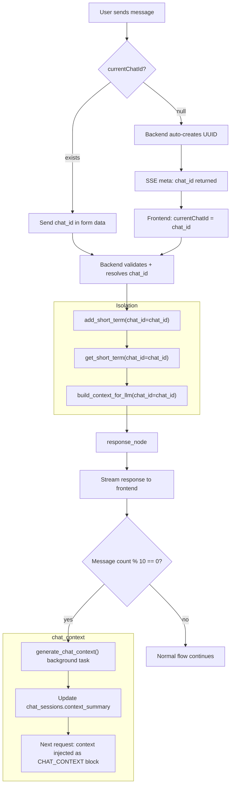

# Chat Isolation & `chat_id` Hardening — Implementation Plan

## Problem Statement

Terdapat dua bug kritis dan satu fitur baru yang perlu diimplementasikan:

1. **Bug 1 — History Bleed on New Chat:** Saat `startNewChat()` di-trigger, `currentChatId = null`. Namun ketika Enter ditekan, `sendMessage()` mengirim `chat_id = null` ke backend. Backend membuat UUID baru, tapi `currentChatId` di frontend hanya di-update **setelah** SSE `meta` event diterima — ada window race condition. Di sisi lain, `kuroLoadHistory()` yang dipanggil saat `selectChatSession()` tidak memfilter by `chat_id` yang baru → old history muncul.

2. **Bug 2 — Chat Cross-Contamination:** `add_short_term()` dan `get_short_term()` di `memory_manager.py` di-key hanya oleh `(persona_scope, username)`, **bukan** `chat_id`. Semua chat dari user yang sama + persona yang sama berbagi satu short-term buffer di `kuro_short_term.db`. Ini adalah root cause utama kenapa pesan dari Chat A muncul di Chat B.

3. **Fitur Baru — `chat_context` Auto-Generation:** Setiap 10-15 pesan dalam satu chat, generate `chat_context` menggunakan Gemini 2.5 Flash yang digunakan sebagai context penanaman untuk LLM, sehingga context tetap relevan dan tidak stale.

4. **Migration — Default Chat:** Chat lama yang belum punya `chat_id` yang sah (berlabel `legacy_*`) dipindahkan ke satu "Default Chat" per `(username, persona)`.

---

## Root Cause Map

```
Bug 1 (Frontend Race):
  startNewChat() → currentChatId = null
  sendMessage() → form_data: chat_id = null
  Backend → creates new UUID → sends in SSE meta event
  BUT: loadChatSessions() called before meta received → no chat_id filter on history

Bug 2 (Backend Isolation Failure):
  add_short_term(role, content, persona_scope, username)  ← NO chat_id
  get_short_term(persona_scope, username)                 ← NO chat_id
  → short_term table shared across ALL chat sessions of same user+persona
  → build_context_for_llm() pulls mixed turns from all sessions

Bug 2b (referent_grounding bleed):
  build_referent_grounding_block() calls chat_history.get_history(persona, username)
  → NO chat_id filter → deictic grounding reads attachments from OTHER chat sessions
```

---

## User Review Required

> [!IMPORTANT]
> **Short-term buffer isolation strategy**: Ada dua opsi untuk menambahkan `chat_id` ke `short_term` table. Aku pilih **Opsi B** (add `chat_id` column + migrate) karena backward-compatible dan tidak butuh recreate table. Opsi A (terpisah ke table baru) lebih clean tapi lebih banyak refactor. Konfirmasi jika kamu lebih suka Opsi A.

> [!WARNING]
> **`chat_context` vs `short_term` summary**: Saat ini sudah ada `build_compressed_short_term_text()` yang melakukan sliding-window summarization per `(persona_scope, username)`. Fitur `chat_context` baru akan **menggantikan** fungsi ini dalam konteks per-chat. Ini berarti `short_term_summaries` table akan di-extend dengan `chat_id` kolom.

> [!CAUTION]
> **Database migration**: `short_term` table tidak punya `chat_id`. Migration akan menambahkan kolom ini dan set default `NULL` (bukan legacy_*) untuk existing rows — karena short-term buffer boleh di-reset pada migration. Short-term data lama tidak kritikal.

---

## Open Questions

> [!NOTE]
> 1. **Model untuk `chat_context`**: Kamu menyebut Gemini 2.5 Flash. Ini tersedia via `settings.PRIMARY_MODEL` atau perlu env var baru `KURO_CHAT_CONTEXT_MODEL`? Aku akan buat env var baru dengan default `gemini-2.5-flash-preview-04-17` (atau model yang sudah diconfig).
>> Answer: Gunakan Gemini 3 Flash dengan code `gemini-3-flash-preview` agar bisa mengikuti, semisal ada perubahan jadi engga bingung juga
> 2. **Trigger threshold `chat_context`**: "10-15 chat" — aku interpret sebagai **setiap 10 pasang** user+assistant (20 rows), generate ulang. Atau 10 pesan total (user+assistant)?
>> Answer: Setiap 10 pasang user+assistant (20 rows)
> 3. **`chat_context` di mana disimpan**: Aku rencana tambahkan kolom `context_summary TEXT` + `context_updated_at` di `chat_sessions` table — lebih simple dari table terpisah. Setuju?
>> Answer: Silahkan, jika menurut kamu itu yang terbaik
---

## Proposed Changes

### Component 1: Database — `chat_history.py`

#### [MODIFY] [chat_history.py](file:///home/kuro/projects/kuro/kuro_backend/chat_history.py)

**Schema additions:**
```sql
-- chat_sessions: add context_summary + context_message_count
ALTER TABLE chat_sessions ADD COLUMN context_summary TEXT DEFAULT '';
ALTER TABLE chat_sessions ADD COLUMN context_message_count INTEGER DEFAULT 0;
ALTER TABLE chat_sessions ADD COLUMN context_updated_at DATETIME;
```

**New functions:**
- `update_session_context(chat_id, context_summary)` — upsert context summary untuk sebuah chat
- `get_session_context(chat_id)` — ambil context summary
- `get_session_message_count(chat_id)` — count messages untuk trigger threshold
- `get_default_chat_id(username, persona)` — ambil atau create "Default Chat" untuk migration

**Modified functions:**
- `get_history()` → **always require `chat_id`** untuk strict isolation; fallback ke persona-only hanya jika `chat_id = None` (untuk backward compat legacy endpoints)
- `record_uploaded_file_integrity()` → tambahkan `chat_id` parameter dan column

**Migration logic dalam `init_db()`:**
```python
# Create "Default Chat" for each (username, persona) that has legacy rows
# INSERT OR IGNORE into chat_sessions: chat_id = f"default_{username}_{persona}"
# UPDATE chat_history SET chat_id = "default_{username}_{persona}"
#   WHERE chat_id LIKE "legacy_%"
```

---

### Component 2: Memory — `memory_manager.py`

#### [MODIFY] [memory_manager.py](file:///home/kuro/projects/kuro/kuro_backend/memory_manager.py)

**Schema addition to `short_term` table:**
```sql
ALTER TABLE short_term ADD COLUMN chat_id TEXT DEFAULT NULL;
CREATE INDEX IF NOT EXISTS idx_short_term_chat_id ON short_term(chat_id, username);
```

**Modified functions:**
- `add_short_term(role, content, persona_scope, username, chat_id=None)` — tambahkan `chat_id` parameter
  - Jika `chat_id` provided: write + limit by `(persona_scope, username, chat_id)`
  - Jika `chat_id = None`: write to legacy bucket (backward compat)
- `get_short_term(persona_scope, username, chat_id=None)` — filter by `chat_id` jika provided
- `get_short_term_with_ids(persona_scope, username, chat_id=None)` — idem

**Short-term limit enforcement per chat:**
- Existing `SHORT_TERM_LIMIT = 15` tetap, tapi sekarang per `(persona_scope, username, chat_id)` 
- Legacy rows (chat_id IS NULL) tetap terisolasi di bucket sendiri

---

### Component 3: Memory Coordinator — `memory_coordinator.py`

#### [MODIFY] [memory_coordinator.py](file:///home/kuro/projects/kuro/kuro_backend/memory_coordinator.py)

**Modified functions:**
- `build_context_for_llm(user_input, persona_mode, ..., chat_id=None)` — pass `chat_id` ke `get_short_term()` dan `build_referent_grounding_block()`
- `build_context_for_llm_async(...)` — idem
- `build_referent_grounding_block(user_input, persona_mode, ..., chat_id=None)` — filter history by `chat_id`
- `build_compressed_short_term_text(persona_scope, ..., chat_id=None)` — keyed by `(persona_scope, username, chat_id)`
- `_persist_short_term_and_enqueue_writes()` di `langgraph_core.py` — pass `chat_id`

**New function — `generate_chat_context(chat_id, persona_scope, username)`:**
```python
def generate_chat_context(chat_id: str, persona_scope: str, username: str) -> str:
    """
    Generate a compressed context summary for a chat session using Gemini 2.5 Flash.
    Called every CHAT_CONTEXT_REFRESH_THRESHOLD messages.
    Stores result in chat_sessions.context_summary.
    """
```

**`chat_context` trigger logic:**
- Setelah `add_message()`, check `get_session_message_count(chat_id) % CHAT_CONTEXT_REFRESH_THRESHOLD == 0`
- Threshold default: `10` (configurable via `KURO_CHAT_CONTEXT_THRESHOLD` env var, range 10-15)
- Run as background task (non-blocking, same queue as post-response tasks)
- Result injected sebagai `[CHAT_CONTEXT]` block di `build_context_for_llm()`

---

### Component 4: LangGraph Core — `langgraph_core.py`

#### [MODIFY] [langgraph_core.py](file:///home/kuro/projects/kuro/kuro_backend/langgraph_core.py)

**`KuroState` — add field:**
```python
chat_id: Optional[str]  # Active chat session ID for isolation
```

**Modified functions:**
- `process_chat_with_graph()` → accept `chat_id` param → inject to state
- `process_chat_with_graph_stream()` → idem
- `_persist_short_term_and_enqueue_writes()` → pass `chat_id` ke `add_short_term()`
- `response_node()` / `reflective_response_node()` → pass `chat_id` ke `build_context_for_llm()`
- Post-response tasks → include `chat_id` in task payload

---

### Component 5: API Layer — `main.py`

#### [MODIFY] [main.py](file:///home/kuro/projects/kuro/main.py)

**`chat_endpoint()` (non-streaming):**
- Pass `chat_id=session_scope` ke `process_chat_with_graph()`
- Pass `chat_id=session_scope` ke `record_uploaded_file_integrity()`

**`chat_stream_endpoint()` (streaming):**
- Pass `chat_id=session_scope` ke `process_chat_with_graph_stream()`
- Pass `chat_id=session_scope` ke `record_uploaded_file_integrity()`

**`get_chat_history()` (`GET /api/history`):**
- Require `chat_id` param untuk strict filtering
- Kalau tidak ada `chat_id`: return empty atau return all sessions for persona (untuk backward compat)

**`get_chats()` (`GET /api/chats`):**
- Tambahkan `context_summary` di response payload

---

### Component 6: Frontend — `app.js`

#### [MODIFY] [app.js](file:///home/kuro/projects/kuro/web_interface/static/js/app.js)

**`getChatSessionId()` — REMOVE/DEPRECATE:**
- Fungsi ini menggunakan localStorage global dengan key `kuro_chat_session_id` yang di-share semua persona. Ini adalah source of bug. **Hapus** dan ganti dengan `currentChatId` state variable.

**`authFetch()` — REMOVE chat session header:**
- `X-Chat-Session` header tidak lagi dibutuhkan (backend pakai `chat_id` dari form data)

**`sendMessage()`:**
- Cek `currentChatId` sebelum send — **jika null**, backend akan buat baru dan return via SSE meta
- Fix race: set `currentChatId` **immediately** dari SSE `meta` event sebelum ada render apapun
- Jangan panggil `kuroLoadHistory()` untuk chat baru saat pertama send — bubble sudah ada di DOM dari streaming

**`startNewChat()`:**
- Set `currentChatId = null` (sudah ada)
- Clear `chatHistory = []` (sudah ada)
- **Clear chatOffset dan hasMoreMessages** (sudah ada)
- **Tidak panggil `kuroLoadHistory()`** — welcome screen sudah di-show

**`selectChatSession(chatId)`:**
- Pass `chat_id` to `kuroLoadHistory()` via `currentChatId`
- Pastikan `currentChatId` di-set **sebelum** `kuroLoadHistory()` dipanggil

**`kuroLoadHistory(isInitial)`:**
- Selalu include `chat_id` di URL query jika `currentChatId` tersedia
- Jika `!currentChatId` dan bukan infinite scroll: **return early** (jangan load history tanpa chat_id)

---

### Component 7: Migration Script — `scripts/migrate_chat_id.py` [NEW]

#### [NEW] [migrate_chat_id.py](file:///home/kuro/projects/kuro/scripts/migrate_chat_id.py)

Script one-shot untuk:
1. Scan `chat_history` WHERE `chat_id IS NULL OR chat_id LIKE 'legacy_%'`
2. Group by `(username, persona)`
3. Create "Default Chat" session: `chat_id = f"default_{username}_{persona}"`, `title = "Default Chat"`
4. Update `chat_history` rows dengan `chat_id` yang baru
5. Print summary

---

## Clean Tree (Updated)

```
kuro_backend/
│   ├── chat_history.py          # + context_summary column, update_session_context(), get_default_chat_id()
│   ├── memory_manager.py        # + chat_id in short_term table, add_short_term(chat_id=), get_short_term(chat_id=)
│   ├── memory_coordinator.py    # + chat_id param propagation, generate_chat_context()
│   ├── langgraph_core.py        # + chat_id in KuroState, process_chat_with_graph_stream(chat_id=)
│   ├── llm_utils.py             # + generate_chat_context_summary() helper
├── main.py                      # + chat_id propagation to langgraph + record_uploaded_file
├── web_interface/static/js/
│   └── app.js                   # + fix getChatSessionId removal, sendMessage chat_id fix
scripts/
│   └── migrate_chat_id.py       # [NEW] one-shot migration
```

---

## Flow Diagram



---

## Intelligence Engine — Core Reform

### `generate_chat_context()` — New Function in `memory_coordinator.py`

```python
CHAT_CONTEXT_REFRESH_THRESHOLD = int(os.getenv("KURO_CHAT_CONTEXT_THRESHOLD", "10"))
CHAT_CONTEXT_MODEL = os.getenv("KURO_CHAT_CONTEXT_MODEL", "gemini-2.5-flash-preview-04-17")

def generate_chat_context(chat_id: str, persona_scope: str, username: str) -> str:
    """
    Generate compressed context for a chat using Gemini 2.5 Flash.
    Triggered every CHAT_CONTEXT_REFRESH_THRESHOLD messages (default: 10).
    
    Uses the last 30 messages (raw history) as input.
    Output: A structured context block injected as [CHAT_CONTEXT] in system prompt.
    
    Storage: chat_sessions.context_summary (updated in-place)
    """
```

**Context block format:**
```
[CHAT_CONTEXT - Generated by Gemini 2.5 Flash]
Topik: {topic}
Keputusan: {decisions}
Entitas: {entities}
Pertanyaan terbuka: {open_questions}
Konteks teknis: {technical_specs}
Terakhir diperbarui: {timestamp}
```

**Injection point:** Setelah `memory_injection` block di `build_context_for_llm()`, sebelum `mem0_context_block`.

---

## Database — Schema Addition

### `chat_history` table

```sql
-- chat_sessions table (sudah ada, tambahan):
ALTER TABLE chat_sessions ADD COLUMN context_summary TEXT DEFAULT '';
ALTER TABLE chat_sessions ADD COLUMN context_message_count INTEGER DEFAULT 0;
ALTER TABLE chat_sessions ADD COLUMN context_updated_at DATETIME;

-- uploaded_file_integrity (tambahan):
ALTER TABLE uploaded_file_integrity ADD COLUMN chat_id TEXT;
CREATE INDEX IF NOT EXISTS idx_uploaded_file_chat_id ON uploaded_file_integrity(chat_id);
```

### `short_term` table (kuro_short_term.db)

```sql
ALTER TABLE short_term ADD COLUMN chat_id TEXT DEFAULT NULL;
CREATE INDEX IF NOT EXISTS idx_short_term_chat_id ON short_term(chat_id, persona_scope, username);
```

### Migration: Default Chat

```sql
-- Per (username, persona) yang punya legacy rows:
INSERT OR IGNORE INTO chat_sessions (chat_id, username, persona, title)
SELECT 
    'default_' || username || '_' || persona,
    username,
    persona,
    'Default Chat'
FROM chat_history
WHERE chat_id IS NULL OR chat_id LIKE 'legacy_%'
GROUP BY username, persona;

-- Update legacy rows:
UPDATE chat_history
SET chat_id = 'default_' || username || '_' || persona
WHERE chat_id IS NULL OR chat_id LIKE 'legacy_%';
```

---

## Verification Plan

### Automated Tests

```bash
# Smoke test: create 2 chats, send message to each, verify isolation
cd /home/kuro/projects/kuro
python -c "
from kuro_backend import chat_history, memory_manager

# Create 2 sessions
chat_history.create_session('test_chat_A', 'TestUser', 'consultant', 'Chat A')
chat_history.create_session('test_chat_B', 'TestUser', 'consultant', 'Chat B')

# Add messages to each
chat_history.add_message('web', 'user', 'Hello from Chat A', [], persona='consultant', username='TestUser', chat_id='test_chat_A')
chat_history.add_message('web', 'user', 'Hello from Chat B', [], persona='consultant', username='TestUser', chat_id='test_chat_B')

# Verify isolation
hist_A = chat_history.get_history(chat_id='test_chat_A', username='TestUser')
hist_B = chat_history.get_history(chat_id='test_chat_B', username='TestUser')

assert all(m['chat_id'] == 'test_chat_A' for m in hist_A), 'FAIL: Chat A has foreign messages'
assert all(m['chat_id'] == 'test_chat_B' for m in hist_B), 'FAIL: Chat B has foreign messages'
assert len(hist_A) == 1 and len(hist_B) == 1, 'FAIL: Cross-contamination detected'
print('PASS: Chat isolation verified')
"

# Test short-term isolation
python -c "
from kuro_backend import memory_manager

memory_manager.add_short_term('user', 'Msg from Chat A', 'consultant', 'TestUser', chat_id='test_chat_A')
memory_manager.add_short_term('user', 'Msg from Chat B', 'consultant', 'TestUser', chat_id='test_chat_B')

st_A = memory_manager.get_short_term('consultant', 'TestUser', chat_id='test_chat_A')
st_B = memory_manager.get_short_term('consultant', 'TestUser', chat_id='test_chat_B')

assert all('Chat A' in m['content'] for m in st_A), 'FAIL: Short-term A leaked'
assert all('Chat B' in m['content'] for m in st_B), 'FAIL: Short-term B leaked'
print('PASS: Short-term isolation verified')
"
```

### Manual Verification

1. Login sebagai User A, buat Chat 1 → kirim "Hello Chat 1"
2. Buat Chat 2 → kirim "Hello Chat 2"
3. Kembali ke Chat 1 → verifikasi hanya "Hello Chat 1" yang muncul (tidak ada "Hello Chat 2")
4. Login sebagai User B → verifikasi chat User A tidak muncul
5. Buat 10+ pesan di satu chat → verifikasi `chat_context` di-generate di background
6. Check log: `[CHAT_CONTEXT] Generated for chat_id=...`

---

## Improvement Suggestions (dari aku)

> [!TIP]
> **1. Tambahkan `chat_id` ke `uploaded_file_integrity`** — File yang di-attach ke Chat A tidak boleh muncul di deictic grounding Chat B. Ini sudah termasuk dalam plan (Component 5).

> [!TIP]
> **2. `X-Chat-Session` header cleanup** — Header ini saat ini dipakai sebagai fallback untuk `chat_id`. Setelah refactor, ini tidak lagi dibutuhkan. Kita bisa keep untuk backward compat tapi deprecate secara resmi.

> [!TIP]
> **3. `chat_context` untuk Telegram** — Plan ini fokus ke web dashboard. Telegram handler di `main.py` punya `telegram_handler()` yang tidak pakai `chat_id` sama sekali. Bisa di-extend nanti dengan Telegram `chat_id` → Kuro `chat_id` mapping. Apakah ini in-scope untuk sekarang?

> [!TIP]
> **4. Sidebar refresh timing** — Saat ini `loadChatSessions()` dipanggil setelah streaming complete. Race condition bisa terjadi jika title generation belum selesai. Bisa tambah `retry_after: 1000ms` logic.
