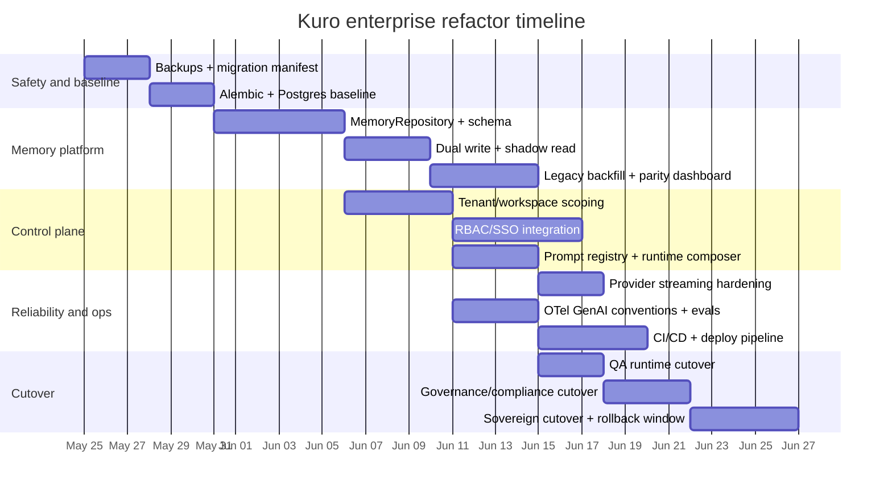

# Enterprise Refactor and Memory Modernization Report for Kuro AI

## Executive summary

The GitHub connector scan shows that **Kuro AI is no longer a simple monolith**, but it is also **not yet an enterprise-ready platform**. The repository already contains several strong architectural building blocks: runtime configuration and fallback logic, boundary guards, typed structured-output contracts, a provider abstraction, typed Memory V2 objects with provenance and TTL fields, and observability hooks via OpenTelemetry and Phoenix. In other words, the codebase has crossed the line from “hacky prototype” into “serious evolving platform.” But its **core enterprise blockers are still concentrated in the data plane and control plane**: memory remains fragmented across SQLite, Mem0, Chroma, and a JSON “master profile”; prompt stack identifiers exist but I did not surface a central prompt registry/loader in the reviewed modules; provider streaming is still partly legacy; admin access patterns are still lightweight; and tenant, RBAC, governance, CI/CD, and deployment controls are not yet first-class platform concepts in the parts of the repo I reviewed. fileciteturn68file0L1-L3 fileciteturn69file0L1-L3 fileciteturn70file0L1-L3 fileciteturn42file0L1-L3 fileciteturn45file0L1-L3 fileciteturn27file0L1-L3

My highest-confidence conclusion is this: **the next major refactor should be memory-first, not UI-first**. Retrieval-augmented systems become far more debuggable, governable, and enterprise-safe when they have a single source of truth for memory, provenance, tenancy, retention, and access logging. The strongest near-term design for Kuro is to move from the current split memory architecture to a **unified memory platform backed by Postgres + pgvector**, with hybrid retrieval, explicit provenance, conflict/version tracking, and dual-write migration from the current stores. That recommendation aligns with both the current Kuro code shape and the best-supported production patterns in the literature and official vector-database documentation. fileciteturn68file0L1-L3 fileciteturn42file0L1-L3 fileciteturn45file0L1-L3 citeturn0academia0turn18academia1turn18academia2turn15view0turn15view2

If I were sequencing execution for an enterprise push, I would do it in this order: **unify memory**, **enforce tenancy and RBAC**, **formalize prompt/runtime composition**, **upgrade observability and governance**, and **only then** invest harder in wider frontend polish or additional runtimes. That order best reduces operational risk, data leakage risk, and migration debt. NIST’s AI RMF and Playbook also point in this same direction: operational trustworthiness depends on governed design, deployment, measurement, and management processes, not only on model quality. citeturn7view0turn8view4turn8view5turn8view0turn8view2

For this report, I assumed **no specific infrastructure constraint** beyond Python/FastAPI compatibility: introducing Postgres, Redis, object storage, Alembic, OIDC, and Kubernetes-ready deployment artifacts is allowed; multi-region is not required immediately; and cost notes for vector stores are **relative operational assessments**, not vendor price quotes. The implementation guidance below is therefore optimized for a **first credible enterprise-grade architecture**, not an exotic hyperscale design.

## Repository scan and current architecture

### What the scanner surfaced

The repo artifacts I reviewed show a system in transition: `SYSTEM_MAP.md` and `docs/architecture/current-runtime-map.md` describe a still-central `main.py` and `kuro_backend` package, while the scanned backend modules show a newer V2 layer for runtime isolation, structured output, memory typing, provider routing, telemetry, vocabulary sanitization, and a QA playground. That combination strongly suggests **incremental refactoring on top of a still-live monolithic service**, not a clean-slate rewrite. fileciteturn5file0L1-L3 fileciteturn8file0L1-L3

A concise map of the key surfaced modules is below.

| Area | Key files surfaced in the scan | What they do now | Architectural reading |
|---|---|---|---|
| Runtime core | `kuro_backend/runtime/runtime_registry.py`, `runtime_context.py`, `boundary_guard.py`, `config/runtime/*.runtime.yaml`, `tests/test_runtime_registry.py`, `tests/test_boundary_guard.py` | Load runtime YAML, resolve request-scoped runtime, fallback unknown runtimes to `sovereign`, and enforce namespace/tool/prompt boundaries with audit-vs-strict behavior. | This is one of the strongest parts of the repo already. It is very close to a usable enterprise “control plane” foundation, but needs real tenant and authz integration behind it. fileciteturn16file0L1-L3 fileciteturn15file0L1-L3 fileciteturn17file0L1-L3 fileciteturn18file0L1-L3 fileciteturn19file0L1-L3 fileciteturn20file0L1-L3 fileciteturn21file0L1-L3 fileciteturn60file0L1-L3 fileciteturn61file0L1-L3 fileciteturn51file0L1-L3 fileciteturn56file0L1-L3 |
| Memory | `memory_coordinator.py`, `memory_manager.py`, `perpetual_memory.py`, `memory_v2/memory_store.py`, `memory_v2/migrations.py`, `memory_v2/memory_router.py`, `memory_v2/provenance_tracker.py`, `memory_v2/conflict_resolver.py`, `memory_v2/decay_engine.py`, `tests/test_memory_v2.py` | Orchestrate reads/writes across SQLite, Mem0, Chroma, and JSON; extend the legacy `short_term` table with typed V2 fields; add TTL, provenance, conflict resolution, and routing by memory type. | This is the **largest enterprise gap**. The repo now has memory-typed abstractions, but the source of truth is still split across multiple stores and legacy paths. fileciteturn68file0L1-L3 fileciteturn69file0L1-L3 fileciteturn70file0L1-L3 fileciteturn42file0L1-L3 fileciteturn43file0L1-L3 fileciteturn44file0L1-L3 fileciteturn45file0L1-L3 fileciteturn46file0L1-L3 fileciteturn47file0L1-L3 fileciteturn48file0L1-L3 fileciteturn53file0L1-L3 |
| Prompt/output stack | `output/schema_registry.py`, `output/output_validator.py`, `output/output_repair.py`, runtime YAML prompt stacks, QA runtime, `tests/test_structured_output.py` | Define contract schemas for QA/compliance/governance/forensic runtimes, validate JSON output, and attempt repair with a second LLM pass. | Good foundation for enterprise-safe output handling. The missing piece is a **real prompt registry/composer/versioning layer** that matches the runtime registry’s maturity. fileciteturn28file0L1-L3 fileciteturn29file0L1-L3 fileciteturn32file0L1-L3 fileciteturn19file0L1-L3 fileciteturn18file0L1-L3 fileciteturn20file0L1-L3 fileciteturn21file0L1-L3 fileciteturn61file0L1-L3 fileciteturn55file0L1-L3 |
| Provider adapters | `provider/provider_interface.py`, `provider/provider_router.py`, `provider/gemini_provider.py`, `tests/test_provider_abstraction.py` | Define provider contracts, route primary→fallback by runtime config, and wrap Gemini calls. | Useful abstraction, but not fully complete: the Gemini adapter explicitly leaves `stream()` unimplemented and tests preserve the legacy streaming path when the new router is off. That is a real production-hardening item. fileciteturn26file0L1-L3 fileciteturn25file0L1-L3 fileciteturn27file0L1-L3 fileciteturn54file0L1-L3 |
| Telemetry | `observability.py`, `telemetry/cognition_trace.py`, `tests/test_observability_v2.py`, `vocabulary/sanitizer.py` | Run Phoenix/OTel, track traces, tokens, and latency; persist cognition traces; attach trace IDs; sanitize internal jargon for user-facing text. | Strong observability instincts are already present. The next step is standardizing on GenAI semantic conventions and promoting traces/metrics/logs to first-class operational SLOs. fileciteturn67file0L1-L3 fileciteturn37file0L1-L3 fileciteturn36file0L1-L3 fileciteturn50file0L1-L3 |
| Specialized runtime | `playground/qa/qa_runtime.py` | Orchestrate requirement parsing, testcase generation, gherkin generation, and episodic memory writes into the `kuro.qa` namespace. | This is a good proof that runtime-specific workflows can work. It should be treated as the template for future bounded runtimes, not as a one-off playground forever. fileciteturn49file0L1-L3 |

### Current architecture notes

**Runtime layer.** The runtime system is already fairly disciplined. `RuntimeRegistry` loads YAML configs from `config/runtime/*.runtime.yaml`, requires the sovereign runtime, honors a schema version guard, and falls back unknown runtime IDs to `sovereign`. `RuntimeContext` is explicitly request-scoped and warns that only primitive fields such as `runtime_id` and `runtime_namespace` should enter LangGraph state. Tests show the team already cares about backward compatibility: legacy chats without `runtime_id` still work, existing session/runtime conflicts return `409`, and the public `/api/runtimes` view hides sensitive internal runtime fields. fileciteturn16file0L1-L3 fileciteturn15file0L1-L3 fileciteturn51file0L1-L3 fileciteturn52file0L1-L3

**Prompt stack.** The runtime YAML files already encode `prompt_stack` and `structured_output_contract` per runtime, and `boundary_guard.py` includes `assert_prompt_access`. That is the right direction. But in the files surfaced here, prompt composition still looks more like **declarative configuration without a fully surfaced registry/composer service**. I would not call prompt governance enterprise-ready until prompt bundles have IDs, versions, checksums, rollout policies, and review metadata. fileciteturn17file0L1-L3 fileciteturn18file0L1-L3 fileciteturn19file0L1-L3 fileciteturn20file0L1-L3 fileciteturn21file0L1-L3 fileciteturn60file0L1-L3 fileciteturn61file0L1-L3

**Memory layer.** This is where the architecture most clearly shows its historical layering. `memory_coordinator.py` says it orchestrates reads and post-response writes across short-term SQLite, Chroma, Mem0, and a system-of-record revision path; `memory_manager.py` describes a three-tier system of SQLite short-term, Mem0 semantic memory, and JSON master profile; `perpetual_memory.py` separately manages Mem0-backed personal memory; while `memory_v2` adds typed memory records, provenance, conflicts, and TTL—but still persists them into an extended legacy `short_term` SQLite table. `memory_router.py` makes the split explicit: semantic memories route to Mem0, document memory routes to Chroma, and several other memory types stay on SQLite. That is workable for a single-operator intelligent assistant, but it is exactly the kind of fragmentation that becomes painful under enterprise requirements for provenance, export/delete, tenancy isolation, and operational debugging. fileciteturn68file0L1-L3 fileciteturn69file0L1-L3 fileciteturn70file0L1-L3 fileciteturn42file0L1-L3 fileciteturn44file0L1-L3 fileciteturn45file0L1-L3

**Provider and output layer.** The provider abstraction is solid conceptually: the repo has a provider interface, a runtime-aware router, and a Gemini adapter; the output layer has typed Pydantic schemas, validation, and a repair loop. The weakness is that the adapter surface is not fully production-finished yet: `GeminiProvider.stream()` still raises `NotImplementedError`, and tests explicitly preserve a legacy streaming path when the router feature flag is off. That means the system is still in a **migration phase**, not at the end of one. fileciteturn26file0L1-L3 fileciteturn25file0L1-L3 fileciteturn27file0L1-L3 fileciteturn55file0L1-L3 fileciteturn54file0L1-L3

**Telemetry and governance.** The telemetry story is better than most repos at this stage. `observability.py` explicitly boots OpenTelemetry plus Phoenix, accepts OTLP traces, tracks token usage/cost, and exposes tracing helpers; `CognitionTrace` stores node sequences, namespaces, tool calls, and duration; tests confirm request trace propagation and admin runtime-health access behavior. Phoenix’s official docs also align well with this choice: Phoenix is built on OpenTelemetry/OpenInference, supports tracing, evals, prompt iteration, experiments, and self-hosting, while OpenTelemetry now defines dedicated semantic conventions for GenAI events, metrics, model spans, and agent spans. That makes Kuro’s observability direction sound; it just needs to be standardized and adopted everywhere. fileciteturn67file0L1-L3 fileciteturn37file0L1-L3 fileciteturn36file0L1-L3 citeturn17view0turn8view2

### Bottom-line assessment of the current repo

Kuro today looks like an **advanced internal platform / serious prototype** with several enterprise-shaped subsystems already present, especially around runtimes, boundary controls, output schemas, and telemetry. Its biggest blockers are **unified memory, first-class tenancy/authz, prompt governance, and production delivery controls**. That means the codebase is worth refactoring forward. I would not rewrite it from zero.

## Enterprise-readiness refactor checklist

The checklist below is deliberately prescriptive. It assumes FastAPI remains the service framework, Pydantic remains the contract layer, and Alembic is introduced as the migration system. FastAPI’s `APIRouter` and “bigger applications” pattern, Alembic’s migration environment, Pydantic’s `model_validate` / `model_json_schema`, and JSON Schema Draft 2020-12 make a strong and coherent backbone for a contract-first Python service. citeturn3view0turn4view5turn4view0turn4view1turn4view2turn4view3turn4view4

| Domain | Refactor item | Priority | Est. effort | Acceptance criteria | Tests to add |
|---|---|---:|---:|---|---|
| Backend | **Unify memory into a Memory Platform V3** backed by Postgres + pgvector, with dual-write from legacy stores | P0 | 10–12 days | All new reads/writes go through `MemoryRepository`; dual-write parity >99.9%; shadow-read diffs visible in telemetry; no production path reads directly from legacy SQLite/Mem0/Chroma except behind adapters | Unit: repository/filter logic. Integration: read/write/search. Migration: backfill idempotency and parity. E2E: runtime-specific retrieval correctness |
| Tenancy | Add **tenant_id / workspace_id / user_id** to every persisted business object that can affect retrieval, prompts, or tool execution | P0 | 6–7 days | Cross-tenant memory access blocked by policy layer and DB filters; public APIs require tenant context; no unscoped query paths remain | Unit: scope resolver. Integration: scoped DB queries. E2E: foreign-tenant access returns 403 / empty result |
| RBAC/SSO | Replace lightweight admin checks with **OIDC/SAML-backed identity** and role/claim mapping (`admin`, `workspace_admin`, `operator`, `developer`, `viewer`) | P0 | 7–8 days | Admin routes no longer depend on hardcoded usernames; tokens map to roles/scopes; audit log includes subject, role, tenant | Unit: claim mapper. Integration: IdP callback. E2E: role matrix over admin/runtime routes |
| API | Introduce **versioned REST contracts** under `/api/v1`, strict request/response models, idempotency keys for mutating operations, and explicit error envelopes | P0 | 4 days | OpenAPI is stable; all mutating endpoints are typed; duplicate writes are safely deduplicated | Unit: schema validation. Integration: idempotency. E2E: client compatibility snapshots |
| Middleware | Create a **RequestContext middleware** that resolves trace_id, request_id, tenant context, runtime context, auth claims, and feature flags once per request | P0 | 3–4 days | Every request has a consistent context object; logs/traces/DB writes share the same correlation IDs | Unit: context builder. Integration: middleware propagation. E2E: trace/request IDs preserved through API and background jobs |
| Prompt stack | Build a **Prompt Registry + Runtime Composer**: prompt bundle IDs, versions, hashes, reviewers, rollout state, and runtime composition rules | P0 | 4–5 days | Runtime config references immutable prompt bundle versions; can diff prompt revisions; public routes never expose internal prompt content | Unit: registry lookup/hash validation. Integration: runtime composer. E2E: runtime switch uses expected prompt bundle |
| Security | Add **prompt-injection isolation, outbound content validation, secret scanning, and least-privilege tool policies** aligned to OWASP LLM risks | P0 | 5–6 days | Untrusted retrieved content is isolated from system instructions; high-risk tool calls require policy approval; output validation exists before execution | Unit: sanitizer/policy rules. Integration: blocked tool flows. E2E: prompt-injection and insecure-output test cases citeturn8view0 |
| Provider layer | Finish **provider abstraction hardening**: streaming support, retries, circuit breakers, structured response normalization, and provider capability registry | P1 | 3–4 days | `stream()` never raises `NotImplementedError` in prod path; provider failures fall back cleanly; normalized usage/latency fields exist | Unit: capability registry. Integration: provider fallback. E2E: streaming + failover |
| Observability | Standardize traces/metrics/logs on **OpenTelemetry + GenAI semantic conventions**, with Phoenix or equivalent eval dashboards attached | P0 | 4–5 days | Model spans, retrieval spans, tool spans, and memory events are visible per request; SLO dashboards exist for latency, failure, drift, and retrieval hit quality | Unit: span decorators. Integration: emitted attributes. E2E: one request yields complete trace tree citeturn8view2turn17view0 |
| Data governance | Add **provenance, retention, export/delete, legal hold, and confidence/revalidation state** to memory and document ingestion | P0 | 7–8 days | Every memory has source provenance; retention jobs are policy-driven; export/delete can be executed tenant-by-tenant | Unit: provenance model. Integration: retention/export flows. Migration: delete/export correctness |
| Deployment | Package as **containerized FastAPI app + worker + Postgres + Redis + object storage**, with environment separation and secret injection | P1 | 5–6 days | One-command local stack, review env, staging, and production manifests exist; secrets come from env/secret manager, not repo | Integration: startup health. E2E: deploy smoke tests |
| CI/CD | Add **GitHub Actions quality gates** for lint, typing, unit/integration/e2e, migration rehearsal, dependency scans, and canary rollout checks | P0 | 5 days | PRs cannot merge without passing gates; migrations run in ephemeral DB; release tags publish immutable artifacts | Unit/integration/e2e/migration all automated |
| Testing | Build an **AI-specific test program**: deterministic mock harnesses, retrieval/eval datasets, regression prompts, migration parity, chaos/fault tests | P0 | 6–7 days | Tests cover both software correctness and AI behavior regressions; release requires parity + eval thresholds | Unit, integration, E2E, migration, eval, chaos |
| Frontend | Expose **runtime, tenant, provenance, and trace-aware UX** in admin and expert views | P1 | 3 days | Operators can inspect runtime, memory provenance, and trace links without DB access | E2E: admin console visibility, permission-based rendering |

The reason these items are ordered this way is simple: **memory, identity, and policy form the blast-radius boundary**. Before those are mature, a richer UI or additional runtimes mostly amplify risk.

## Memory subsystem target design

### Why memory must be the first major refactor

The current repo already contains the evidence for why this needs to happen. `memory_coordinator.py` explicitly orchestrates across short-term SQLite, Chroma, Mem0, and revision paths; `memory_manager.py` defines a three-tier system centered on SQLite, Mem0, and a JSON master profile; `perpetual_memory.py` separately manages Mem0-backed personal memory; and `memory_v2` improves type safety, TTL, provenance, and conflicts but still writes into an extended legacy SQLite table. That is a sensible evolutionary path for a personal assistant, but it creates four enterprise problems at once: **inconsistent provenance, inconsistent deletion semantics, inconsistent tenancy semantics, and fragmented debugging**. fileciteturn68file0L1-L3 fileciteturn69file0L1-L3 fileciteturn70file0L1-L3 fileciteturn42file0L1-L3

The research literature reinforces the choice to treat memory as a first-class subsystem. RAG’s original formulation combined parametric memory with explicit non-parametric retrieval to improve knowledge-intensive generation and traceability; MemGPT proposed OS-like memory tiers to manage long context; LongMem focused on long-term memory banks; Generative Agents emphasized observation, planning, and reflection; MemoryBank introduced time-based forgetting and reinforcement; and Self-RAG showed that retrieval works best when it is adaptive and coupled with self-critique rather than blindly always-on. The practical implication for Kuro is that the best memory subsystem is **not just a vector store**. It is a governed platform for storing memories, ranking them, decaying them, reconciling contradictions, and proving where they came from. citeturn0academia0turn18academia2turn18academia3turn18academia0turn19academia0turn18academia1

### Recommended target architecture

My recommendation is:

- **Primary system of record:** Postgres + pgvector
- **Document payload storage:** object storage
- **Hot request cache / idempotency / rate limit / async work coordination:** Redis
- **Optional later scale-out:** Milvus or Weaviate for very large vector-heavy, high-tenant, or ultra-low-latency retrieval workloads
- **Do not use Chroma or Mem0 as the enterprise system of record**

This recommendation is grounded in both the repo’s current shape and official database docs. pgvector gives Kuro what it currently lacks in one place: transactional metadata and vectors together, exact + approximate ANN, HNSW and IVFFlat indexing, joins, ACID properties, and WAL-based replication / point-in-time recovery. That is unusually valuable for a memory platform because memory records are rarely “just vectors”—they also carry provenance, retention state, runtime scope, user scope, and audit metadata. Specialized vector databases are stronger at some large-scale ANN workloads, but they often force a split between business truth and retrieval truth. Kuro is already suffering from exactly that split today. fileciteturn42file0L1-L3 citeturn11view0turn15view0turn15view1turn15view2

### Memory type taxonomy

I would keep Kuro’s existing six core types because they are already encoded in `KuroMemory`, but formalize them and add two enterprise-specific classes.

| Memory type | Purpose | Default retention | Retrieval weight |
|---|---|---:|---:|
| `short_term` | raw recent interaction facts and latent follow-up context | 24 hours | high recency, low permanence |
| `working` | active task state, intermediate planning, WIP summaries | 7 days | high during active task/thread |
| `episodic` | completed events, session summaries, milestones | 90–180 days | medium-high with time/runtimes |
| `semantic` | stable facts, preferences, profile facts, learned domain truths | no hard delete by TTL; revalidation every 180 days | high if provenance strong |
| `operational` | tool state, budgets, workflow state, job checkpoints | policy-based, usually 7–90 days | high only for matching workflows |
| `reflective` | post-mortems, error lessons, evaluation summaries | 30–90 days unless promoted | medium, mostly for internal optimization |
| `document_chunk` | source chunks/sections from ingested docs | tied to document lifecycle | retrieval-first, never directly user-authored |
| `policy` | governance, compliance, tenant-specific rules | until superseded | always preferred over informal memories |

The first six align to Kuro’s current V2 type system. The additional `document_chunk` and `policy` classes make enterprise retrieval and governance much cleaner because they let the system distinguish **authoritative source evidence** from **derived memory** instead of treating both as equivalent embedded text. fileciteturn42file0L1-L3

### Proposed schema

Below is the schema pattern I would implement first. It is intentionally normalized enough for provenance and policy, but not over-modeled.

```sql
CREATE EXTENSION IF NOT EXISTS vector;

CREATE TABLE tenants (
    tenant_id UUID PRIMARY KEY,
    tenant_key TEXT UNIQUE NOT NULL,
    display_name TEXT NOT NULL,
    status TEXT NOT NULL DEFAULT 'active',
    created_at TIMESTAMPTZ NOT NULL DEFAULT now()
);

CREATE TABLE workspaces (
    workspace_id UUID PRIMARY KEY,
    tenant_id UUID NOT NULL REFERENCES tenants(tenant_id),
    workspace_key TEXT NOT NULL,
    display_name TEXT NOT NULL,
    status TEXT NOT NULL DEFAULT 'active',
    created_at TIMESTAMPTZ NOT NULL DEFAULT now(),
    UNIQUE (tenant_id, workspace_key)
);

CREATE TABLE memory_records (
    memory_id UUID PRIMARY KEY,
    tenant_id UUID NOT NULL REFERENCES tenants(tenant_id),
    workspace_id UUID NULL REFERENCES workspaces(workspace_id),
    user_id TEXT NULL,
    runtime_id TEXT NOT NULL,
    namespace TEXT NOT NULL,
    memory_type TEXT NOT NULL,
    scope TEXT NOT NULL,         -- user | workspace | tenant | global
    status TEXT NOT NULL DEFAULT 'active',   -- active | expired | conflicted | deprecated | deleted
    contradiction_state TEXT NOT NULL DEFAULT 'none',
    canonical_group_id UUID NULL,
    content TEXT NOT NULL,
    summary TEXT NULL,
    source_kind TEXT NOT NULL,   -- conversation | tool | doc | import | policy | connector
    source_ref TEXT NULL,
    source_hash TEXT NULL,
    provenance JSONB NOT NULL DEFAULT '{}'::jsonb,
    facets JSONB NOT NULL DEFAULT '{}'::jsonb,      -- tags, entities, runtime hints
    confidence NUMERIC(4,3) NOT NULL DEFAULT 1.0 CHECK (confidence >= 0 AND confidence <= 1),
    salience NUMERIC(4,3) NOT NULL DEFAULT 0.5 CHECK (salience >= 0 AND salience <= 1),
    valid_from TIMESTAMPTZ NOT NULL DEFAULT now(),
    valid_to TIMESTAMPTZ NULL,
    expires_at TIMESTAMPTZ NULL,
    created_at TIMESTAMPTZ NOT NULL DEFAULT now(),
    updated_at TIMESTAMPTZ NOT NULL DEFAULT now(),
    deleted_at TIMESTAMPTZ NULL
);

CREATE TABLE memory_embeddings (
    memory_id UUID PRIMARY KEY REFERENCES memory_records(memory_id) ON DELETE CASCADE,
    embedding_model TEXT NOT NULL,
    embedding vector(1536) NOT NULL,
    created_at TIMESTAMPTZ NOT NULL DEFAULT now()
);

CREATE TABLE memory_edges (
    edge_id UUID PRIMARY KEY,
    from_memory_id UUID NOT NULL REFERENCES memory_records(memory_id) ON DELETE CASCADE,
    to_memory_id UUID NOT NULL REFERENCES memory_records(memory_id) ON DELETE CASCADE,
    relation_type TEXT NOT NULL,   -- supports | derived_from | contradicts | supersedes | summarizes
    weight NUMERIC(4,3) NOT NULL DEFAULT 1.0,
    created_at TIMESTAMPTZ NOT NULL DEFAULT now()
);

CREATE TABLE memory_access_log (
    access_id UUID PRIMARY KEY,
    memory_id UUID NOT NULL REFERENCES memory_records(memory_id) ON DELETE CASCADE,
    tenant_id UUID NOT NULL REFERENCES tenants(tenant_id),
    workspace_id UUID NULL REFERENCES workspaces(workspace_id),
    runtime_id TEXT NOT NULL,
    trace_id TEXT NOT NULL,
    request_id TEXT NOT NULL,
    access_mode TEXT NOT NULL,   -- retrieved | promoted | expired | exported | deleted
    created_at TIMESTAMPTZ NOT NULL DEFAULT now()
);

CREATE INDEX idx_memory_scope
    ON memory_records (tenant_id, workspace_id, runtime_id, namespace, memory_type, status);

CREATE INDEX idx_memory_validity
    ON memory_records (status, expires_at, valid_to);

CREATE INDEX idx_memory_content_fts
    ON memory_records
    USING GIN (to_tsvector('english', coalesce(content, '') || ' ' || coalesce(summary, '')));

CREATE INDEX idx_memory_embedding_hnsw
    ON memory_embeddings
    USING hnsw (embedding vector_cosine_ops);
```

This schema matches the realities of enterprise AI systems better than the current SQLite extension strategy because it keeps **scope, provenance, lifecycle, and embeddings** in one governed model. pgvector’s official docs are especially relevant here because they document exact and approximate nearest-neighbor search, multiple distance functions, HNSW/IVFFlat indexing choices, and replication/PITR support; those are all directly useful for a memory platform, not just for a search demo. citeturn11view0turn15view0turn15view1turn15view2

### Entity relationship view

```mermaid
erDiagram
    TENANTS ||--o{ WORKSPACES : contains
    TENANTS ||--o{ MEMORY_RECORDS : owns
    WORKSPACES ||--o{ MEMORY_RECORDS : scopes
    MEMORY_RECORDS ||--|| MEMORY_EMBEDDINGS : indexed_as
    MEMORY_RECORDS ||--o{ MEMORY_EDGES : from
    MEMORY_RECORDS ||--o{ MEMORY_EDGES : to
    MEMORY_RECORDS ||--o{ MEMORY_ACCESS_LOG : accessed_by

    TENANTS {
      uuid tenant_id PK
      text tenant_key
      text display_name
      text status
    }

    WORKSPACES {
      uuid workspace_id PK
      uuid tenant_id FK
      text workspace_key
      text display_name
      text status
    }

    MEMORY_RECORDS {
      uuid memory_id PK
      uuid tenant_id FK
      uuid workspace_id FK
      text user_id
      text runtime_id
      text namespace
      text memory_type
      text scope
      text status
      text contradiction_state
      uuid canonical_group_id
      text content
      text summary
      text source_kind
      text source_ref
      text source_hash
      jsonb provenance
      jsonb facets
      numeric confidence
      numeric salience
      timestamptz valid_from
      timestamptz valid_to
      timestamptz expires_at
      timestamptz created_at
      timestamptz updated_at
    }

    MEMORY_EMBEDDINGS {
      uuid memory_id PK,FK
      text embedding_model
      vector embedding
      timestamptz created_at
    }

    MEMORY_EDGES {
      uuid edge_id PK
      uuid from_memory_id FK
      uuid to_memory_id FK
      text relation_type
      numeric weight
      timestamptz created_at
    }

    MEMORY_ACCESS_LOG {
      uuid access_id PK
      uuid memory_id FK
      uuid tenant_id FK
      uuid workspace_id FK
      text runtime_id
      text trace_id
      text request_id
      text access_mode
      timestamptz created_at
    }
```

### Retrieval, provenance, conflict resolution, and decay

The production retrieval pipeline should be **hybrid and policy-first**:

1. **Hard authorization filter first.** Always filter by `tenant_id`, then `workspace_id`, then `runtime_id`/namespace, then `status`, then validity window. Retrieval should never “discover” an unauthorized memory and only later discard it. This is the most important anti-leak rule. The vector-db literature is increasingly clear that multi-tenant retrieval quality and efficiency depend heavily on good filtered-search design, not just raw ANN performance. citeturn20academia0turn20academia2

2. **Candidate generation second.** Use:
   - FTS/BM25-like lexical search over `content + summary`
   - vector ANN over embeddings
   - optional edge-expansion using `memory_edges`
   - optional exact facet filters (`source_kind`, `memory_type`, tags, policy IDs)

3. **Reranking third.** Score with a transparent weighted function:
   - semantic similarity
   - recency
   - salience
   - provenance rank
   - runtime affinity
   - conflict penalty
   - policy priority boost

4. **Adaptive retrieval budget.** Self-RAG’s findings matter here: retrieving indiscriminately is often worse than retrieving conditionally. Sovereign/general chat may retrieve lightly by default; QA/compliance/governance should retrieve more aggressively and require stronger provenance. citeturn18academia1turn0academia0

5. **Citable output payload.** Every retrieved item returned to the model or UI should include:
   - `memory_id`
   - `source_kind`
   - `source_ref`
   - `confidence`
   - `valid_from` / `updated_at`
   - `trace_id` or retrieval event ID

For **provenance**, I recommend a simple evidence ranking model for conflict decisions:

`policy / system connector > user-confirmed form input > authoritative uploaded document > tool output > user utterance > model inference`

When conflicts arise, do **not** overwrite in place. Instead:
- create a new record,
- link it via `contradicts` or `supersedes`,
- set the old record to `conflicted` only if the new record wins under provenance + recency + confidence rules,
- keep both for auditability.

Kuro’s current V2 conflict resolver uses token-overlap Jaccard and “newest wins.” That is fine as a placeholder, but not enough for enterprise truth management. A more durable rule set should consider **entity identity + provenance rank + confirmation state + temporal validity**. fileciteturn47file0L1-L3

For **decay**, I recommend:
- `short_term`: hard TTL 24h
- `working`: hard TTL 7d
- `episodic`: soft TTL 180d
- `semantic`: no hard TTL, but revalidation needed after 180d unless stronger provenance
- `operational`: TTL from source system or workflow job
- `reflective`: 30–90d unless promoted to policy/incident knowledge

This approach is consistent with the direction of Kuro’s current decay engine and also matches the literature better than simple deletion: MemoryBank explicitly modeled forgetting/reinforcement over time, while Generative Agents showed the value of reflection and memory summarization beyond raw turn storage. fileciteturn48file0L1-L3 citeturn19academia0turn18academia0

### Storage options comparison

The table below is the practical recommendation view. The “cost/ops” column is a **relative operational assessment**, not a vendor quote.

| Option | Best fit | Strengths | Main tradeoffs | Cost / operational notes |
|---|---|---|---|---|
| **Postgres + pgvector** | Best default for Kuro’s next phase | ACID transactions, joins, WAL/PITR, exact + ANN search, HNSW and IVFFlat, keeps business truth and vector truth together | Not the most specialized engine for ultra-large billion-scale ANN workloads | Usually the **lowest operational complexity** if you already need a relational DB anyway; strongest first-step enterprise choice for Kuro. citeturn11view0turn15view0turn15view1turn15view2 |
| **Milvus** | Large-scale, vector-heavy, multi-tenant deployments | Distributed architecture, K8s-native deployment, strong metadata filtering, hot/cold storage, multiple multi-tenancy levels, good scale story | More infra to operate; more separation from transactional app data than Postgres | Good when vectors dominate and tenant scale is large; cost/ops are **medium to high** unless you already operate K8s well. citeturn12view1turn12view0turn14view2turn14view3 |
| **Chroma** | Dev, prototyping, smaller self-managed RAG apps | Open source, easy to start, metadata filtering, dense/sparse/hybrid, self-host or cloud | Weaker fit as enterprise system-of-record; less attractive as the canonical governance plane | Cheap and fast for prototyping; I would keep it for local experimentation, not for Kuro’s core governed memory platform. citeturn12view2turn16view2 |
| **Pinecone** | Managed production when ops headcount is minimal | Fully managed, good production ergonomics, strong namespace-per-tenant pattern, physical isolation in serverless namespaces | Vendor dependency; cross-tenant/global analytics patterns can get more opinionated; cost tied to managed usage | Very low ops burden, but potentially higher recurring cost; official docs explicitly call out namespace-based isolation and cost tradeoffs versus metadata filtering. citeturn14view1turn14view0turn14view5 |
| **Weaviate** | Open-source/cloud-native RAG and agent workloads | Open-source vector DB, semantic/hybrid search, RAG support, managed cloud and self-hosted modes, explicit multi-tenancy with tenant-per-shard isolation | More moving parts than pgvector; governance still needs an external transactional control plane | Strong candidate if Kuro becomes heavily agentic and retrieval-centric, especially with many workspaces; ops burden is **medium**. citeturn12view4turn13view0 |

My recommendation for Kuro is **Postgres + pgvector first**, then reevaluate Milvus or Weaviate only if profiling later shows the memory platform is dominated by vector throughput rather than governance-rich transactional workflows.

## Phased implementation plan and code-generation prompts

### Migration strategy

Use Alembic from the start. Its official tutorial is clear that a migration environment is created once, versioned in source control, and made customizable through `env.py`; that is exactly what Kuro needs to move out of informal schema mutation and idempotent ad hoc migrations. citeturn4view0turn4view1

The migration path I recommend is:

**Phase A — Safety first**
- Create immutable backups of current SQLite DBs, Chroma dirs, Mem0 exports, and `master_profile.json`
- Record a migration manifest with timestamps and file hashes
- Introduce `alembic/` and a baseline revision for the new Postgres memory platform

**Phase B — Dual write**
- Add `MemoryRepository` and `LegacyMemoryAdapter`
- All new writes go to Postgres first and also to legacy stores while flags are on
- Emit parity telemetry for every dual write

**Phase C — Backfill**
- Backfill legacy `short_term` rows into `memory_records`
- Import JSON master-profile facts into `semantic` and `policy` classes
- Import Chroma documents into `document_chunk`
- Import Mem0 facts into `semantic` memories with explicit provenance labels

**Phase D — Shadow read**
- Continue production reads from legacy path
- In parallel, run shadow reads from Postgres and compare result overlap / rank drift
- Promote dashboards for shadow-read quality

**Phase E — Cutover**
- Enable Postgres-backed reads for a low-risk runtime first, ideally `qa`
- Expand to `governance`, `compliance`, `research`, then `sovereign`
- Keep dual write until cutover confidence is high

**Phase F — Decommission**
- Freeze legacy writes
- Keep legacy export tools for rollback window
- Remove dead code when final parity and retention checks pass

### Feature flags

These are the flags I would add immediately:

| Flag | Default | Purpose |
|---|---|---|
| `KURO_MEMORY_PLATFORM_V3_ENABLED` | `false` | Master kill switch for the new memory platform |
| `KURO_MEMORY_DUAL_WRITE_ENABLED` | `false` | Write to both new and legacy backends |
| `KURO_MEMORY_SHADOW_READ_ENABLED` | `false` | Compare new retrieval path with legacy path |
| `KURO_MEMORY_READ_SOURCE` | `legacy` | `legacy | shadow | v3` |
| `KURO_TENANCY_ENFORCED` | `false` | Require tenant/workspace scoping in APIs and queries |
| `KURO_RBAC_ENFORCED` | `false` | Turn on role-based authz for admin/runtime/tool routes |
| `KURO_PROMPT_REGISTRY_ENABLED` | `false` | Use prompt registry/composer instead of runtime IDs alone |
| `KURO_PROVIDER_STREAMING_V2_ENABLED` | `false` | Turn on provider-native streaming path |
| `KURO_MEMORY_REVALIDATION_JOB_ENABLED` | `false` | Soft-decay/revalidation worker |
| `KURO_MEMORY_EXPORT_DELETE_ENABLED` | `false` | Governance endpoints for export/delete workflows |

### Recommended FastAPI endpoint surface

FastAPI’s `APIRouter` organization is the right pattern here, especially once Kuro starts separating runtime APIs, admin APIs, and memory-governance APIs more cleanly. citeturn3view0turn4view5

```python
# app/api/v1/memories.py
router = APIRouter(prefix="/api/v1/memories", tags=["memories"])

@router.post("/search", response_model=MemorySearchResponse)
async def search_memories(
    req: MemorySearchRequest,
    ctx: RequestContext = Depends(get_request_context),
    svc: MemoryService = Depends(get_memory_service),
) -> MemorySearchResponse:
    return await svc.search(req, ctx)

@router.post("", response_model=MemoryRecordResponse, status_code=201)
async def create_memory(
    req: MemoryCreateRequest,
    ctx: RequestContext = Depends(get_request_context),
    svc: MemoryService = Depends(get_memory_service),
) -> MemoryRecordResponse:
    return await svc.create(req, ctx)

@router.get("/{memory_id}", response_model=MemoryRecordResponse)
async def get_memory(
    memory_id: UUID,
    ctx: RequestContext = Depends(get_request_context),
    svc: MemoryService = Depends(get_memory_service),
) -> MemoryRecordResponse:
    return await svc.get(memory_id, ctx)

@router.post("/{memory_id}/resolve-conflict", response_model=ConflictResolutionResponse)
async def resolve_conflict(
    memory_id: UUID,
    req: ConflictResolutionRequest,
    ctx: RequestContext = Depends(get_request_context),
    svc: MemoryService = Depends(get_memory_service),
) -> ConflictResolutionResponse:
    return await svc.resolve_conflict(memory_id, req, ctx)
```

Suggested administrative endpoints:

- `GET /api/v1/admin/memory/health`
- `POST /api/v1/admin/memory/reindex`
- `POST /api/v1/admin/memory/revalidation/run`
- `POST /api/v1/admin/memory/export`
- `POST /api/v1/admin/memory/delete-subject`
- `GET /api/v1/admin/runtimes/{runtime_id}/prompt-bundles`

### Phased timeline



### Codex prompts for high-priority implementation

Use these prompts only with guardrails like these at the top of every run:

- make a pre-execution backup of touched files and DB migration manifests
- use feature flags for every new production path
- migrations must be idempotent and reversible where practical
- do not introduce `NotImplementedError` on any production path
- preserve current behavior unless the prompt explicitly says to change it
- add tests with every change
- do not remove legacy paths until shadow-read parity is proven

#### Prompt for the memory schema and repository foundation

```text
Implement a new Postgres-backed Memory Platform V3 for the Kuro AI FastAPI codebase.

Requirements:
- Create SQLAlchemy 2.0 models and Alembic migrations for:
  tenants, workspaces, memory_records, memory_embeddings, memory_edges, memory_access_log
- Keep current Memory V2 concepts: runtime_id, namespace, memory_type, confidence, provenance
- Add new fields: tenant_id, workspace_id, user_id, scope, contradiction_state, canonical_group_id, salience
- Add pgvector support with HNSW index and GIN full-text index
- Create repository interfaces:
  MemoryRepository, LegacyMemoryAdapter, MemorySearchService
- Add feature flags:
  KURO_MEMORY_PLATFORM_V3_ENABLED
  KURO_MEMORY_DUAL_WRITE_ENABLED
  KURO_MEMORY_SHADOW_READ_ENABLED
  KURO_MEMORY_READ_SOURCE
- Do not remove legacy SQLite / Mem0 / Chroma code
- Add tests:
  unit tests for repository methods
  integration tests for CRUD + search + scoped filtering
  migration tests for idempotent create/upgrade/downgrade
- Output:
  changed file list
  migration file names
  test commands
  rollback notes
```

#### Prompt for dual write, backfill, and shadow read

```text
Add a safe migration bridge from legacy Kuro memory stores to Memory Platform V3.

Requirements:
- Implement dual-write in the memory service so new writes can go to both legacy stores and Postgres
- Add backfill jobs for:
  legacy short_term SQLite rows
  master_profile.json facts
  Chroma document chunks
  Mem0 semantic memories
- Every imported record must include provenance:
  source_kind, source_ref, source_hash, imported_from, imported_at
- Implement shadow-read comparison:
  execute legacy retrieval and V3 retrieval in parallel
  compare overlap, ordering drift, and scope mismatches
  emit metrics and structured logs
- Add admin endpoints:
  POST /api/v1/admin/memory/backfill
  GET /api/v1/admin/memory/parity
- Add tests:
  migration parity tests
  idempotent re-run tests
  duplicate import protection
  rollback tests
- Never mutate or delete legacy data in this prompt
```

#### Prompt for retrieval, conflict resolution, and decay

```text
Implement enterprise retrieval and lifecycle controls for Kuro Memory Platform V3.

Requirements:
- Create a hybrid retrieval pipeline:
  authorization filter -> lexical search -> vector search -> reranking
- Add reranking factors:
  semantic_score, recency_score, salience, provenance_rank, conflict_penalty, runtime_affinity
- Implement conflict handling:
  create contradicts/supersedes edges
  never overwrite records destructively
  mark records conflicted only after conflict policy evaluation
- Implement decay/revalidation policies by memory_type
- Add admin/job entry points for:
  revalidation
  expiration
  summary compaction
- Add service-level acceptance metrics:
  p95 search latency
  hit-rate by memory_type
  stale-memory retrieval rate
  shadow-read drift
- Add tests:
  conflicting fact ingestion
  retrieval excludes expired/unauthorized rows
  revalidation job behavior
  compaction summaries preserve provenance
```

#### Prompt for tenancy, RBAC, and governance controls

```text
Harden Kuro for enterprise tenancy and governance.

Requirements:
- Introduce RequestContext with:
  request_id, trace_id, tenant_id, workspace_id, user_id, runtime_id, roles
- Add OIDC-ready auth abstraction and role mapping
- Protect admin routes and memory export/delete routes with RBAC scopes
- Enforce tenant/workspace filters in repositories and services
- Add governance operations:
  export subject memories
  delete subject memories
  legal hold flag
  retention policy evaluation
- Ensure no public API leaks prompt_stack, tools, memory_namespace, or tenant internals
- Add tests:
  role matrix access tests
  cross-tenant leakage tests
  export/delete correctness
  audit-log completeness
```

#### Prompt for provider and observability hardening

```text
Complete provider hardening and standards-aligned observability for Kuro.

Requirements:
- Finish provider streaming abstraction with no NotImplementedError in production code paths
- Normalize provider usage/latency/error fields across adapters
- Instrument model calls, retrieval, tool execution, and memory access with OpenTelemetry
- Follow current GenAI semantic conventions where applicable
- Preserve Phoenix compatibility
- Add dashboards / exported metrics for:
  latency, token usage, error rate, fallback rate, retrieval latency, shadow-read drift
- Add tests:
  provider fallback
  streaming behavior
  trace correlation from request to model + memory spans
  missing API key / degraded provider behavior
```

## Annotated bibliography and open questions

### Annotated bibliography

**Retrieval-Augmented Generation for Knowledge-Intensive NLP Tasks.** Lewis et al. introduced the canonical RAG framing: pair a parametric LM with non-parametric retrieved knowledge, improving knowledge-intensive performance and making external knowledge updates easier than retraining. This is the paper that most directly justifies Kuro’s need for a governed external memory layer rather than ever-more prompt stuffing. citeturn0academia0

**Generative Agents: Interactive Simulacra of Human Behavior.** Park et al. showed a practical architecture where observation, planning, and reflection all depend on storing and retrieving natural-language memories over time. It is highly relevant for Kuro because it supports using summaries, reflections, and episodic recall as distinct memory products—not just raw vectors. citeturn18academia0

**MemGPT: Towards LLMs as Operating Systems.** MemGPT’s key contribution is the OS analogy: large-context behavior is best achieved through hierarchical memory management instead of hoping the model context window will do everything alone. That directly supports Kuro’s move toward typed tiers, controlled promotion, and policy-based memory movement. citeturn18academia2

**Augmenting Language Models with Long-Term Memory.** LongMem argues for a long-term memory bank that can be updated and retrieved independently of the frozen LLM backbone. This is relevant to Kuro because it supports separating memory governance and retrieval quality from provider/vendor choice. citeturn18academia3

**Self-RAG: Learning to Retrieve, Generate, and Critique through Self-Reflection.** Self-RAG is important because it argues against naive always-on retrieval and instead favors adaptive retrieval plus self-critique. For Kuro, that maps cleanly to runtime-specific retrieval budgets and quality gates before answer finalization. citeturn18academia1

**MemoryBank: Enhancing Large Language Models with Long-Term Memory.** MemoryBank is especially useful for lifecycle policy design: it treats forgetting and reinforcement as part of the memory mechanism itself. That is a strong conceptual basis for Kuro’s move from crude TTL-only decay to revalidation and soft-decay strategies. citeturn19academia0

**Efficient and robust approximate nearest neighbor search using Hierarchical Navigable Small World graphs.** The HNSW paper remains foundational for vector retrieval because it explains the graph-based ANN structure behind many production vector databases. It is relevant both for pgvector indexing choices and for understanding why HNSW is often preferred when the speed/recall tradeoff matters. citeturn20academia1

**Curator: Efficient Indexing for Multi-Tenant Vector Databases.** Curator is one of the most useful recent papers for enterprise memory platforms because it focuses specifically on the memory/search tradeoff under multi-tenancy. It supports the recommendation that tenant-aware retrieval design should be central, not an afterthought bolted onto a global vector index. citeturn20academia0

**ACORN: Performant and Predicate-Agnostic Search Over Vector Embeddings and Structured Data.** ACORN matters because enterprise retrieval almost always involves both vectors and structured predicates. That is exactly why Kuro’s future memory platform should combine transactional filtering and vector search rather than treating vector search as the whole product. citeturn20academia2

**NIST AI Risk Management Framework and Playbook.** NIST’s AI RMF is voluntary but highly influential; the Playbook turns it into concrete actions across Govern, Map, Measure, and Manage, and NIST also points to a Generative AI profile for gen-AI-specific risks. This is the strongest practical governance anchor for Kuro’s enterprise push. citeturn7view0turn8view4turn8view5

**OWASP Top 10 for Large Language Model Applications.** OWASP’s LLM Top 10 identifies prompt injection and insecure output handling as the first two risks in v1.1. That is directly relevant to Kuro because it already mixes retrieval, tool use, and generated outputs, which means content isolation and execution validation are not optional. citeturn8view0

**Semantic conventions for generative AI systems.** OpenTelemetry’s GenAI semantic conventions explicitly define signals for events, metrics, model spans, and agent spans. This is the right standards target for evolving Kuro’s already-promising trace and cognition telemetry into a portable operational observability system. citeturn8view2

**What is Arize Phoenix?** Phoenix is relevant because it sits at the intersection of tracing, evals, prompt iteration, and experiments, and it is built on top of OpenTelemetry/OpenInference. Since Kuro already uses Phoenix-like observability patterns in code, this is a natural platform to standardize around instead of inventing a custom black-box monitoring scheme. citeturn17view0

**FastAPI Bigger Applications, Alembic Tutorial, Pydantic Models, JSON Schema Draft 2020-12.** These official sources collectively support a Python enterprise backbone built around modular `APIRouter`s, disciplined migrations, typed validation, and stable JSON schema contracts. They are especially relevant because Kuro’s current repo already leans that way, even if it has not formalized every layer yet. citeturn3view0turn4view5turn4view0turn4view1turn4view2turn4view3turn4view4

### Open questions and limitations

This report is grounded in a **GitHub connector scan**, not a full local execution of the application. I reviewed the surfaced repository files and official/primary external sources, but I did **not** run the system, inspect secrets or deployment environments, or execute runtime traces end-to-end.

A few conclusions are intentionally cautious. In particular, I did **not** claim that a prompt registry, CI pipeline, or deployment manifests categorically do not exist anywhere in the repo; I only say that I did not surface them in the reviewed artifacts. Likewise, vector-store cost notes are **relative operational judgments**, not live pricing quotes.

The most important unresolved architectural question is strategic, not technical: whether Kuro is meant to remain a **single-tenant premium assistant platform with bounded enterprise features**, or evolve into a **true multi-tenant enterprise AI product**. The refactor plan above supports either direction, but the RBAC, tenancy, and governance layers become much more urgent if the latter is the real destination.