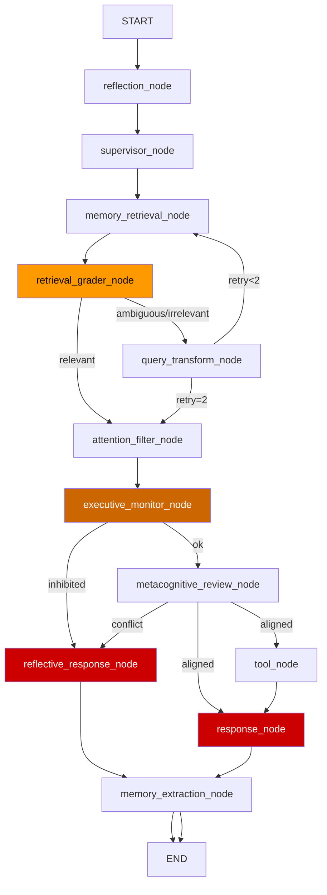
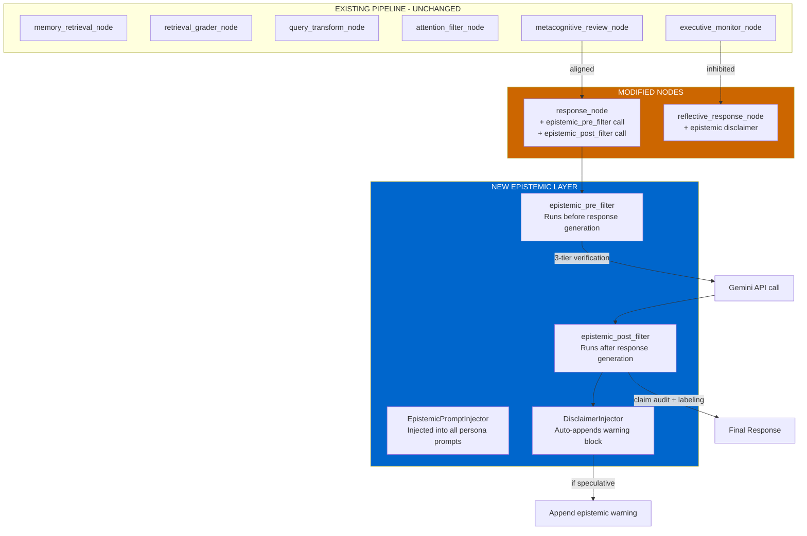
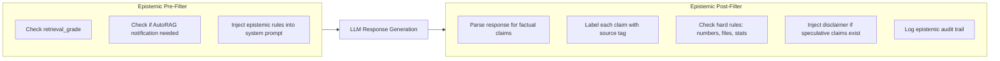
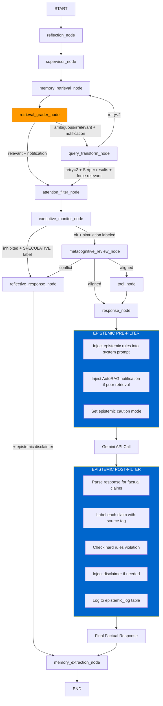
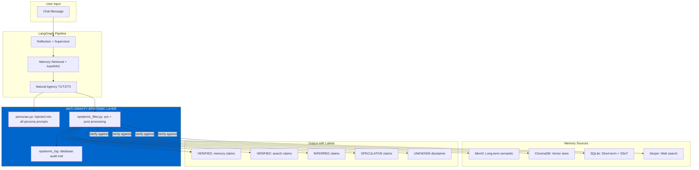

# Anti-Halusinasi Implementation Plan

> **Goal:** Prevent Kuro from generating unverified claims by implementing a 3-tier Epistemic Accountability Layer across all agency personas, integrating with the existing AutoRAG system, and enforcing hard rules on source labeling.

---

## 0. Conflict Analysis: Anti-Halusinasi vs Existing Reasoning Core

Before designing the solution, every proposed change was audited against Kuro's existing anti-hallucination mechanisms to identify conflicts. Three areas required refinements.

### 0.1 Existing Safeguards Inventory

| Safeguard | Location | Mechanism | Strength |
|-----------|----------|-----------|----------|
| `_SSOT_PRIORITY_DIRECTIVE` | [`personas.py:77`](kuro_backend/personas.py:77) | Pre-generation prompt — "never follow model-side guesses" | Medium (LLM may ignore) |
| `_CORE_COMMON_TAIL` lines 126-138 | [`personas.py:126`](kuro_backend/personas.py:126) | Pre-generation prompt — negative constraints, anti-hallucination rules | Medium (LLM may ignore) |
| `_GRAPH_COMMON_TAIL` lines 160-164 | [`personas.py:160`](kuro_backend/personas.py:160) | Pre-generation prompt — "do not fabricate", cross-verify memory | Medium (LLM may ignore) |
| `_REALTIME_GROUNDING_DIRECTIVE` | [`personas.py:103`](kuro_backend/personas.py:103) | Pre-generation prompt — "proactively search for grounding" | Medium (LLM may ignore) |
| `retrieval_grader_node` | [`langgraph_core.py:760`](kuro_backend/langgraph_core.py:760) | Post-retrieval quality grading | Strong (LLM-based, automated) |
| `metacognitive_review_node` evidence note | [`langgraph_core.py:1198`](kuro_backend/langgraph_core.py:1198) | Post-retrieval evidence quality injection | Strong (automated, but passive note) |
| `SAMPLING_PROFILES` | [`personas.py:193`](kuro_backend/personas.py:193) | Low temperature (0.0-0.15 for professional personas) | Strong (reduces randomness) |

### 0.2 Gap: Pre-generation vs Post-generation

The critical gap is that **all existing safeguards operate BEFORE generation** — they are prompt instructions trusted to the LLM. None validate what the LLM actually outputs. The Anti-Halusinasi layer is the **first post-generation enforcement mechanism**, making it architecturally complementary, not conflicting.

### 0.3 Conflict Point 1: `_CORE_COMMON_TAIL` line 129 — General Knowledge Clause

**Existing directive** ([`personas.py:129`](kuro_backend/personas.py:129)):
> *"For general-knowledge questions (legal theory, IT security, digital forensics, ISO, PDP Law, GRC, compliance documentation), answer broadly from model knowledge; DO NOT reply 'I have no data' merely because SQLite is empty."*

And line 137:
> *"For general technical/compliance knowledge, local memory is only supplementary; the main answer may come from your internal knowledge base."*

**Risk:** If the epistemic layer labels all parametric-model knowledge as `[SPECULATIVE]`, it contradicts this directive which explicitly **encourages** answering from model knowledge for technical domains.

**Refinement applied:** The epistemic filter maintains a **knowledge domain classification** — it applies different labeling strictness based on claim type:

| Claim Domain | Examples | Epistemic Label Rule |
|-------------|----------|---------------------|
| **Operational/Personal** | File paths, user data, schedules, concrete facts | **Strict**: `[VERIFIED: memory]` or `[UNKNOWN]` — never fabricate |
| **Technical/Compliance/General** | ISO clauses, legal theory, forensic methods, security concepts | **Relaxed**: allowed from parametric knowledge, labeled `[INFERRED]` not `[SPECULATIVE]` |
| **Search-dependent** | Recent events, live prices, specific versions/dates | **Moderate**: `[VERIFIED: search]` if searched, `[SPECULATIVE]` if not |

This maps exactly to the existing `_CORE_COMMON_TAIL` distinction between "operational facts" (line 130: follow memory and tools) and "general technical knowledge" (line 129: answer broadly from model knowledge).

**Implementation in `epistemic_filter.py`:**
```python
# Domain classifier regex patterns
_OPERATIONAL_PATTERNS = re.compile(
    r'\b(file|path|/[\w/]+\.\w+|username|password|budget|subscription|'
    r'jadwal|schedule|deadline|commitment)\b', re.I
)
_TECHNICAL_PATTERNS = re.compile(
    r'\b(ISO\s*\d+|NIST|EU\s+AI\s+Act|PDP\s+Law|forensic|clause|'
    r'standard|framework|methodology|security|audit)\b', re.I
)
```

### 0.4 Conflict Point 2: `metacognitive_review_node` Evidence Note Duplication

**Existing behavior** ([`langgraph_core.py:1198-1207`](kuro_backend/langgraph_core.py:1198)):
```python
evidence_weak = retrieval_grade in ("irrelevant", "ambiguous")
if evidence_weak:
    evidence_note = "... response may be less supported by long-term memory evidence."
```
This note fires **only when there's a belief conflict** (score < threshold).

**Risk:** The new epistemic pre-filter also generates an AutoRAG notification when retrieval is poor. These could duplicate.

**Refinement:** The epistemic pre-filter fires **unconditionally** (for all responses, not just conflicted ones). The metacognitive node fires **conditionally** (only on conflict). They serve different purposes:
- Metacognitive note = "your plan conflicts with commitments AND evidence is weak"
- Epistemic notification = "memory retrieval was poor for this query, labels apply"

**Deduplication guard** added to the epistemic post-filter:
```python
# Check if metacognitive already injected an evidence note
if state.get("metacognitive_flag") and state.get("alignment_score", 1.0) < 0.35:
    # Metacognitive already warned — skip epistemic duplicate
    pass
else:
    # Inject epistemic AutoRAG notification
    response_text = ef.inject_autorag_notification(response_text, retrieval_grade)
```

### 0.5 Conflict Point 3: `_REALTIME_GROUNDING_DIRECTIVE` vs Speculative Labeling

**Existing directive** ([`personas.py:103-108`](kuro_backend/personas.py:103)):
> *"You are not limited by your internal knowledge cut-off"* • *"MUST proactively use web search"* • *"Do not restrict yourself to hardcoded data"*

**Risk:** Adding `[SPECULATIVE]` labels everywhere could discourage Kuro from using its full knowledge, creating a "gatekeeping" effect contrary to this directive.

**Refinement:** The epistemic layer does NOT restrict *what* Kuro can answer. It only labels *how confident* the source is. The directive says "MUST proactively search" — the epistemic layer adds "and if you didn't search, be transparent about it." **No behavioral restriction, only transparency.**

### 0.6 Summary of Refinements Applied

| Area | Refinement | Implementation |
|------|-----------|---------------|
| General knowledge labeling | Relaxed: `[INFERRED]` instead of `[SPECULATIVE]` | `epistemic_filter.py` domain classifier |
| Metacognitive deduplication | Skip epistemic note if metacognitive already warned | Post-filter conditional guard |
| Real-time grounding compatibility | Labels don't restrict answers, only add transparency | No behavioral changes in prompt |
| SSOT priority preservation | Epistemic labels respect SSOT as highest trust tier | `[VERIFIED: memory]` prioritized over other labels |

---

## 1. Current Architecture Audit — Risk Points

### 1.1 LangGraph Pipeline (Current)



### 1.2 Identified Risk Nodes

| Node | Risk Level | Issue |
|------|-----------|-------|
| `response_node` | **CRITICAL** | Generates final response with NO epistemic labeling. All claims appear equally confident. No source audit before generation. |
| `reflective_response_node` | **HIGH** | Generates metacognitive/inhibition messages that may contain unverified assumptions about user intent or memory state. |
| `executive_monitor_node` | **HIGH** | Imaginative simulation (A/B drafts) generates purely speculative content labeled as simulation output, but no disclaimer is applied. |
| `metacognitive_review_node` | **MEDIUM** | Already uses `retrieval_grade` for evidence quality, but only adds a passive note — does not enforce hard rules or labeling. |
| `retrieval_grader_node` | **LOW** | Already grades correctly, but the grade is not propagated to the user-facing response as a mandatory notification. |

### 1.3 Current Safeguards (Existing)

- [`_SSOT_PRIORITY_DIRECTIVE`](kuro_backend/personas.py:77) — SSOT priority rule exists in prompts
- [`_CORE_COMMON_TAIL`](kuro_backend/personas.py:111) — Anti-hallucination constraints (lines 126-138)
- [`_GRAPH_COMMON_TAIL`](kuro_backend/personas.py:151) — Negative constraints & hallucination check
- [`retrieval_grader_node`](kuro_backend/langgraph_core.py:760) — CRAG-style retrieval quality grading
- [`metacognitive_review_node`](kuro_backend/langgraph_core.py:1152) — Evidence quality note (lines 1198-1207)
- [`SAMPLING_PROFILES`](kuro_backend/personas.py:193) — Low temperature for professional personas

### 1.4 Gaps

1. **No source labeling** — Claims in responses have no [VERIFIED]/[INFERRED]/[SPECULATIVE] tags
2. **No AutoRAG user notification** — `retrieval_grade = 'irrelevant'` is logged but user is not explicitly warned
3. **No hard rules** — Numbers, filenames, stats can be generated without source checks
4. **No epistemic disclaimer** — No automatic warning block for speculative content
5. **No 3-tier verification** — No structured verification process before response generation

---

## 2. Proposed Architecture — Anti-Halusinasi Layer

### 2.1 High-Level Design



### 2.2 Epistemic Filter Placement



---

## 3. Detailed File Changes

### 3.1 [`kuro_backend/personas.py`](kuro_backend/personas.py) — Persona System Prompts

#### 3.1.1 New Constants to Add

| Constant | Purpose | Line |
|----------|---------|------|
| `_EPISTEMIC_ACCOUNTABILITY_LAYER` | Full 3-tier verification directive (TIER-1 SOURCE AUDIT, TIER-2 CLAIM DENSITY CONTROL, TIER-3 DISCLAIMER INJECTION) | New after line 88 |
| `_CLAIM_LABELING_RULES` | Mandatory labeling grammar for all responses: `[VERIFIED: memory]`, `[VERIFIED: search]`, `[INFERRED]`, `[SPECULATIVE]`, `[UNKNOWN]` | New |
| `_HARD_RULES_ANTI_HALLUCINATION` | Hard rules: no numbers without source, no file/fn confirmation without SYSTEM_MAP, retrieval_grade notification | New |
| `_AUTORAG_NOTIFICATION_RULE` | Rule: if `retrieval_grade` is `irrelevant`/`ambiguous`, notify user before responding | New |

#### 3.1.2 Modify [`build_system_instruction()`](kuro_backend/personas.py:373)

Change the tail assembly logic to inject epistemic layer into ALL persona prompts:

```python
# Current (line 416-419):
if variant == "graph":
    return persona_text + header + ssot_tail + _GRAPH_COMMON_TAIL
tail = _CORE_COMMON_TAIL
return persona_text + header + ssot_tail + tail

# Proposed:
epistemic_tail = _EPISTEMIC_ACCOUNTABILITY_LAYER + _CLAIM_LABELING_RULES + _HARD_RULES_ANTI_HALLUCINATION
if variant == "graph":
    return persona_text + header + ssot_tail + _GRAPH_COMMON_TAIL + epistemic_tail
tail = _CORE_COMMON_TAIL
return persona_text + header + ssot_tail + tail + epistemic_tail
```

#### 3.1.3 New Function: `build_autorag_notification_block(retrieval_grade, retry_count)`

Returns a formatted warning block when retrieval quality is poor:

```
⚠️ **AutoRAG Notice:** Long-term memory retrieval returned `{retrieval_grade}` 
quality after {retry_count} attempt(s). Response sections may rely on 
parametric knowledge [SPECULATIVE]. Verify before acting on specific claims.
```

---

### 3.2 [`kuro_backend/langgraph_core.py`](kuro_backend/langgraph_core.py) — LangGraph State Machine

#### 3.2.1 Modify [`KuroState`](kuro_backend/langgraph_core.py:391) — Add Fields

```python
# New fields to add to KuroState:
epistemic_labels: Dict[str, List[str]]  # claim -> [label, source]
# e.g. {"The ISO 27001:2022 clause A.9.1.2 requires...": ["SPECULATIVE", "parametric"]}

_autorag_notification: str  # Pre-formatted notification if retrieval was poor
```

#### 3.2.2 Modify [`retrieval_grader_node`](kuro_backend/langgraph_core.py:760) — Add Notification

After line 787 where grade is determined, add:

```python
# Build AutoRAG notification for user
if grade in ("irrelevant", "ambiguous"):
    notification = (
        f"\n\n[RETRIEVAL QUALITY: {grade.upper()}]\n"
        f"Memory search returned {grade} results after {retry_count} retries.\n"
        f"Response will note which parts are [VERIFIED: memory] vs [SPECULATIVE]."
    )
else:
    notification = ""

return {"retrieval_grade": grade, "_autorag_notification": notification}
```

#### 3.2.3 Modify [`response_node`](kuro_backend/langgraph_core.py:1280) — Epistemic Filters

Add three integration points:

**Point A (Pre-Generation) — Lines 1314-1317:**
After building `system_prompt`, inject the `_autorag_notification` and check if epistemic layer needs to warn the user.

```python
# --- Epistemic Pre-Filter ---
autorag_notice = state.get("_autorag_notification", "")
if autorag_notice:
    system_prompt += f"\n\n{autorag_notice}"

# If retrieval was poor, add extra epistemic caution
retrieval_grade = state.get("retrieval_grade", "relevant")
if retrieval_grade in ("irrelevant", "ambiguous"):
    system_prompt += (
        "\n\n⚠️ EPISTEMIC CAUTION: Memory retrieval quality is POOR. "
        "You MUST label every factual claim with [VERIFIED: search], "
        "[INFERRED], or [SPECULATIVE]. DO NOT fabricate specific numbers, "
        "dates, filenames, or function names without a verifiable source."
    )
```

**Point B (Post-Generation) — After line 1535:**
After response is generated, run the epistemic post-filter.

```python
# --- Epistemic Post-Filter ---
if response_text:
    from kuro_backend.epistemic_filter import EpistemicFilter
    ef = EpistemicFilter()
    
    # Parse claims and label them
    response_text = ef.label_claims_in_response(
        response_text,
        retrieval_grade=state.get("retrieval_grade", "relevant"),
        has_memory=bool(state.get("mem0_retrieved_memories")),
    )
    
    # Check hard rules
    violation = ef.check_hard_rules(response_text)
    if violation:
        logger.warning("[EPISTEMIC] Hard rule violation: %s", violation)
    
    # Inject disclaimer if speculative content exists
    response_text = ef.inject_disclaimer_if_needed(response_text)
```

#### 3.2.4 Modify [`reflective_response_node`](kuro_backend/langgraph_core.py:1253) — Epistemic Disclaimer

Add epistemic labeling to inhibition and metacognitive messages. After line 1270 (inhibition path) and line 1273 (metacognitive passthrough):

```python
# Epistemic disclaimer for reflective messages
if state.get("inhibited"):
    msg += (
        "\n\n⚠️ **Epistemic Note:** This message is [INFERRED] based on "
        "pattern matching and intent classification. The determination that "
        "this request is off-track has not been verified with external sources."
    )
```

#### 3.2.5 Modify [`executive_monitor_node`](kuro_backend/langgraph_core.py:1018) — Label Simulations

After imaginative simulation (line 1128), label simulation outputs:

```python
# Epistemic label for simulation drafts
if simulated_outcomes:
    for draft in simulated_outcomes:
        draft["_epistemic"] = "SPECULATIVE"
    logger.info(
        "[EXECUTIVE] Simulation drafts labeled [SPECULATIVE]. Selected=%s",
        selected_outcome.get("label") if selected_outcome else "none",
    )
```

---

### 3.3 New Module: [`kuro_backend/epistemic_filter.py`](kuro_backend/epistemic_filter.py)

The core epistemic processing engine.

#### Class: `EpistemicFilter`

```python
"""
Kuro AI Anti-Halusinasi — Epistemic Filter Module

Provides post-generation claim auditing, source labeling, hard-rule
enforcement, and automatic disclaimer injection.

--- Header Doc ---
Purpose: Post-generation epistemic verification and labeling.
Caller: langgraph_core.response_node, reflective_response_node.
Dependencies: re (regex for pattern matching), logging.
Main Functions: label_claims_in_response(), check_hard_rules(), inject_disclaimer_if_needed().
Side Effects: Logs epistemic audit trail; may modify response text.
"""
```

#### 3.3.1 `label_claims_in_response(text, retrieval_grade, has_memory) -> str`

Parses the response text and inserts source labels for factual claims.

**Algorithm:**
1. Split text into sentences/paragraphs
2. For each sentence, detect if it contains:
   - A specific number, date, version → requires source label
   - A filename, function name, module path → requires source label  
   - A reference to memory content → check if memory was retrieved
3. Apply labeling:
   - If `retrieval_grade == "relevant"` and claim matches memory content → `[VERIFIED: memory]`
   - If claim matches Serper/web search results → `[VERIFIED: search]`
   - If claim is a logical deduction from context → `[INFERRED]`
   - If claim is parametric knowledge without verification → `[SPECULATIVE]`
   - If claim is about something not in any source → `[UNKNOWN]`
4. Return modified text with labels inserted

#### 3.3.2 `check_hard_rules(text) -> Optional[str]`

Returns violation description if:
- A number/digit appears without a `[VERIFIED:` or `[SPECULATIVE]` or `[INFERRED]` label nearby
- A filename pattern (`*.py`, `*.js`, `/path/to/file`) appears without a label
- A function name pattern (`def func_name`, `func_name()`) appears without a label

Returns `None` if all rules pass.

#### 3.3.3 `inject_disclaimer_if_needed(text) -> str`

If text contains `[SPECULATIVE]` or `[INFERRED]` labels, append:

```
⚠️ **Epistemic Notice:** Sections of this response contain [SPECULATIVE] 
or [INFERRED] claims that have not been independently verified. 
Independent verification is recommended before acting on these claims.
```

If text contains `[UNKNOWN]` labels, append a stronger disclaimer.

#### 3.3.4 `count_claim_density(text) -> Dict[str, int]`

Counts claims per label type per paragraph. If any paragraph exceeds 3 specific factual claims without sources, flag for density control.

---

### 3.4 Database Schema Addition — [`kuro_intelligence.db`](kuro_backend/intelligence_db.py)

New table `epistemic_log` for audit trail:

```sql
CREATE TABLE IF NOT EXISTS epistemic_log (
    id INTEGER PRIMARY KEY AUTOINCREMENT,
    username TEXT NOT NULL DEFAULT 'Pantronux',
    session_id TEXT NOT NULL DEFAULT '',
    claim_text TEXT NOT NULL,
    claim_label TEXT NOT NULL,  -- VERIFIED:memory | VERIFIED:search | INFERRED | SPECULATIVE | UNKNOWN
    source_ref TEXT DEFAULT '',  -- memory_id, search_url, or empty
    retrieval_grade_at_time TEXT DEFAULT '',
    persona_mode TEXT DEFAULT '',
    timestamp TEXT NOT NULL DEFAULT (datetime('now')),
    response_snippet TEXT DEFAULT ''  -- first 200 chars of response containing this claim
);

CREATE INDEX IF NOT EXISTS idx_epistemic_log_user ON epistemic_log(username);
CREATE INDEX IF NOT EXISTS idx_epistemic_log_label ON epistemic_log(claim_label);
```

---

## 4. Change Summary Table

| File | Change Type | Lines Affected | Description |
|------|------------|----------------|-------------|
| `kuro_backend/personas.py` | **Add** | +80 lines | New constants: `_EPISTEMIC_ACCOUNTABILITY_LAYER`, `_CLAIM_LABELING_RULES`, `_HARD_RULES_ANTI_HALLUCINATION`, `_AUTORAG_NOTIFICATION_RULE` |
| `kuro_backend/personas.py` | **Modify** | Line 416-420 | `build_system_instruction()` — inject epistemic tail into `"graph"` and `"core"` variants |
| `kuro_backend/personas.py` | **Add** | +15 lines | New function `build_autorag_notification_block()` |
| `kuro_backend/langgraph_core.py` | **Modify** | Lines 391-451 | Add `epistemic_labels` and `_autorag_notification` to `KuroState` |
| `kuro_backend/langgraph_core.py` | **Modify** | Lines 786-827 | `retrieval_grader_node` — return `_autorag_notification` in state |
| `kuro_backend/langgraph_core.py` | **Modify** | Lines 1280-1537 | `response_node` — add epistemic pre-filter and post-filter |
| `kuro_backend/langgraph_core.py` | **Modify** | Lines 1253-1273 | `reflective_response_node` — add epistemic disclaimer |
| `kuro_backend/langgraph_core.py` | **Modify** | Lines 1070-1135 | `executive_monitor_node` — label simulation drafts as `[SPECULATIVE]` |
| `kuro_backend/epistemic_filter.py` | **NEW** | ~200 lines | Core epistemic filter module with all processing functions |
| `kuro_backend/intelligence_db.py` | **Modify** | +25 lines | Add `epistemic_log` table schema + creation |
| `SYSTEM_MAP.md` | **Modify** | +40 lines | Update Clean Tree, Flow Diagram, add epistemic_filter, update graph docs |

---

## 5. Updated LangGraph Pipeline (After Anti-Halusinasi)



---

## 6. Intelligence Engine — Core Refactor Integration

The [`intelligence_engine.py`](kuro_backend/intelligence_engine.py) and [`intelligence_db.py`](kuro_backend/intelligence_db.py) currently handle daily briefings and market intelligence. The epistemic layer integrates as follows:

### 6.1 Intelligence Engine Changes

- All intelligence responses (daily briefings, market scans) MUST include source labels
- Serper-sourced intelligence → `[VERIFIED: search]`
- LLM-inferred analysis → `[INFERRED]`  
- Price predictions / market speculation → `[SPECULATIVE]`

### 6.2 Database Integration

The `epistemic_log` table lives in `kuro_intelligence.db` alongside the intelligence tables, allowing unified querying:
```sql
-- Find all SPECULATIVE claims made in the last 24h for a user
SELECT claim_text, timestamp FROM epistemic_log 
WHERE claim_label = 'SPECULATIVE' 
  AND username = 'Pantronux' 
  AND timestamp > datetime('now', '-1 day');
```

---

## 7. Implementation Order (Execution Sequence)

### Step 1: Create `epistemic_filter.py` (New Module)
- Implement `EpistemicFilter` class with all methods
- Write unit tests for claim detection, labeling, hard rule checking

### Step 2: Modify `personas.py`
- Add all new epistemic constants
- Modify `build_system_instruction()` to inject epistemic layer
- Add `build_autorag_notification_block()` function

### Step 3: Modify `langgraph_core.py` — KuroState
- Add `epistemic_labels` and `_autorag_notification` fields

### Step 4: Modify `langgraph_core.py` — Nodes
- `retrieval_grader_node`: add notification generation
- `executive_monitor_node`: label simulations as `[SPECULATIVE]`
- `reflective_response_node`: add epistemic disclaimer
- `response_node`: add pre-filter and post-filter integration

### Step 5: Modify `intelligence_db.py`
- Add `epistemic_log` table schema

### Step 6: Update `SYSTEM_MAP.md`
- Add epistemic_filter to Clean Tree
- Update flow diagram
- Add documentation for Anti-Halusinasi layer

### Step 7: Write Tests
- Test epistemic labeling accuracy
- Test hard rule enforcement
- Test disclaimer injection triggers
- Test AutoRAG notification formatting
- Test integration with existing personas

---

## 8. Clean Tree Addition

New/Modified files in Clean Tree:

```
kuro_backend/
├── epistemic_filter.py          # NEW — Epistemic verification module
├── personas.py                  # MODIFIED — Added epistemic constants + injection
├── langgraph_core.py            # MODIFIED — Epistemic filters in nodes
├── intelligence_db.py           # MODIFIED — epistemic_log table
...
```

---

## 9. Mermaid: System Architecture with Anti-Halusinasi Layer



---

## 10. Edge Cases & Risk Mitigation

| Edge Case | Mitigation |
|-----------|------------|
| Over-labeling makes response unreadable | Claim Density Control: max 3 labels per paragraph; bulk label at section level |
| LLM ignores epistemic instructions | Hard rules are enforced POST-generation in `epistemic_filter.py` — not just as prompt instructions |
| Performance overhead from post-processing | Post-filter runs in O(n) regex scan; no additional LLM calls in hot path |
| False positives in hard rule checking | Whitelist common non-claim patterns (years like 2024, simple numbers like version 1.0) |
| Epistemic labels confuse the user | Labels use `[TAG: source]` format — compact and self-explanatory |
| `retrieval_grade` not propagated to all paths | Add default initialization in `KuroState` and ensure all node returns preserve the field |

---

## 11. Summary of What Changes Where

| What | Where | Impact |
|------|-------|--------|
| Epistemic system prompt directives | `personas.py` — new constants + `build_system_instruction()` | All persona responses will receive epistemic instructions |
| AutoRAG notification on poor retrieval | `langgraph_core.py` — `retrieval_grader_node` return | User is explicitly warned before seeing the response |
| Pre-generation epistemic caution | `langgraph_core.py` — `response_node` pre-filter | System prompt gets extra epistemic rules when needed |
| Post-generation claim labeling | `epistemic_filter.py` — `label_claims_in_response()` | Response text gets `[VERIFIED]/[INFERRED]/[SPECULATIVE]` tags |
| Hard rule enforcement | `epistemic_filter.py` — `check_hard_rules()` | Numbers, files, functions without labels are flagged |
| Disclaimer injection | `epistemic_filter.py` — `inject_disclaimer_if_needed()` | Auto-appends `⚠️ Epistemic Notice` block |
| Audit trail | `intelligence_db.py` — `epistemic_log` table | All epistemic decisions are logged for review |
| Simulation labeling | `langgraph_core.py` — `executive_monitor_node` | A/B drafts labeled `[SPECULATIVE]` transparently |
| Reflective message disclaimer | `langgraph_core.py` — `reflective_response_node` | Inhibition/metacognitive messages get epistemic context |
